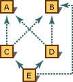

# Destructors (C++)
"Destructor" functions are the inverse of constructor functions. They are called when objects are destroyed (deallocated). Designate a function as a class's destructor by preceding the class name with a tilde (<CodeContentPlaceHolder>5\</CodeContentPlaceHolder>). For example, the destructor for class <CodeContentPlaceHolder>6\</CodeContentPlaceHolder> is declared: <CodeContentPlaceHolder>7\</CodeContentPlaceHolder>.  
  
 In a /clr compilation, the destructor has a special role in releasing managed and unmanaged resources. See [Destructors and Finalizers](../vs140/destructors-and-finalizers-in-visual-c--.md) for more information.  
  
 The destructor is commonly used to "clean up" when an object is no longer necessary. Consider the following declaration of a <CodeContentPlaceHolder>8\</CodeContentPlaceHolder> class:  
  
<CodeContentPlaceHolder>0\</CodeContentPlaceHolder>  
 In the preceding example, the destructor <CodeContentPlaceHolder>9\</CodeContentPlaceHolder> uses the <CodeContentPlaceHolder>10\</CodeContentPlaceHolder> operator to deallocate the space dynamically allocated for text storage.  
  
## Delcaring destructors  
 Destructors are functions with the same name as the class but preceded by a tilde (<CodeContentPlaceHolder>11\</CodeContentPlaceHolder>)  
  
 The first form of the syntax is used for destructors declared or defined inside a class declaration; the second form is used for destructors defined outside a class declaration.  
  
 Several rules govern the declaration of destructors. Destructors:  
  
-   Do not accept arguments.  
  
-   Cannot specify any return type (including <CodeContentPlaceHolder>12\</CodeContentPlaceHolder>).  
  
-   Cannot return a value using the <CodeContentPlaceHolder>13\</CodeContentPlaceHolder> statement.  
  
-   Cannot be declared as **const**, <CodeContentPlaceHolder>14\</CodeContentPlaceHolder>, or **static**. However, they can be invoked for the destruction of objects declared as **const**, <CodeContentPlaceHolder>15\</CodeContentPlaceHolder>, or **static**.  
  
-   Can be declared as **virtual**. Using virtual destructors, you can destroy objects without knowing their type — the correct destructor for the object is invoked using the virtual function mechanism. Note that destructors can also be declared as pure virtual functions for abstract classes.  
  
## Using destructors  
 Destructors are called when one of the following events occurs:  
  
-   An object allocated using the **new** operator is explicitly deallocated using the **delete** operator. When objects are deallocated using the **delete** operator, memory is freed for the "most derived object," or the object that is a complete object and not a subobject representing a base class. This "most-derived object" deallocation is guaranteed to work only with virtual destructors. Deallocation may fail in multiple-inheritance situations where the type information does not correspond to the underlying type of the actual object.  
  
-   A local (automatic) object with block scope goes out of scope.  
  
-   The lifetime of a temporary object ends.  
  
-   A program ends and global or static objects exist.  
  
-   The destructor is explicitly called using the destructor function's fully qualified name. (For more information, see [Explicit Destructor Calls](../vs140/explicit-destructor-calls.md).)  
  
 The cases described in the preceding list ensure that all objects can be destroyed with user-defined methods.  
  
 If a base class or data member has an accessible destructor, and if a derived class does not declare a destructor, the compiler generates one. This compiler-generated destructor calls the base class destructor and the destructors for members of the derived type. Default destructors are public. (For more information about accessibility, see [Access Specifiers for Base Classes](../vs140/access-specifiers-for-base-classes.md).)  
  
 Destructors can freely call class member functions and access class member data. When a virtual function is called from a destructor, the function called is the function for the class currently being destroyed. (For more information, see [Order of Destruction](../vs140/order-of-destruction.md).)  
  
 There are two restrictions on the use of destructors. The first restriction is that you cannot take the address of a destructor. The second is that derived classes do not inherit their base class's destructors. Instead, as previously explained, they always override the base class's destructors.  
  
## Order of destruction  
 When an object goes out of scope or is deleted, the sequence of events in its complete destruction is as follows:  
  
1.  The class's destructor is called, and the body of the destructor function is executed.  
  
2.  Destructors for nonstatic member objects are called in the reverse order in which they appear in the class declaration. The optional member initialization list used in construction of these members does not affect the order of (construction or) destruction. (For more information about initializing members, see [Initializing Bases and Members](assetId:///2f71377e-2b6b-49da-9a26-18e9b40226a1).)  
  
3.  Destructors for nonvirtual base classes are called in the reverse order of declaration.  
  
4.  Destructors for virtual base classes are called in the reverse order of declaration.  
  
<CodeContentPlaceHolder>1\</CodeContentPlaceHolder>  
### Virtual base classes  
 Destructors for virtual base classes are called in the reverse order of their appearance in a directed acyclic graph (depth-first, left-to-right, postorder traversal). the following figure depicts an inheritance graph.  
  
   
Inheritance Graph Showing Virtual Base Classes  
  
 The following lists the class heads for the classes shown in the figure.  
  
<CodeContentPlaceHolder>2\</CodeContentPlaceHolder>  
 To determine the order of destruction of the virtual base classes of an object of type <CodeContentPlaceHolder>16\</CodeContentPlaceHolder>, the compiler builds a list by applying the following algorithm:  
  
1.  Traverse the graph left, starting at the deepest point in the graph (in this case, <CodeContentPlaceHolder>17\</CodeContentPlaceHolder>).  
  
2.  Perform leftward traversals until all nodes have been visited. Note the name of the current node.  
  
3.  Revisit the previous node (down and to the right) to find out whether the node being remembered is a virtual base class.  
  
4.  If the remembered node is a virtual base class, scan the list to see whether it has already been entered. If it is not a virtual base class, ignore it.  
  
5.  If the remembered node is not yet in the list, add it to the bottom of the list.  
  
6.  Traverse the graph up and along the next path to the right.  
  
7.  Go to step 2.  
  
8.  When the last upward path is exhausted, note the name of the current node.  
  
9. Go to step 3.  
  
10. Continue this process until the bottom node is again the current node.  
  
 Therefore, for class <CodeContentPlaceHolder>18\</CodeContentPlaceHolder>, the order of destruction is:  
  
1.  The nonvirtual base class <CodeContentPlaceHolder>19\</CodeContentPlaceHolder>.  
  
2.  The nonvirtual base class <CodeContentPlaceHolder>20\</CodeContentPlaceHolder>.  
  
3.  The nonvirtual base class <CodeContentPlaceHolder>21\</CodeContentPlaceHolder>.  
  
4.  The virtual base class <CodeContentPlaceHolder>22\</CodeContentPlaceHolder>.  
  
5.  The virtual base class <CodeContentPlaceHolder>23\</CodeContentPlaceHolder>.  
  
 This process produces an ordered list of unique entries. No class name appears twice. Once the list is constructed, it is walked in reverse order, and the destructor for each of the classes in the list from the last to the first is called.  
  
 The order of construction or destruction is primarily important when constructors or destructors in one class rely on the other component being created first or persisting longer — for example, if the destructor for <CodeContentPlaceHolder>24\</CodeContentPlaceHolder> (in the figure shown above) relied on <CodeContentPlaceHolder>25\</CodeContentPlaceHolder> still being present when its code executed, or vice versa.  
  
 Such interdependencies between classes in an inheritance graph are inherently dangerous because classes derived later can alter which is the leftmost path, thereby changing the order of construction and destruction.  
  
### Nonvirtual base classes  
 The destructors for nonvirtual base classes are called in the reverse order in which the base class names are declared. Consider the following class declaration:  
  
<CodeContentPlaceHolder>3\</CodeContentPlaceHolder>  
 In the preceding example, the destructor for <CodeContentPlaceHolder>26\</CodeContentPlaceHolder> is called before the destructor for <CodeContentPlaceHolder>27\</CodeContentPlaceHolder>.  
  
## Explicit destructor calls  
 Calling a destructor explicitly is seldom necessary. However, it can be useful to perform cleanup of objects placed at absolute addresses. These objects are commonly allocated using a user-defined **new** operator that takes a placement argument. The **delete** operator cannot deallocate this memory because it is not allocated from the free store (for more information, see [The new and delete Operators](../vs140/new-and-delete-operators.md)). A call to the destructor, however, can perform appropriate cleanup. To explicitly call the destructor for an object, <CodeContentPlaceHolder>28\</CodeContentPlaceHolder>, of class <CodeContentPlaceHolder>29\</CodeContentPlaceHolder>, use one of the following statements:  
  
<CodeContentPlaceHolder>4\</CodeContentPlaceHolder>  
 The notation for explicit calls to destructors, shown in the preceding, can be used regardless of whether the type defines a destructor. This allows you to make such explicit calls without knowing if a destructor is defined for the type. An explicit call to a destructor where none is defined has no effect.  
  
## See Also  
 [Special Member Functions](../vs140/special-member-functions--c---.md)