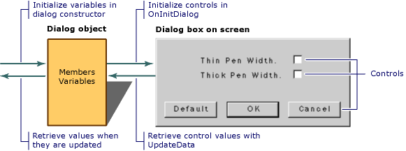

# Dialog Data Exchange
If you use the DDX mechanism, you set the initial values of the dialog object's member variables, typically in your <CodeContentPlaceHolder>0\</CodeContentPlaceHolder> handler or the dialog constructor. Immediately before the dialog is displayed, the framework's DDX mechanism transfers the values of the member variables to the controls in the dialog box, where they appear when the dialog box itself appears in response to <CodeContentPlaceHolder>1\</CodeContentPlaceHolder> or **Create**. The default implementation of <CodeContentPlaceHolder>2\</CodeContentPlaceHolder> in <CodeContentPlaceHolder>3\</CodeContentPlaceHolder> calls the <CodeContentPlaceHolder>4\</CodeContentPlaceHolder> member function of class <CodeContentPlaceHolder>5\</CodeContentPlaceHolder> to initialize the controls in the dialog box.  
  
 The same mechanism transfers values from the controls to the member variables when the user clicks the OK button (or whenever you call the <CodeContentPlaceHolder>6\</CodeContentPlaceHolder> member function with the argument **TRUE**). The dialog data validation mechanism validates any data items for which you specified validation rules.  
  
 The following figure illustrates dialog data exchange.  
  
   
Dialog Data Exchange  
  
 <CodeContentPlaceHolder>7\</CodeContentPlaceHolder> works in both directions, as specified by the **BOOL** parameter passed to it. To carry out the exchange, <CodeContentPlaceHolder>8\</CodeContentPlaceHolder> sets up a <CodeContentPlaceHolder>9\</CodeContentPlaceHolder> object and calls your dialog class's override of <CodeContentPlaceHolder>10\</CodeContentPlaceHolder>'s <CodeContentPlaceHolder>11\</CodeContentPlaceHolder> member function. <CodeContentPlaceHolder>12\</CodeContentPlaceHolder> takes an argument of type <CodeContentPlaceHolder>13\</CodeContentPlaceHolder>. The <CodeContentPlaceHolder>14\</CodeContentPlaceHolder> object passed to <CodeContentPlaceHolder>15\</CodeContentPlaceHolder> represents the context of the exchange, defining such information as the direction of the exchange.  
  
 When you (or a Code wizard) override <CodeContentPlaceHolder>16\</CodeContentPlaceHolder>, you specify a call to one DDX function per data member (control). Each DDX function knows how to exchange data in both directions based on the context supplied by the <CodeContentPlaceHolder>17\</CodeContentPlaceHolder> argument passed to your <CodeContentPlaceHolder>18\</CodeContentPlaceHolder> by <CodeContentPlaceHolder>19\</CodeContentPlaceHolder>.  
  
 MFC provides many DDX functions for different kinds of exchange. The following example shows a <CodeContentPlaceHolder>20\</CodeContentPlaceHolder> override in which two DDX functions and one DDV function are called:  
  
 [!code[NVC_MFCControlLadenDialog#49](../vs140/codesnippet/CPP/dialog-data-exchange_1.cpp)]  
  
 The <CodeContentPlaceHolder>21\</CodeContentPlaceHolder> and <CodeContentPlaceHolder>22\</CodeContentPlaceHolder> lines are a data map. The sample DDX and DDV functions shown are for a check-box control and an edit-box control, respectively.  
  
 If the user cancels a modal dialog box, the <CodeContentPlaceHolder>23\</CodeContentPlaceHolder> member function terminates the dialog box and <CodeContentPlaceHolder>24\</CodeContentPlaceHolder> returns the value **IDCANCEL**. In that case, no data is exchanged between the dialog box and the dialog object.  
  
## See Also  
 [Dialog Data Exchange and Validation](../vs140/dialog-data-exchange-and-validation.md)   
 [Life Cycle of a Dialog Box](../vs140/life-cycle-of-a-dialog-box.md)   
 [Dialog Data Validation](../vs140/dialog-data-validation.md)