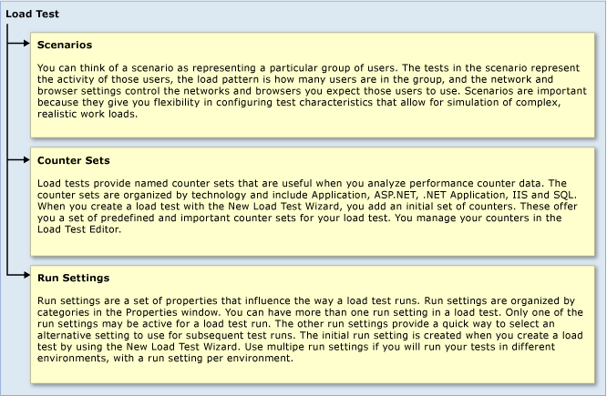

# Editing Load Test Using the Load Test Editor
Edit existing load tests by using the Load Test Editor. Before you can edit a load test, you must first create one by using the New Load Test Wizard. See [Creating Load Tests Using the New Load Test Wizard](../vs140/creating-load-tests.md).  
  
 **Requirements**  
  
-   Visual Studio Enterprise  
  
 Load tests can contain both unit tests and Web performance tests. The main purpose of a load test is to simulate many users accessing a server at the same time. A load test gives you access to application stress and performance data. A load test can be configured to emulate various load conditions such as user loads and network types.  
  
   
Load Test Editor Hierarchy  
  
 **Load Tests Created in the New Load Test Wizard**  
  
 Any of the initial configuration options and settings that you specified in the New Load Test Wizard when you created a load test can be modified in the Load Test Editor after the wizard is finished. The Load Test Editor lets you to modify an existing load test's properties, and add more scenarios, counter sets, and run settings.  
  
## Tasks  
  
|Tasks|Associated topics|  
|-----------|-----------------------|  
|**Edit load test scenario settings:** A scenario is used to model how a group of users interacts with a server application. A scenario consists of a load pattern, a test mix model, a test mix, a browser mix, and network mix. A load test can have more than one scenario and a single scenario can contain Web performance tests and unit tests. By grouping similar settings together, a scenario lets you to group and run tests of a similar nature together.|-   [Editing Load Test Scenarios Using the Load Test Editor](assetId:///fec04f2e-bf38-4d44-b2ec-fa50f58fd0d9) -   [Load Test Scenario Properties](assetId:///4414a638-1fa2-40ad-b1f4-b99f90b62e62)|  
|**Configure and manage performance counter sets specified for computers that are used in a load test:** Load tests provide named counter sets, organized by technology, that are useful when you analyze performance counter data. The counter sets include Load Test, IIS, ASP.NET, and SQL. When you create a load test with the New Load Test Wizard, an initial set of predefined and important counter set are configured by default for the computers that you specify to include in the load test. You manage your counters in the Load Test Editor.|-   [Specifying the Counter Sets for Computers in a Load Test](assetId:///9e14d955-f3a4-4717-bbfe-7f08cdda5678)|  
|**Configure and manage load test run settings:** Run settings are a set of properties that influence the way a load test runs. Run settings are organized by categories in the Properties window.|-   [Configuring Load Test Run Settings](assetId:///0c86918b-cd63-4468-8f49-6d547a1276dc) -   [Load Test Run Setting Properties](assetId:///de10dabb-02ed-403b-9e6f-0b735524988c)|  
|**Specify 64-bit processes for load testing:** You can configure the test setting that you are using with your load test to specify that you want to use 64-bit processes.|-   [How to: Specify 64-Bit Process Using the Load Test Editor](../vs140/how-to--specify-64-bit-process-using-test-settings.md)|  
|**Configuration considerations for load tests:** You can configure load test to ideal settings by modifying such settings as sample rates and think times. You can also configure your load test for optimal settings if it includes Web performance tests.|-   [Considerations for Load Testing](assetId:///e2985d15-60a7-4177-93b4-f986c2936337#CreatingEditingLoadTestsConsiderations)|  
  
## Related Tasks  
 [Configuring Load Test Run Settings](assetId:///0c86918b-cd63-4468-8f49-6d547a1276dc)  
  
 Run settings are a set of properties that influence the way a load test runs. Run settings are organized by categories in the Properties window.  
  
 [Distributing Load Tests Across Multiple Test Machines Using Test Controllers and Test Agents](../vs140/distributing-load-test-runs-across-multiple-test-machines-using-test-controllers-and-test-agents.md)  
  
 You can use a group of computers to generate simulated load for testing, and to run tests remotely and concurrently on several computers.  
  
## External resources  
  
### Guidance  
 [Testing for Continuous Delivery with Visual Studio 2012 – Chapter 6: A Testing Toolbox](http://go.microsoft.com/fwlink/?LinkID=255203)  
  
## See Also  
 [Creating and Editing Load Tests](assetId:///e2985d15-60a7-4177-93b4-f986c2936337)   
 [Creating Load Tests Using the New Load Test Wizard](../vs140/creating-load-tests.md)   
 [Load Test Walkthroughs](assetId:///21c5ebd2-cd1e-4aed-a112-1027b4ee4fbf)   
 [Troubleshooting Load Tests](../vs140/troubleshooting-load-tests.md)   
 [Analyzing Load Tests Results Using the Load Test Analyzer](../vs140/analyzing-load-test-results-using-the-load-test-analyzer.md)   
 [Analyzing Threshold Rule Violations](assetId:///969ed346-cf2e-4d48-82b3-edb3e075e1c0)   
 [Considerations for Load Testing](assetId:///e2985d15-60a7-4177-93b4-f986c2936337#CreatingEditingLoadTestsConsiderations)