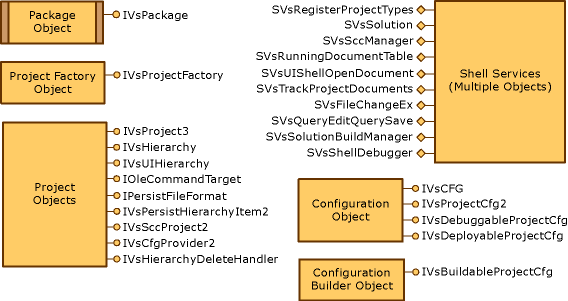

# Elements of a Project Model
The interfaces and implementations of all projects in [!INCLUDE[vsprvs](../vs140/includes/vsprvs_md.md)] share a basic structure: the project model for your project type. In your project model, which is the VSPackage you are developing, you create objects that comply with your design decisions and work together with global functionality provided by the IDE. Although you control how a project item is persisted, for example, you do not control notification that a file must be persisted. When a user places the focus on an open project item and chooses **Save** on the **File** menu on the [!INCLUDE[vsprvs](../vs140/includes/vsprvs_md.md)] menu bar, your project type code must intercept the command from the IDE, persist the file, and send notification back to the IDE that the file is no longer changed.  
  
 Your VSPackage interacts with the IDE through services that provide access to the IDE interfaces. For example, through particular services, you monitor and route commands and provide context information for selections made in the project. All the global IDE functionality needed for your VSPackage is provided by services. For more information about services, see [How to: Consume a Service (C#)](../vs140/how-to--get-a-service.md).  
  
 Other implementation considerations:  
  
-   A single project model can contain more than one project type.  
  
-   Project types and the attendant project factories are registered independently with GUIDs.  
  
-   Each project must have a template file or wizard to initialize the new project file when a user creates a new project through the [!INCLUDE[vsprvs](../vs140/includes/vsprvs_md.md)] UI. For example, the [!INCLUDE[vcprvc](../vs140/includes/vcprvc_md.md)] templates initialize what eventually become .vcproj files.  
  
 The following illustration shows the primary interfaces, services, and objects that compose a typical project implementation. You can use the application helper, HierUtil7, to create the underlying objects and other programming boilerplate. For more information about the HierUtil7 application helper, see [Not in Build: Using HierUtil7 Project Classes to Implement a Project Type (C++)](assetId:///a5c16a09-94a2-46ef-87b5-35b815e2f346).  
  
   
Project model  
  
 For more information about the interfaces and services listed in the previous diagram, and other optional interfaces not included in the diagram, see [Project Model Core Components](../vs140/project-model-core-components.md).  
  
 Projects can support commands and therefore must implement the <xref:Microsoft.VisualStudio.OLE.Interop.IOleCommandTarget*> interface to participate in command routing through the command context GUIDs.  
  
## See Also  
 [Checklist: Creating New Project Types](../vs140/checklist--creating-new-project-types.md)   
 [Not in Build: Using HierUtil7 Project Classes to Implement a Project Type (C++)](assetId:///a5c16a09-94a2-46ef-87b5-35b815e2f346)   
 [Project Model Core Components](../vs140/project-model-core-components.md)   
 [Creating Project Instances By Using Project Factories](../vs140/creating-project-instances-by-using-project-factories.md)   
 [How to: Consume a Service (C#)](../vs140/how-to--get-a-service.md)   
 [Project Types Overview](../vs140/creating-project-types.md)