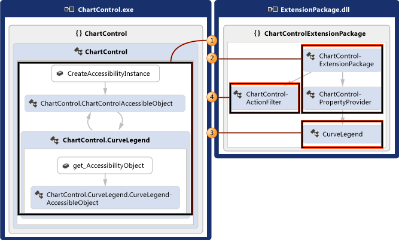
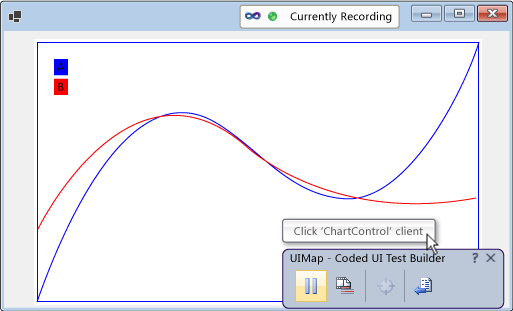
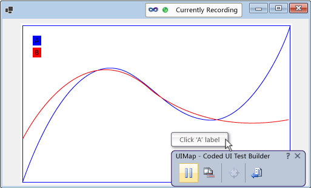
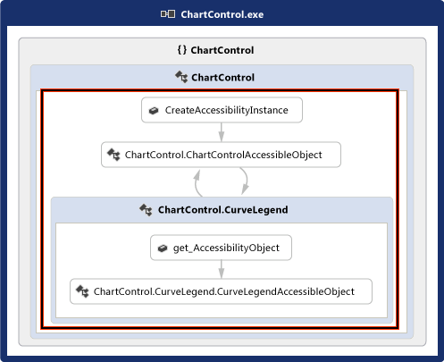
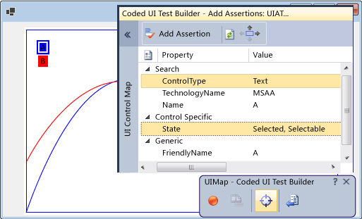
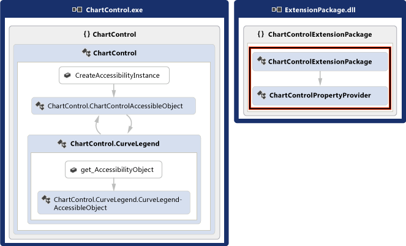

# Enable Coded UI Testing of Your Controls
Your control can be more easily tested if you implement support for the coded UI testing framework. You can add increasing levels of support incrementally. You can start by supporting record and playback and property validation. You can build on that to allow the coded UI test builder to recognize your control’s custom properties, and provide custom classes to access those properties from generated code. You can also help the coded UI test builder capture actions in a way that is closer to the intent of the action being recorded.  
  
 **In this topic:**  
  
1.  [Support Record and Playback and Property Validation by implementing Accessibility](../vs140/enable-coded-ui-testing-of-your-controls.md#recordandplayback)  
  
2.  [Add Custom Property Validation by implementing a Property Provider](../vs140/enable-coded-ui-testing-of-your-controls.md#customproprties)  
  
3.  [Support Code Generation by implementing a Class to Access Custom Properties](../vs140/enable-coded-ui-testing-of-your-controls.md#codegeneration)  
  
4.  [Support Intent-Aware Actions by implementing an Action Filter](../vs140/enable-coded-ui-testing-of-your-controls.md#intentawareactions)  
  
   
  
##  \<a name="recordandplayback">\</a> Support Record and Playback and Property Validation by implementing Accessibility  
 The coded UI test builder captures information about the controls that it encounters during a recording and then generates code to replay that session. If your control doesn't support accessibility, then the coded UI test builder will capture actions (like mouse clicks) using screen coordinates. When the test is played back, the generated code will issue those mouse clicks in the same screen coordinates. If your control appears in a different place on the screen when the test is played back, the generated code will fail to perform that action on your control. This can result in failures if the test is played back on different screen configurations, in different environments, or after there have been changes to the UI layout.  
  
   
  
 If you implement accessibility, though, the coded UI test builder will use that to capture information about your control when it records a test and generates code. Then, when you run the test, the generated code will replay those events against your control, even if it's somewhere else in the user interface. Test authors will also be able create asserts using the basic properties of your control.  
  
   
  
### To support record and playback, property validation, and navigation for a Windows forms control  
 Implement accessibility for your control as outlined in the following procedure, and explained in detail in \<xref:System.Windows.Forms.AccessibleObject*>.  
  
   
  
1.  Implement a class that derives from \<xref:System.Windows.Forms.Control.ControlAccessibleObject*>, and override the \<xref:System.Windows.Forms.Control.AccessibilityObject*> property to return an object of your class.  
  
<CodeContentPlaceHolder>0\</CodeContentPlaceHolder>  
2.  Override the accessible object’s \<xref:System.Windows.Forms.AccessibleObject.Role*>, \<xref:System.Windows.Forms.AccessibleObject.State*>, \<xref:System.Windows.Forms.AccessibleObject.GetChild*> and \<xref:System.Windows.Forms.AccessibleObject.GetChildCount*> properties and methods.  
  
3.  Implement another accessibility object for the child control and   override the child control’s \<xref:System.Windows.Forms.Control.AccessibilityObject*> property to return that accessibility object.  
  
4.  Override the \<xref:System.Windows.Forms.AccessibleObject.Bounds*>, \<xref:System.Windows.Forms.AccessibleObject.Name*>, \<xref:System.Windows.Forms.AccessibleObject.Parent*>, \<xref:System.Windows.Forms.AccessibleObject.Role*>, \<xref:System.Windows.Forms.AccessibleObject.State*>, \<xref:System.Windows.Forms.AccessibleObject.Navigate*>, and \<xref:System.Windows.Forms.AccessibleObject.Select*> properties and methods for the child control’s accessibility object.  
  
> [!NOTE]
>  This topic starts with the accessibility sample in \<xref:System.Windows.Forms.AccessibleObject*> in this procedure, and then builds on that in the remaining procedures. If you want to create a working version of the accessibility sample, create a console application and then replace the code in Program.cs with the sample code. You’ll need to add references to Accessibility, System.Drawing, and System.Windows.Forms. You should change the **Embed Interop Types** for Accessibility to **False** to eliminate a build warning. You can change the project’s output type to from **Console Application** to **Windows Application** so that a console window doesn’t appear when you run the application.  
  
##  \<a name="customproprties">\</a> Support Custom Property Validation by implementing a Property Provider  
 Once you’ve implemented basic support for record and playback and property validation, you can make your control’s custom properties available to coded UI tests by implementing a \<xref:Microsoft.VisualStudio.TestTools.UITesting.UITestPropertyProvider*> plug-in. For example, the following procedure creates a property provider that allows coded UI tests to access the State property of the chart control’s CurveLegend child controls.  
  
   
  
### To support custom property validation  
   
  
1.  Override the curve legend accessible object’s \<xref:System.Windows.Forms.AccessibleObject.Description*> property to pass rich property values in the description string, separated from the main description (and each other if you are implementing multiple properties) by semicolons (;).  
  
<CodeContentPlaceHolder>1\</CodeContentPlaceHolder>  
2.  Create a UI test extension package for your control by creating a class library project and add references to Accessibility, Microsoft.VisualStudio.TestTools.UITesting, Microsoft.VisualStudio.TestTools.UITest.Common, and Microsoft.VisualStudio.TestTools.Extension. Change the **Embed Interop Types** for Accessibility to **False**.  
  
3.  Add a property provider class that’s derived from \<xref:Microsoft.VisualStudio.TestTools.UITesting.UITestPropertyProvider*>.  
  
<CodeContentPlaceHolder>2\</CodeContentPlaceHolder>  
4.  Implement the property provider by placing property names and property descriptors in a <xref:System.Collections.Generic.Dictionary<CodeContentPlaceHolder>19\</CodeContentPlaceHolder>UITestExtensionPackage<CodeContentPlaceHolder>20\</CodeContentPlaceHolder>codedUITestBuilder.exe  /standalone`  
  
4.  Attach the debugger to the codedUITestBuilder process.  
  
5.  Set breakpoints in your code.  
  
6.  In the coded UI test builder, create asserts to exercise your property provider, and record actions to exercise your action filters.  
  
## External resources  
  
### Guidance  
 [Testing for Continuous Delivery with Visual Studio 2012 – Chapter 2: Unit Testing: Testing the Inside](http://go.microsoft.com/fwlink/?LinkID=255188)  
  
## See Also  
 \<xref:System.Windows.Forms.AccessibleObject*>   
 [Testing the User Interface with Automated Coded UI Tests](../vs140/use-ui-automation-to-test-your-code.md)