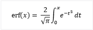

# erf, erff, erfl, erfc, erfcf, erfcl
Computes the error function or the complementary error function of a value.  
  
## Syntax  
  
<CodeContentPlaceHolder>0\</CodeContentPlaceHolder>  
#### Parameters  
 <CodeContentPlaceHolder>1\</CodeContentPlaceHolder>  
 A floating-point value.  
  
## Return Value  
 The <CodeContentPlaceHolder>2\</CodeContentPlaceHolder> functions return the Gauss error function of <CodeContentPlaceHolder>3\</CodeContentPlaceHolder>. The <CodeContentPlaceHolder>4\</CodeContentPlaceHolder> functions return the complementary Gauss error function of <CodeContentPlaceHolder>5\</CodeContentPlaceHolder>.  
  
## Remarks  
 The <CodeContentPlaceHolder>6\</CodeContentPlaceHolder> functions calculate the Gauss error function of x, which is defined as:  
  
   
  
 The complementary Gauss error function is defined as 1 – erf(x). The <CodeContentPlaceHolder>7\</CodeContentPlaceHolder> functions return a value in the range -1.0 to 1.0. There is no error return. The <CodeContentPlaceHolder>8\</CodeContentPlaceHolder> functions return a value in the range 0 to 2. If <CodeContentPlaceHolder>9\</CodeContentPlaceHolder> is too large for <CodeContentPlaceHolder>10\</CodeContentPlaceHolder>, the <CodeContentPlaceHolder>11\</CodeContentPlaceHolder> variable is set to <CodeContentPlaceHolder>12\</CodeContentPlaceHolder>.  
  
 Because C++ allows overloading, you can call overloads of <CodeContentPlaceHolder>13\</CodeContentPlaceHolder> and <CodeContentPlaceHolder>14\</CodeContentPlaceHolder> that take and return <CodeContentPlaceHolder>15\</CodeContentPlaceHolder> and <CodeContentPlaceHolder>16\</CodeContentPlaceHolder> types. In a C program, <CodeContentPlaceHolder>17\</CodeContentPlaceHolder> and <CodeContentPlaceHolder>18\</CodeContentPlaceHolder> always take and return a <CodeContentPlaceHolder>19\</CodeContentPlaceHolder>.  
  
## Requirements  
  
|Function|Required header|  
|--------------|---------------------|  
|<CodeContentPlaceHolder>20\</CodeContentPlaceHolder>, <CodeContentPlaceHolder>21\</CodeContentPlaceHolder>, <CodeContentPlaceHolder>22\</CodeContentPlaceHolder>, <CodeContentPlaceHolder>23\</CodeContentPlaceHolder>, <CodeContentPlaceHolder>24\</CodeContentPlaceHolder>, <CodeContentPlaceHolder>25\</CodeContentPlaceHolder>|\<math.h>|  
  
 For additional compatibility information, see [Compatibility](../vs140/compatibility.md).  
  
## .NET Framework Equivalent  
 Not applicable. To call the standard C function, use <CodeContentPlaceHolder>26\</CodeContentPlaceHolder>. For more information, see [Platform Invoke Examples](assetId:///15926806-f0b7-487e-93a6-4e9367ec689f).  
  
## See Also  
 [Floating-Point Support](../vs140/floating-point-support.md)