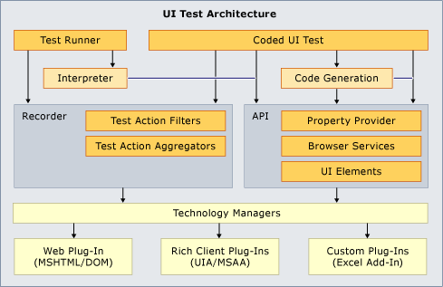

# Extending Coded UI Tests and Action Recordings to Support Microsoft Excel
The testing framework for coded UI tests and action recordings does not support every possible user interface. It might not support the specific UI that you want to test. For example, you cannot immediately create a coded UI test or an action recording for a [!INCLUDE[ofprexcel](../vs140/includes/ofprexcel_md.md)] spreadsheet. However, you can create your own extension to the coded UI test framework that will support your specific UI by taking advantage of the extensibility of the coded UI test framework. The following topic gives an example of how to extend the framework to support the creation of coded UI tests and action recordings for [!INCLUDE[ofprexcel](../vs140/includes/ofprexcel_md.md)]. For more information about the platforms that are supported, see [Supported Configurations for Coded UI Tests](../vs140/supported-configurations-and-platforms-for-coded-ui-tests-and-action-recordings.md).  
  
 **Requirements**  
  
-   Visual Studio Enterprise  
  
 This section presents a coded UI test extension that can record and play back tests of Excel Worksheets. Each part of the extension is explained in this section and in the code comments for developers who want to create just such an extension.  
  
   
Architecture Overview  
  
## Download the sample  
 The sample consists of four projects in the `CodedUIExtensibilitySample.sln` solution:  
  
-   CodedUIextensibilitySample  
  
-   ExcelCodedUIAddInHelper  
  
-   ExcelUICommunicationHelper  
  
-   SampleTestProject  
  
 Get the sample from this [blog post](http://go.microsoft.com/fwlink/?LinkID=185592).  
  
> [!NOTE]
>  The sample is intended for use with Microsoft Excel 2010. The sample may work with other versions of Microsoft Excel, but it is not currently supported.  
  
## Details about the sample  
 The following sections provide information about the sample and its structure.  
  
### Microsoft Excel Add-in: ExcelCodedUIAddinHelper  
 This project includes an add-in that runs in the Excel process. See [Sample Excel Add-in for Coded UI Test Communication](../vs140/sample-excel-add-in-for-coded-ui-testing.md) for a brief overview of the add-in project.  
  
 For more information, see [Walkthrough: Creating Your First Application-Level Add-in for Excel](assetId:///a855e2be-3ecf-4112-a7f5-ec0f7fad3b5f).  
  
### Excel UI communication: ExcelUIcommunicationHelper  
 This project includes the `IExcelUICommunication` interface and the information classes that are used to pass data between the Coded UI Testing Framework and Excel. For more information, see [Sample Excel Communicator Interface](../vs140/sample-excel-communicator-interface.md).  
  
### Coded UI Test Extension: CodedUIExentsibilitySample  
 This project includes the custom classes that are used in tests of an Excel worksheet. The code for each of these classes is fairly self-explanatory. However, we provide a short description of each custom class. For more information, see [Sample Coded UI Test Extension for Excel](../vs140/sample-coded-ui-test-extension-for-excel.md).  
  
### Deploying Your Add-in and Extension  
 After you have created all projects and objects, run the provided `CopyDrop.bat` file as an administrator. This file copies the `ExcelCodedUIAddinHelper` DLL and PDB files to:  
  
 "`%CommonProgramFiles(x86)%\Microsoft Shared\VSTT\<version number>\UITestExtensionPackages\*.*`", where version number could be 11.0, 12.0 etc based on your Visual Studio version.  
  
 The `ExcelUICommunicationHelper` DLL and PDB files are copied to `"%ProgramFiles(x86)%\Microsoft Visual Studio <version number>\Common7\IDE\PrivateAssemblies”`.  
  
 You might have to adjust the exact copy paths, but no additional installation is required. On a 64-bit machine, use the 32-bit Visual Studio Enterprise command prompt to run the `CopyDrop.bat` file.  
  
### Testing Excel with the SampleTestProject  
 You can run the test in the provided test project which uses a specific version of Excel that you may not have, or create your own test project and record a test of your own. For more information, see [Creating Coded UI Tests](../vs140/use-ui-automation-to-test-your-code.md#VerifyingCodeUsingCUITCreate).  
  
## See Also  
 <xref:Microsoft.VisualStudio.TestTools.UITesting.UITestPropertyProvider*>   
 <xref:Microsoft.VisualStudio.TestTools.UITest.Extension.UITechnologyElement*>   
 <xref:Microsoft.VisualStudio.TestTools.UITest.Common.UITestActionFilter*>   
 <xref:Microsoft.VisualStudio.TestTools.UITest.Extension.UITestExtensionPackage*>   
 [Verifying Code by Using Coded User Interface Tests](../vs140/use-ui-automation-to-test-your-code.md)   
 [Best Practices for Coded UI Tests](../vs140/best-practices-for-coded-ui-tests.md)   
 [Supported Configurations for Coded UI Tests](../vs140/supported-configurations-and-platforms-for-coded-ui-tests-and-action-recordings.md)