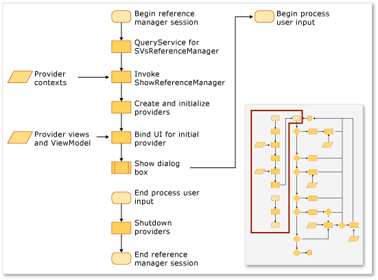
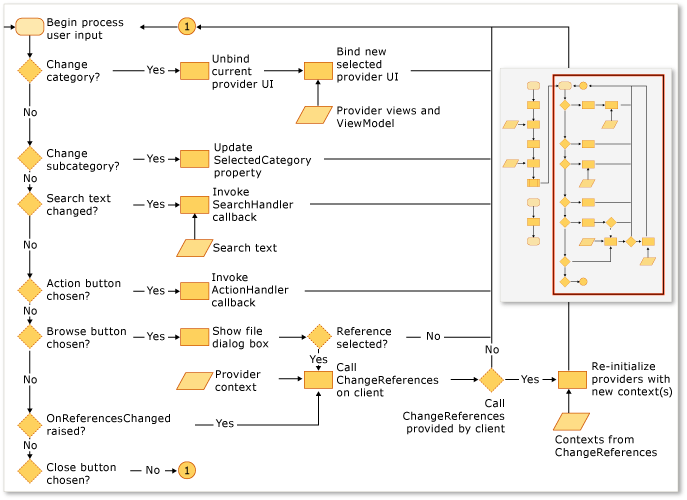

# Extending the Reference Manager
You can add references to your project by using the Reference Manager in a Visual Studio extension. Before the Reference Manager appears, your projects must configure it to show data from the correct locations. For example, a project that targets the [!INCLUDE[net_v40_short](../vs140/includes/net_v40_short_md.md)] must populate assemblies from a different folder than a project that targets the [!INCLUDE[net_v35_long](../vs140/includes/net_v35_long_md.md)].  
  
 You typically configure the Reference Manager by using a collection of ProviderContexts from the following providers:  
  
-   \<xref:Microsoft.VisualStudio.Shell.Interop.IVsAssemblyReferenceProviderContext*>  
  
-   \<xref:Microsoft.VisualStudio.Shell.Interop.IVsComReferenceProviderContext*>  
  
-   \<xref:Microsoft.VisualStudio.Shell.Interop.IVsFileReferenceProviderContext*>  
  
-   \<xref:Microsoft.VisualStudio.Shell.Interop.IVsProjectReferenceProviderContext*>  
  
-   \<xref:Microsoft.VisualStudio.Shell.Interop.IVsPlatformReferenceProviderContext*>  
  
 A client component displays the Reference Manager by calling the ShowReferenceManager method on the Visual Studio service that's named SVsReferenceManager. A collection of IVsReferenceProviderContext classes is passed into this method as an argument. These contexts determine which tabs appear along the left side of the Reference Manager dialog box. Each provider contains all of the information necessary for the dialog box to populate and display the necessary data for you to add a reference to your project.  
  
 The following illustration summarizes the process.  
  
   
  
   
  
## Adding a custom tab  
 To add a custom tab, you must implement an IReferenceProvider, an IVsReference, and an IVsReferenceProviderContext.  
  
#### To add a custom tab  
  
1.  Implement the IReferenceProvider interface, and then export it through the Managed Extensibility Framework (MEF) for the Reference Manager to use.  
  
     The Reference Manager uses the ReferenceProvider object to generate the items that appear in the Reference Manager. The interface for that object is defined in Microsoft.VisualStudio.ReferenceManager.Contracts.dll.  
  
2.  Implement a ProviderContext object.  
  
     The Reference Manager uses the GUID property of this object to match the context to the provider. When the Reference Manager initializes, it passes the provider the ProviderContext that’s passed in through the ShowReferenceManager method. The ProviderContext should contain all of the information that the provider needs to enumerate IVsReferences.  
  
3.  Extend the StandardReferenceProviderContext class.  
  
     The Reference Manager provides some base classes, such as the StandardReferenceProviderContext class, that you can use to get started. Your Provider class can extend StandardReferenceProvider, and the reference item can extend StandardReferenceItem.  
  
 Your provider class might look like this example:  
  
<CodeContentPlaceHolder>0\</CodeContentPlaceHolder>  
 Your context class might look like this example:  
  
<CodeContentPlaceHolder>1\</CodeContentPlaceHolder>  
 For your reference item class, we recommend that you implement IWatchableReference and make your class serializable. By following this approach, you can take advantage of the cache serialization methods in the StandardReferenceProvider class, in addition to the ReferenceWatcher service, which automatically synchronizes item checks between the various tabs in the dialog box:  
  
<CodeContentPlaceHolder>2\</CodeContentPlaceHolder>  
 The ReferenceProvider class contains two important methods. The first method is Initialize, which is called only once, when the provider is first loaded into the dialog box. The second method is SetContext, which is called immediately after Initialize but can be called again if the project systems fail to add any of the references that you specified and tried to commit.  
  
> [!NOTE]
>  Because providers persist for the duration of the program, they can save state between sessions, but race conditions can occur if the user closes the dialog box and then quickly reopens it.  
  
## Override the existing source of tab enumeration  
 Some provider contexts have a property called Tabs, whose type is uint. This property is a bitmask, and its values control which tabs that provider displays.  For example, the IVsAssemblyReferenceProviderContext interface defines a Tabs property, which can be set to the following values:  
  
<CodeContentPlaceHolder>3\</CodeContentPlaceHolder>  
 The IVsPlatformReferenceProviderContext class has a similar property. You can’t change the tab name, but you can control the header text that appears when the user chooses the tab. You can control this value through the following methods on the IVsAssemblyProviderContext class:  
  
<CodeContentPlaceHolder>4\</CodeContentPlaceHolder>  
## Override filter in the Browse dialog box  
 You can supply a custom type filter to the Browse dialog box in the Reference Manager by changing the value of the BrowseFilter property on the IFileReferenceProviderContext object.  The following example demonstrates this technique from native code:  
  
<CodeContentPlaceHolder>5\</CodeContentPlaceHolder>  
## See Also  
 [How to: Add or Remove References By Using the Reference Manager](../vs140/how-to--add-or-remove-references-by-using-the-reference-manager.md)