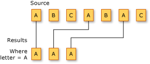

# Filtering Data (Visual Basic)
Filtering refers to the operation of restricting the result set to contain only those elements that satisfy a specified condition. It is also known as selection.  
  
 The following illustration shows the results of filtering a sequence of characters. The predicate for the filtering operation specifies that the character must be 'A'.  
  
   
  
 The standard query operator methods that perform selection are listed in the following section.  
  
## Methods  
  
|Method Name|Description|Visual Basic Query Expression Syntax|More Information|  
|-----------------|-----------------|------------------------------------------|----------------------|  
|OfType|Selects values, depending on their ability to be cast to a specified type.|Not applicable.|<xref:System.Linq.Enumerable.OfType*?displayProperty=fullName><br /><br /> <xref:System.Linq.Queryable.OfType*?displayProperty=fullName>|  
|Where|Selects values that are based on a predicate function.|`Where`|<xref:System.Linq.Enumerable.Where*?displayProperty=fullName><br /><br /> <xref:System.Linq.Queryable.Where*?displayProperty=fullName>|  
  
## Query Expression Syntax Example  
 The following example uses the `Where` to filter from an array those strings that have a specific length.  
  
```vb  
Dim words() As String = {"the", "quick", "brown", "fox", "jumps"}  
  
Dim query = From word In words   
            Where word.Length = 3   
            Select word  
  
Dim sb As New System.Text.StringBuilder()  
For Each str As String In query  
    sb.AppendLine(str)  
Next  
  
' Display the results.  
MsgBox(sb.ToString())  
  
' This code produces the following output:  
  
' the  
' fox  
```  
  
## See Also  
 <xref:System.Linq*>   
 [Standard Query Operators Overview (Visual Basic)](../vs140/standard-query-operators-overview--visual-basic-.md)   
 [Where Clause (Visual Basic)](../vs140/where-clause--visual-basic-.md)   
 [How To: Filter Query Results by Using LINQ (Visual Basic)](../vs140/how-to--filter-query-results-by-using-linq--visual-basic-.md)   
 [How to: Query An Assembly's Metadata with Reflection (LINQ) (Visual Basic)](../vs140/how-to--query-an-assembly-s-metadata-with-reflection--linq---visual-basic-.md)   
 [How to: Query for Files with a Specified Attribute or Name (Visual Basic)](../vs140/how-to--query-for-files-with-a-specified-attribute-or-name--visual-basic-.md)   
 [How to: Sort or Filter Text Data by Any Word or Field (LINQ) (Visual Basic)](../vs140/how-to--sort-or-filter-text-data-by-any-word-or-field--linq---visual-basic-.md)