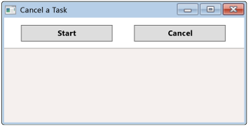

# Fine-Tuning Your Async Application (C#)
You can add precision and flexibility to your async applications by using the methods and properties that the \<xref:System.Threading.Tasks.Task*> type makes available. The topics in this section show examples that use \<xref:System.Threading.CancellationToken*> and important `Task` methods such as \<xref:System.Threading.Tasks.Task.WhenAll*?displayProperty=fullName> and \<xref:System.Threading.Tasks.Task.WhenAny*?displayProperty=fullName>.  
  
 By using `WhenAny` and `WhenAll`, you can more easily start multiple tasks and await their completion by monitoring a single task.  
  
-   `WhenAny` returns a task that completes when any task in a collection is complete.  
  
     For examples that use `WhenAny`, see [Cancel Remaining Async Tasks after One Is Complete (C#)](../vs140/cancel-remaining-async-tasks-after-one-is-complete--csharp-.md) and [Start Multiple Async Tasks and Process Them As They Complete (C#)](../vs140/start-multiple-async-tasks-and-process-them-as-they-complete--csharp-.md).  
  
-   `WhenAll` returns a task that completes when all tasks in a collection are complete.  
  
     For more information and an example that uses `WhenAll`, see [How to: Extend the async Walkthrough by Using Task.WhenAll (C#)](../vs140/how-to--extend-the-async-walkthrough-by-using-task.whenall--csharp-.md).  
  
 This section includes the following examples.  
  
-   [Cancel an Async Task or a List of Tasks (C#)](../vs140/cancel-an-async-task-or-a-list-of-tasks--csharp-.md).  
  
-   [Cancel Async Tasks after a Period of Time (C#)](../vs140/cancel-async-tasks-after-a-period-of-time--csharp-.md)  
  
-   [Cancel Remaining Async Tasks after One Is Complete (C#)](../vs140/cancel-remaining-async-tasks-after-one-is-complete--csharp-.md)  
  
-   [Start Multiple Async Tasks and Process Them As They Complete (C#)](../vs140/start-multiple-async-tasks-and-process-them-as-they-complete--csharp-.md)  
  
> [!NOTE]
>  To run the examples, you must have Visual Studio 2012 or newer and the .NET Framework 4.5 or newer installed on your computer.  
  
 The projects create a UI that contains a button that starts the process and a button that cancels it, as the following image shows. The buttons are named `startButton` and `cancelButton`.  
  
   
  
 You can download the complete Windows Presentation Foundation (WPF) projects from [Async Sample: Fine Tuning Your Application](http://go.microsoft.com/fwlink/?LinkId=255046).  
  
## See Also  
 [Asynchronous Programming with async and await (C#)](../vs140/asynchronous-programming-with-async-and-await--csharp-.md)