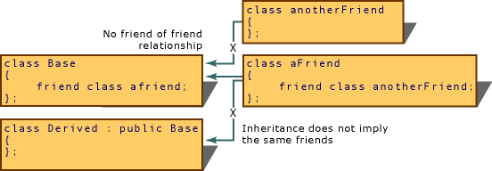

# friend (C++)
In some circumstances, it is more convenient to grant member-level access to functions that are not members of a class or to all members in a separate class. Only the class implementer can declare who its friends are. A function or class cannot declare itself as a friend of any class. In a class definition, use the <CodeContentPlaceHolder>12\</CodeContentPlaceHolder> keyword and the name of a non-member function or other class to grant it access to the private and protected members of your class.         In a template definition, a type parameter can be declared as a friend.  
  
## Syntax  
  
<CodeContentPlaceHolder>0\</CodeContentPlaceHolder>  
## Friend declarations  
 If you declare a friend function that was not previously declared, that function is exported to the enclosing nonclass scope.  
  
 Functions declared in a friend declaration are treated as if they had been declared using the <CodeContentPlaceHolder>13\</CodeContentPlaceHolder> keyword. (For more information about <CodeContentPlaceHolder>14\</CodeContentPlaceHolder>, see [Static Storage-Class Specifiers](assetId:///3ba9289a-a412-4a17-b319-ceb2c087df48).)  
  
 Although functions with global scope can be declared as friends prior to their prototypes, member functions cannot be declared as friends before the appearance of their complete class declaration. The following code shows why this fails:  
  
<CodeContentPlaceHolder>1\</CodeContentPlaceHolder>  
 The preceding example enters the class name <CodeContentPlaceHolder>15\</CodeContentPlaceHolder> into scope, but the complete declaration — specifically, the portion that declares the function <CodeContentPlaceHolder>16\</CodeContentPlaceHolder> — is not known. Therefore, the <CodeContentPlaceHolder>17\</CodeContentPlaceHolder> declaration in class <CodeContentPlaceHolder>18\</CodeContentPlaceHolder> generates an error.  
  
 Starting in C++11, there are two forms of friend declarations for a class:  
  
<CodeContentPlaceHolder>2\</CodeContentPlaceHolder>  
 The first form introduces a new class F if no existing class by that name was found in the innermost namespace.  **C++11**: The second form does not introduce a new class; it can be used when the class has already been declared, and it must be used when declaring a template type parameter or a typedef as a friend.  
  
 Use <CodeContentPlaceHolder>19\</CodeContentPlaceHolder> when the referenced type has not yet been declared:  
  
<CodeContentPlaceHolder>3\</CodeContentPlaceHolder>  
<CodeContentPlaceHolder>4\</CodeContentPlaceHolder>  
 In the following example, <CodeContentPlaceHolder>20\</CodeContentPlaceHolder> refers to the <CodeContentPlaceHolder>21\</CodeContentPlaceHolder> class that is declared outside the scope of NS.  
  
<CodeContentPlaceHolder>5\</CodeContentPlaceHolder>  
 Use <CodeContentPlaceHolder>22\</CodeContentPlaceHolder> to declare a template parameter as a friend:  
  
<CodeContentPlaceHolder>6\</CodeContentPlaceHolder>  
 Use <CodeContentPlaceHolder>23\</CodeContentPlaceHolder> to declare a typedef as friend:  
  
<CodeContentPlaceHolder>7\</CodeContentPlaceHolder>  
 To declare two classes that are friends of one another, the entire second class must be specified as a friend of the first class. The reason for this restriction is that the compiler has enough information to declare individual friend functions only at the point where the second class is declared.  
  
> [!NOTE]
>  Although the entire second class must be a friend to the first class, you can select which functions in the first class will be friends of the second class.  
  
## friend functions  
 A <CodeContentPlaceHolder>24\</CodeContentPlaceHolder> function is a function that is not a member of a class but has access to the class's private and protected members. Friend functions are not considered class members; they are normal external functions that are given special access privileges. Friends are not in the class's scope, and they are not called using the member-selection operators (**.** and –**>**) unless they are members of another class. A <CodeContentPlaceHolder>25\</CodeContentPlaceHolder> function is declared by the class that is granting access. The <CodeContentPlaceHolder>26\</CodeContentPlaceHolder> declaration can be placed anywhere in the class declaration. It is not affected by the access control keywords.  
  
 The following example shows a <CodeContentPlaceHolder>27\</CodeContentPlaceHolder> class and a friend function, <CodeContentPlaceHolder>28\</CodeContentPlaceHolder>. The <CodeContentPlaceHolder>29\</CodeContentPlaceHolder> function has access to the private data member of the <CodeContentPlaceHolder>30\</CodeContentPlaceHolder> object it receives as a parameter.  
  
<CodeContentPlaceHolder>8\</CodeContentPlaceHolder>  
## Class members as friends  
 Class member functions can be declared as friends in other classes. Consider the following example:  
  
<CodeContentPlaceHolder>9\</CodeContentPlaceHolder>  
 In the preceding example, only the function <CodeContentPlaceHolder>31\</CodeContentPlaceHolder> is granted friend access to class <CodeContentPlaceHolder>32\</CodeContentPlaceHolder>. Therefore, access to the private member <CodeContentPlaceHolder>33\</CodeContentPlaceHolder> is correct in <CodeContentPlaceHolder>34\</CodeContentPlaceHolder> of class <CodeContentPlaceHolder>35\</CodeContentPlaceHolder> but not in <CodeContentPlaceHolder>36\</CodeContentPlaceHolder>.  
  
 A <CodeContentPlaceHolder>37\</CodeContentPlaceHolder> class is a class all of whose member functions are friend functions of a class, that is, whose member functions have access to the other class's private and protected members. Suppose the <CodeContentPlaceHolder>38\</CodeContentPlaceHolder> declaration in class <CodeContentPlaceHolder>39\</CodeContentPlaceHolder> had been:  
  
<CodeContentPlaceHolder>10\</CodeContentPlaceHolder>  
 In that case, all member functions in class <CodeContentPlaceHolder>40\</CodeContentPlaceHolder> would have been granted friend access to class <CodeContentPlaceHolder>41\</CodeContentPlaceHolder>. The following code is an example of a friend class:  
  
<CodeContentPlaceHolder>11\</CodeContentPlaceHolder>  
 Friendship is not mutual unless explicitly specified as such. In the above example, member functions of <CodeContentPlaceHolder>42\</CodeContentPlaceHolder> cannot access the private members of <CodeContentPlaceHolder>43\</CodeContentPlaceHolder>.  
  
 A managed type cannot have any friend functions, friend classes, or friend interfaces.  
  
 Friendship is not inherited, meaning that classes derived from <CodeContentPlaceHolder>44\</CodeContentPlaceHolder> cannot access <CodeContentPlaceHolder>45\</CodeContentPlaceHolder>'s private members. Friendship is not transitive, so classes that are friends of <CodeContentPlaceHolder>46\</CodeContentPlaceHolder> cannot access <CodeContentPlaceHolder>47\</CodeContentPlaceHolder>'s private members.  
  
 The following figure shows four class declarations: <CodeContentPlaceHolder>48\</CodeContentPlaceHolder>, <CodeContentPlaceHolder>49\</CodeContentPlaceHolder>, <CodeContentPlaceHolder>50\</CodeContentPlaceHolder>, and <CodeContentPlaceHolder>51\</CodeContentPlaceHolder>. Only class <CodeContentPlaceHolder>52\</CodeContentPlaceHolder> has direct access to the private members of <CodeContentPlaceHolder>53\</CodeContentPlaceHolder> (and to any members <CodeContentPlaceHolder>54\</CodeContentPlaceHolder> might have inherited).  
  
   
Implications of friend Relationship  
  
## Inline friend definitions  
 Friend functions can be defined inside class declarations. These functions are inline functions, and like member inline functions they behave as though they were defined immediately after all class members have been seen but before the class scope is closed (the end of the class declaration).  
  
 Friend functions defined inside class declarations are not considered in the scope of the enclosing class; they are in file scope.  
  
## See Also  
 [Keywords](../vs140/keywords--c---.md)