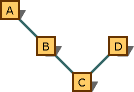

# Function Overloading
C++ allows specification of more than one function of the same name in the same scope. These are called overloaded functions and are described in detail in Overloading. Overloaded functions enable programmers to supply different semantics for a function, depending on the types and number of arguments.  
  
 For example, a **print** function that takes a string (or **char \***) argument performs very different tasks than one that takes an argument of type **double**. Overloading permits uniform naming and prevents programmers from having to invent names such as <CodeContentPlaceHolder>15\</CodeContentPlaceHolder> or <CodeContentPlaceHolder>16\</CodeContentPlaceHolder>. The following table shows what parts of a function declaration C++ uses to differentiate between groups of functions with the same name in the same scope.  
  
### Overloading Considerations  
  
|Function Declaration Element|Used for Overloading?|  
|----------------------------------|---------------------------|  
|Function return type|No|  
|Number of arguments|Yes|  
|Type of arguments|Yes|  
|Presence or absence of ellipsis|Yes|  
|Use of <CodeContentPlaceHolder>17\</CodeContentPlaceHolder> names|No|  
|Unspecified array bounds|No|  
|**const** or <CodeContentPlaceHolder>18\</CodeContentPlaceHolder> (see below)|Yes|  
  
 Although functions can be distinguished on the basis of return type, they cannot be overloaded on this basis.  <CodeContentPlaceHolder>19\</CodeContentPlaceHolder> or <CodeContentPlaceHolder>20\</CodeContentPlaceHolder> are only used as a basis for overloading if they are used in a class to apply to the **this** pointer for the class, not the function's return type.  In other words, overloading applies only if the **const** or <CodeContentPlaceHolder>21\</CodeContentPlaceHolder> keyword follows the function's argument list in the declaration.  
  
## Example  
 The following example illustrates how overloading can be used.  
  
<CodeContentPlaceHolder>0\</CodeContentPlaceHolder>  
 The preceding code shows overloading of the <CodeContentPlaceHolder>22\</CodeContentPlaceHolder> function in file scope.  
  
 The default argument is not considered part of the function type. Therefore, it is not used in selecting overloaded functions. Two functions that differ only in their default arguments are considered multiple definitions rather than overloaded functions.  
  
 Default arguments cannot be supplied for overloaded operators.  
  
 For restrictions on overloading and information on how overloading affects other elements of C++, see [Overloading](../vs140/overloading---c---.md).  
  
## Argument Matching  
 Overloaded functions are selected for the best match of function declarations in the current scope to the arguments supplied in the function call. If a suitable function is found, that function is called. "Suitable" in this context means one of the following:  
  
-   An exact match was found.  
  
-   A trivial conversion was performed.  
  
-   An integral promotion was performed.  
  
-   A standard conversion to the desired argument type exists.  
  
-   A user-defined conversion (either conversion operator or constructor) to the desired argument type exists.  
  
-   Arguments represented by an ellipsis were found.  
  
 The compiler creates a set of candidate functions for each argument. Candidate functions are functions in which the actual argument in that position can be converted to the type of the formal argument.  
  
 A set of "best matching functions" is built for each argument, and the selected function is the intersection of all the sets. If the intersection contains more than one function, the overloading is ambiguous and generates an error. The function that is eventually selected is always a better match than every other function in the group for at least one argument. If this is not the case (if there is no clear winner), the function call generates an error.  
  
 Consider the following declarations (the functions are marked <CodeContentPlaceHolder>23\</CodeContentPlaceHolder>, <CodeContentPlaceHolder>24\</CodeContentPlaceHolder>, and <CodeContentPlaceHolder>25\</CodeContentPlaceHolder>, for identification in the following discussion):  
  
<CodeContentPlaceHolder>1\</CodeContentPlaceHolder>  
 Consider the following statement:  
  
<CodeContentPlaceHolder>2\</CodeContentPlaceHolder>  
 The preceding statement builds two sets:  
  
|Set 1: Candidate Functions That Have First Argument of Type Fraction|Set 2: Candidate Functions Whose Second Argument Can Be Converted to Type int|  
|--------------------------------------------------------------------------|-----------------------------------------------------------------------------------|  
|Variant 1|Variant 1 (<CodeContentPlaceHolder>26\</CodeContentPlaceHolder> can be converted to <CodeContentPlaceHolder>27\</CodeContentPlaceHolder> using a standard conversion)|  
|Variant 3||  
  
 Functions in Set 2 are functions for which there are implicit conversions from actual parameter type to formal parameter type, and among such functions there is a function for which the "cost" of converting the actual parameter type to its formal parameter type is the smallest.  
  
 The intersection of these two sets is Variant 1. An example of an ambiguous function call is:  
  
<CodeContentPlaceHolder>3\</CodeContentPlaceHolder>  
 The preceding function call builds the following sets:  
  
|Set 1: Candidate Functions That Have First Argument of Type int|Set 2: Candidate Functions That Have Second Argument of Type int|  
|---------------------------------------------------------------------|----------------------------------------------------------------------|  
|Variant 2 (<CodeContentPlaceHolder>28\</CodeContentPlaceHolder> can be converted to <CodeContentPlaceHolder>29\</CodeContentPlaceHolder> using a standard conversion)|Variant 1 (<CodeContentPlaceHolder>30\</CodeContentPlaceHolder> can be converted to <CodeContentPlaceHolder>31\</CodeContentPlaceHolder> using a standard conversion)|  
  
 Note that the intersection between these two sets is empty. Therefore, the compiler generates an error message.  
  
 For argument matching, a function with *n* default arguments is treated as *n*+1 separate functions, each with a different number of arguments.  
  
 The ellipsis (...) acts as a wildcard; it matches any actual argument. This can lead to many ambiguous sets, if you do not design your overloaded function sets with extreme care.  
  
> [!NOTE]
>  Ambiguity of overloaded functions cannot be determined until a function call is encountered. At that point, the sets are built for each argument in the function call, and you can determine whether an unambiguous overload exists. This means that ambiguities can remain in your code until they are evoked by a particular function call.  
  
## Argument Type Differences  
 Overloaded functions differentiate between argument types that take different initializers. Therefore, an argument of a given type and a reference to that type are considered the same for the purposes of overloading. They are considered the same because they take the same initializers. For example, <CodeContentPlaceHolder>32\</CodeContentPlaceHolder> is considered the same as <CodeContentPlaceHolder>33\</CodeContentPlaceHolder>. Declaring two such functions causes an error.  
  
 For the same reason, function arguments of a type modified by **const** or <CodeContentPlaceHolder>34\</CodeContentPlaceHolder> are not treated differently than the base type for the purposes of overloading.  
  
 However, the function overloading mechanism can distinguish between references that are qualified by **const** and <CodeContentPlaceHolder>35\</CodeContentPlaceHolder> and references to the base type. This makes code such as the following possible:  
  
<CodeContentPlaceHolder>4\</CodeContentPlaceHolder>  
### Output  
  
<CodeContentPlaceHolder>5\</CodeContentPlaceHolder>  
 Pointers to **const** and <CodeContentPlaceHolder>36\</CodeContentPlaceHolder> objects are also considered different from pointers to the base type for the purposes of overloading.  
  
## Argument matching and conversions  
 When the compiler tries to match actual arguments against the arguments in function declarations, it can supply standard or user-defined conversions to obtain the correct type if no exact match can be found. The application of conversions is subject to these rules:  
  
-   Sequences of conversions that contain more than one user-defined conversion are not considered.  
  
-   Sequences of conversions that can be shortened by removing intermediate conversions are not considered.  
  
 The resultant sequence of conversions, if any, is called the best matching sequence. There are several ways to convert an object of type <CodeContentPlaceHolder>37\</CodeContentPlaceHolder> to type <CodeContentPlaceHolder>38\</CodeContentPlaceHolder>using standard conversions (described in [Standard Conversions](../vs140/standard-conversions.md)):  
  
-   Convert from <CodeContentPlaceHolder>39\</CodeContentPlaceHolder> to <CodeContentPlaceHolder>40\</CodeContentPlaceHolder> and then from <CodeContentPlaceHolder>41\</CodeContentPlaceHolder> to <CodeContentPlaceHolder>42\</CodeContentPlaceHolder>.  
  
-   Convert from <CodeContentPlaceHolder>43\</CodeContentPlaceHolder> to <CodeContentPlaceHolder>44\</CodeContentPlaceHolder>.  
  
 The first sequence, although it achieves the desired goal, is not the best matching sequence — a shorter sequence exists.  
  
 The following table shows a group of conversions, called trivial conversions, that have a limited effect on determining which sequence is the best matching. The instances in which trivial conversions affect choice of sequence are discussed in the list following the table.  
  
### Trivial Conversions  
  
|Convert from Type|Convert to Type|  
|-----------------------|---------------------|  
|*type-name*|*type-name* **&**|  
|*type-name* **&**|*type-name*|  
|*type-name* **[ ]**|*type-name\**|  
|*type-name* **(** *argument-list* **)**|**(** *\*type-name* **) (** *argument-list* **)**|  
|*type-name*|**const** *type-name*|  
|*type-name*|<CodeContentPlaceHolder>45\</CodeContentPlaceHolder> *type-name*|  
|*type-name\**|**const** *type-name\**|  
|*type-name\**|<CodeContentPlaceHolder>46\</CodeContentPlaceHolder> *type-name\**|  
  
 The sequence in which conversions are attempted is as follows:  
  
1.  Exact match. An exact match between the types with which the function is called and the types declared in the function prototype is always the best match. Sequences of trivial conversions are classified as exact matches. However, sequences that do not make any of these conversions are considered better than sequences that convert:  
  
    -   From pointer, to pointer to **const** (<CodeContentPlaceHolder>47\</CodeContentPlaceHolder> **\*** to **const** <CodeContentPlaceHolder>48\</CodeContentPlaceHolder> **\***).  
  
    -   From pointer, to pointer to <CodeContentPlaceHolder>49\</CodeContentPlaceHolder> (<CodeContentPlaceHolder>50\</CodeContentPlaceHolder> **\*** to <CodeContentPlaceHolder>51\</CodeContentPlaceHolder> <CodeContentPlaceHolder>52\</CodeContentPlaceHolder> **\***).  
  
    -   From reference, to reference to **const** (<CodeContentPlaceHolder>53\</CodeContentPlaceHolder> **&** to **const** <CodeContentPlaceHolder>54\</CodeContentPlaceHolder> **&**).  
  
    -   From reference, to reference to <CodeContentPlaceHolder>55\</CodeContentPlaceHolder> (<CodeContentPlaceHolder>56\</CodeContentPlaceHolder> **&** to <CodeContentPlaceHolder>57\</CodeContentPlaceHolder> <CodeContentPlaceHolder>58\</CodeContentPlaceHolder> **&**).  
  
2.  Match using promotions. Any sequence not classified as an exact match that contains only integral promotions, conversions from **float** to **double**, and trivial conversions is classified as a match using promotions. Although not as good a match as any exact match, a match using promotions is better than a match using standard conversions.  
  
3.  Match using standard conversions. Any sequence not classified as an exact match or a match using promotions that contains only standard conversions and trivial conversions is classified as a match using standard conversions. Within this category, the following rules are applied:  
  
    -   Conversion from a pointer to a derived class, to a pointer to a direct or indirect base class is preferable to converting to **void \*** or **const void \***.  
  
    -   Conversion from a pointer to a derived class, to a pointer to a base class produces a better match the closer the base class is to a direct base class. Suppose the class hierarchy is as shown in the following figure.  
  
   
Graph Illustrating Preferred Conversions  
  
 Conversion from type <CodeContentPlaceHolder>59\</CodeContentPlaceHolder> to type <CodeContentPlaceHolder>60\</CodeContentPlaceHolder> is preferable to conversion from type <CodeContentPlaceHolder>61\</CodeContentPlaceHolder> to type <CodeContentPlaceHolder>62\</CodeContentPlaceHolder>. Similarly, conversion from type <CodeContentPlaceHolder>63\</CodeContentPlaceHolder> to type <CodeContentPlaceHolder>64\</CodeContentPlaceHolder> is preferable to conversion from type <CodeContentPlaceHolder>65\</CodeContentPlaceHolder> to type <CodeContentPlaceHolder>66\</CodeContentPlaceHolder>.  
  
 This same rule applies to reference conversions. Conversion from type <CodeContentPlaceHolder>67\</CodeContentPlaceHolder> to type <CodeContentPlaceHolder>68\</CodeContentPlaceHolder> is preferable to conversion from type <CodeContentPlaceHolder>69\</CodeContentPlaceHolder> to type <CodeContentPlaceHolder>70\</CodeContentPlaceHolder>, and so on.  
  
 This same rule applies to pointer-to-member conversions. Conversion from type <CodeContentPlaceHolder>71\</CodeContentPlaceHolder> to type <CodeContentPlaceHolder>72\</CodeContentPlaceHolder> is preferable to conversion from type <CodeContentPlaceHolder>73\</CodeContentPlaceHolder> to type <CodeContentPlaceHolder>74\</CodeContentPlaceHolder>, and so on (where <CodeContentPlaceHolder>75\</CodeContentPlaceHolder> is the type of the member).  
  
 The preceding rule applies only along a given path of derivation. Consider the graph shown in the following figure.  
  
   
Multiple-Inheritance Graph Illustrating Preferred Conversions  
  
 Conversion from type <CodeContentPlaceHolder>76\</CodeContentPlaceHolder> to type <CodeContentPlaceHolder>77\</CodeContentPlaceHolder> is preferable to conversion from type <CodeContentPlaceHolder>78\</CodeContentPlaceHolder> to type <CodeContentPlaceHolder>79\</CodeContentPlaceHolder>. The reason is that they are on the same path, and <CodeContentPlaceHolder>80\</CodeContentPlaceHolder> is closer. However, conversion from type <CodeContentPlaceHolder>81\</CodeContentPlaceHolder> to type <CodeContentPlaceHolder>82\</CodeContentPlaceHolder> is not preferable to conversion to type <CodeContentPlaceHolder>83\</CodeContentPlaceHolder>; there is no preference because the conversions follow different paths.  
  
1.  Match with user-defined conversions. This sequence cannot be classified as an exact match, a match using promotions, or a match using standard conversions. The sequence must contain only user-defined conversions, standard conversions, or trivial conversions to be classified as a match with user-defined conversions. A match with user-defined conversions is considered a better match than a match with an ellipsis but not as good a match as a match with standard conversions.  
  
2.  Match with an ellipsis. Any sequence that matches an ellipsis in the declaration is classified as a match with an ellipsis. This is considered the weakest match.  
  
 User-defined conversions are applied if no built-in promotion or conversion exists. These conversions are selected on the basis of the type of the argument being matched. Consider the following code:  
  
<CodeContentPlaceHolder>6\</CodeContentPlaceHolder>  
 The available user-defined conversions for class <CodeContentPlaceHolder>84\</CodeContentPlaceHolder> are from type <CodeContentPlaceHolder>85\</CodeContentPlaceHolder> and type **long**. Therefore, the compiler considers conversions for the type of the object being matched: <CodeContentPlaceHolder>86\</CodeContentPlaceHolder>. A conversion to <CodeContentPlaceHolder>87\</CodeContentPlaceHolder> exists, and it is selected.  
  
 During the process of matching arguments, standard conversions can be applied to both the argument and the result of a user-defined conversion. Therefore, the following code works:  
  
<CodeContentPlaceHolder>7\</CodeContentPlaceHolder>  
 In the preceding example, the user-defined conversion, **operator long**, is invoked to convert <CodeContentPlaceHolder>88\</CodeContentPlaceHolder> to type **long**. If no user-defined conversion to type **long** had been defined, the conversion would have proceeded as follows: Type <CodeContentPlaceHolder>89\</CodeContentPlaceHolder> would have been converted to type <CodeContentPlaceHolder>90\</CodeContentPlaceHolder> using the user-defined conversion. Then the standard conversion from type <CodeContentPlaceHolder>91\</CodeContentPlaceHolder> to type **long** would have been applied to match the argument in the declaration.  
  
 If any user-defined conversions are required to match an argument, the standard conversions are not used when evaluating the best match. This is true even if more than one candidate function requires a user-defined conversion; in such a case, the functions are considered equal. For example:  
  
<CodeContentPlaceHolder>8\</CodeContentPlaceHolder>  
 Both versions of <CodeContentPlaceHolder>92\</CodeContentPlaceHolder> require a user-defined conversion to convert type <CodeContentPlaceHolder>93\</CodeContentPlaceHolder> to the class type argument. The possible conversions are:  
  
-   Convert from type <CodeContentPlaceHolder>94\</CodeContentPlaceHolder> to type <CodeContentPlaceHolder>95\</CodeContentPlaceHolder> (a user-defined conversion).  
  
-   Convert from type <CodeContentPlaceHolder>96\</CodeContentPlaceHolder> to type **long**; then convert to type <CodeContentPlaceHolder>97\</CodeContentPlaceHolder> (a two-step conversion).  
  
 Even though the second of these requires a standard conversion, as well as the user-defined conversion, the two conversions are still considered equal.  
  
> [!NOTE]
>  User-defined conversions are considered conversion by construction or conversion by initialization (conversion function). Both methods are considered equal when considering the best match.  
  
## Argument matching and the this pointer  
 Class member functions are treated differently, depending on whether they are declared as <CodeContentPlaceHolder>98\</CodeContentPlaceHolder>. Because nonstatic functions have an implicit argument that supplies the <CodeContentPlaceHolder>99\</CodeContentPlaceHolder> pointer, nonstatic functions are considered to have one more argument than static functions; otherwise, they are declared identically.  
  
 These nonstatic member functions require that the implied <CodeContentPlaceHolder>100\</CodeContentPlaceHolder> pointer match the object type through which the function is being called, or, for overloaded operators, they require that the first argument match the object on which the operator is being applied. (For more information about overloaded operators, see [Overloaded Operators](../vs140/operator-overloading.md).)  
  
 Unlike other arguments in overloaded functions, no temporary objects are introduced and no conversions are attempted when trying to match the <CodeContentPlaceHolder>101\</CodeContentPlaceHolder> pointer argument.  
  
 When the <CodeContentPlaceHolder>102\</CodeContentPlaceHolder> member-selection operator is used to access a member function, the <CodeContentPlaceHolder>103\</CodeContentPlaceHolder> pointer argument has a type of <CodeContentPlaceHolder>104\</CodeContentPlaceHolder> <CodeContentPlaceHolder>105\</CodeContentPlaceHolder>. If the members are declared as <CodeContentPlaceHolder>106\</CodeContentPlaceHolder> or <CodeContentPlaceHolder>107\</CodeContentPlaceHolder>, the types are <CodeContentPlaceHolder>108\</CodeContentPlaceHolder> <CodeContentPlaceHolder>109\</CodeContentPlaceHolder> and <CodeContentPlaceHolder>110\</CodeContentPlaceHolder> <CodeContentPlaceHolder>111\</CodeContentPlaceHolder> <CodeContentPlaceHolder>112\</CodeContentPlaceHolder>, respectively.  
  
 The <CodeContentPlaceHolder>113\</CodeContentPlaceHolder> member-selection operator works exactly the same way, except that an implicit <CodeContentPlaceHolder>114\</CodeContentPlaceHolder> (address-of) operator is prefixed to the object name. The following example shows how this works:  
  
<CodeContentPlaceHolder>9\</CodeContentPlaceHolder>  
 The left operand of the <CodeContentPlaceHolder>115\</CodeContentPlaceHolder> and <CodeContentPlaceHolder>116\</CodeContentPlaceHolder> (pointer to member) operators are treated the same way as the <CodeContentPlaceHolder>117\</CodeContentPlaceHolder> and <CodeContentPlaceHolder>118\</CodeContentPlaceHolder> (member-selection) operators with respect to argument matching.  
  
## Restrictions  
 Several restrictions govern an acceptable set of overloaded functions:  
  
-   Any two functions in a set of overloaded functions must have different argument lists.  
  
-   Overloading functions with argument lists of the same types, based on return type alone, is an error.  
  
     **Microsoft Specific**  
  
 You can overload **operator new** solely on the basis of return type — specifically, on the basis of the memory-model modifier specified.  
  
## END Microsoft Specific  
  
-   Member functions cannot be overloaded solely on the basis of one being static and the other nonstatic.  
  
-   <CodeContentPlaceHolder>119\</CodeContentPlaceHolder> declarations do not define new types; they introduce synonyms for existing types. They do not affect the overloading mechanism. Consider the following code:  
  
<CodeContentPlaceHolder>10\</CodeContentPlaceHolder>  
     The preceding two functions have identical argument lists. <CodeContentPlaceHolder>120\</CodeContentPlaceHolder> is a synonym for type **char \***. In member scope, this code generates an error.  
  
-   Enumerated types are distinct types and can be used to distinguish between overloaded functions.  
  
-   The types "array of " and "pointer to" are considered identical for the purposes of distinguishing between overloaded functions. This is true only for singly dimensioned arrays. Therefore, the following overloaded functions conflict and generate an error message:  
  
<CodeContentPlaceHolder>11\</CodeContentPlaceHolder>  
     For multiply dimensioned arrays, the second and all succeeding dimensions are considered part of the type. Therefore, they are used in distinguishing between overloaded functions:  
  
<CodeContentPlaceHolder>12\</CodeContentPlaceHolder>  
## Declaration matching  
 Any two function declarations of the same name in the same scope can refer to the same function, or to two discrete functions that are overloaded. If the argument lists of the declarations contain arguments of equivalent types (as described in the previous section), the function declarations refer to the same function. Otherwise, they refer to two different functions that are selected using overloading.  
  
 Class scope is strictly observed; therefore, a function declared in a base class is not in the same scope as a function declared in a derived class. If a function in a derived class is declared with the same name as a function in the base class, the derived-class function hides the base-class function instead of causing overloading.  
  
 Block scope is strictly observed; therefore, a function declared in file scope is not in the same scope as a function declared locally. If a locally declared function has the same name as a function declared in file scope, the locally declared function hides the file-scoped function instead of causing overloading. For example:  
  
<CodeContentPlaceHolder>13\</CodeContentPlaceHolder>  
 The preceding code shows two definitions from the function <CodeContentPlaceHolder>121\</CodeContentPlaceHolder>. The definition that takes an argument of type <CodeContentPlaceHolder>122\</CodeContentPlaceHolder> is local to <CodeContentPlaceHolder>123\</CodeContentPlaceHolder> because of the <CodeContentPlaceHolder>124\</CodeContentPlaceHolder> statement. Therefore, the definition that takes an argument of type <CodeContentPlaceHolder>125\</CodeContentPlaceHolder> is hidden, and the first call to <CodeContentPlaceHolder>126\</CodeContentPlaceHolder> is in error.  
  
 For overloaded member functions, different versions of the function can be given different access privileges. They are still considered to be in the scope of the enclosing class and thus are overloaded functions. Consider the following code, in which the member function <CodeContentPlaceHolder>127\</CodeContentPlaceHolder> is overloaded; one version is public, the other, private.  
  
 The intent of this sample is to provide an <CodeContentPlaceHolder>128\</CodeContentPlaceHolder> class in which a correct password is required to perform deposits. This is accomplished using overloading.  
  
 Note that the call to <CodeContentPlaceHolder>129\</CodeContentPlaceHolder> in <CodeContentPlaceHolder>130\</CodeContentPlaceHolder> calls the private member function. This call is correct because <CodeContentPlaceHolder>131\</CodeContentPlaceHolder> is a member function and therefore has access to the private members of the class.  
  
<CodeContentPlaceHolder>14\</CodeContentPlaceHolder>  
## See Also  
 [Functions (C++)](../vs140/functions--c---.md)