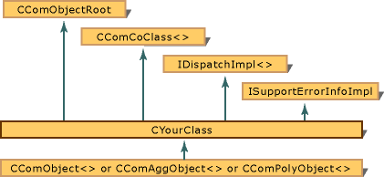

# Fundamentals of ATL COM Objects
The following illustration depicts the relationship among the classes and interfaces that are used to define an ATL COM object.  
  
   
  
> [!NOTE]
>  This diagram shows that <CodeContentPlaceHolder>0\</CodeContentPlaceHolder> is derived from <CodeContentPlaceHolder>1\</CodeContentPlaceHolder> whereas <CodeContentPlaceHolder>2\</CodeContentPlaceHolder> and <CodeContentPlaceHolder>3\</CodeContentPlaceHolder> include <CodeContentPlaceHolder>4\</CodeContentPlaceHolder> as a member variable.  
  
 There are three ways to define an ATL COM object. The standard option is to use the <CodeContentPlaceHolder>5\</CodeContentPlaceHolder> class which is derived from <CodeContentPlaceHolder>6\</CodeContentPlaceHolder>. The second option is to create an aggregated object by using the <CodeContentPlaceHolder>7\</CodeContentPlaceHolder> class. The third option is to use the <CodeContentPlaceHolder>8\</CodeContentPlaceHolder> class. <CodeContentPlaceHolder>9\</CodeContentPlaceHolder> acts as a hybrid: it can function as a <CodeContentPlaceHolder>10\</CodeContentPlaceHolder> class or as a <CodeContentPlaceHolder>11\</CodeContentPlaceHolder> class, depending on how it is first created. For more information about how to use the <CodeContentPlaceHolder>12\</CodeContentPlaceHolder> class, see [CComPolyObject Class](../vs140/ccompolyobject-class.md).  
  
 When you use standard ATL COM, you use two objects: an outer object and an inner object. External clients access the functionality of the inner object through the wrapper functions that are defined in the outer object. The outer object is of type <CodeContentPlaceHolder>13\</CodeContentPlaceHolder>.  
  
 When you use an aggregated object, the outer object does not provide wrappers for the functionality of the inner object. Instead, the outer object provides a pointer that is directly accessed by external clients. In this scenario, the outer object is of type <CodeContentPlaceHolder>14\</CodeContentPlaceHolder>. The inner object is a member variable of the outer object, and it is of type <CodeContentPlaceHolder>15\</CodeContentPlaceHolder>.  
  
 Because the client does not have to go through the outer object to interact with the inner object, aggregated objects are usually more efficient. Also, the outer object does not have to know the functionality of the aggregated object, given that the interface of the aggregated object is directly available to the client. However, not all objects can be aggregated. For an object to be aggregated, it needs to be designed with aggregation in mind.  
  
 ATL implements [IUnknown](http://msdn.microsoft.com/library/windows/desktop/ms680509) in two phases:  
  
-   [CComObject](../vs140/ccomobject-class.md), [CComAggObject](../vs140/ccomaggobject-class.md), or [CComPolyObject](../vs140/ccompolyobject-class.md) implements the **IUnknown** methods.  
  
-   [CComObjectRoot](../vs140/ccomobjectroot-class.md) or [CComObjectRootEx](../vs140/ccomobjectrootex-class.md) manages the reference count and outer pointers of **IUnknown**.  
  
 Other aspects of your ATL COM object are handled by other classes:  
  
-   [CComCoClass](../vs140/ccomcoclass-class.md) defines the object's default class factory and aggregation model.  
  
-   [IDispatchImpl](../vs140/idispatchimpl-class.md) provides a default implementation of the <CodeContentPlaceHolder>16\</CodeContentPlaceHolder> portion of any dual interfaces on the object.  
  
-   [ISupportErrorInfoImpl](../vs140/isupporterrorinfoimpl-class.md) implements the **ISupportErrorInfo** interface that ensures error information can be propagated up the call chain correctly.  
  
## In This Section  
 [Implementing CComObjectRootEx](../vs140/implementing-ccomobjectrootex.md)  
 Show example COM map entries for implementing <CodeContentPlaceHolder>17\</CodeContentPlaceHolder>.  
  
 [Implementing CComObject, CComAggObject, and CComPolyObject](../vs140/implementing-ccomobject--ccomaggobject--and-ccompolyobject.md)  
 Discusses how the **DECLARE_\*_AGGREGATABLE** macros affect the use of <CodeContentPlaceHolder>18\</CodeContentPlaceHolder>, <CodeContentPlaceHolder>19\</CodeContentPlaceHolder>, and <CodeContentPlaceHolder>20\</CodeContentPlaceHolder>.  
  
 [Supporting IDispatch and IErrorInfo](../vs140/supporting-idispatch-and-ierrorinfo.md)  
 Lists the ATL implementation classes to use for supporting the <CodeContentPlaceHolder>21\</CodeContentPlaceHolder> and **IErrorInfo** interfaces.  
  
 [Supporting IDispEventImpl](../vs140/supporting-idispeventimpl.md)  
 Discusses the steps to implement a connection point for your class.  
  
 [Changing the Default Class Factory and Aggregation Model](../vs140/changing-the-default-class-factory-and-aggregation-model.md)  
 Show what macros to use to change the default class factory and aggregation model.  
  
 [Creating an Aggregated Object](../vs140/creating-an-aggregated-object.md)  
 Lists the steps for creating an aggregated object.  
  
## Related Sections  
 [Creating an ATL Project](../vs140/creating-an-atl-project.md)  
 Provides information about creating an ATL COM object.  
  
 [ATL](../vs140/active-template-library--atl--concepts.md)  
 Provides links to conceptual topics on how to program using the Active Template Library.  
  
## See Also  
 [ATL](../vs140/active-template-library--atl--concepts.md)