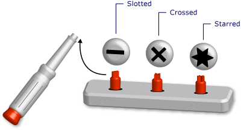

# Generic Types in Visual Basic (Visual Basic)
A *generic type* is a single programming element that adapts to perform the same functionality for a variety of data types. When you define a generic class or procedure, you do not have to define a separate version for each data type for which you might want to perform that functionality.  
  
 An analogy is a screwdriver set with removable heads. You inspect the screw you need to turn and select the correct head for that screw (slotted, crossed, starred). Once you insert the correct head in the screwdriver handle, you perform the exact same function with the screwdriver, namely turning the screw.  
  
   
Screwdriver set as a generic tool  
  
 When you define a generic type, you parameterize it with one or more data types. This allows the using code to tailor the data types to its requirements. Your code can declare several different programming elements from the generic element, each one acting on a different set of data types. But the declared elements all perform the identical logic, no matter what data types they are using.  
  
 For example, you might want to create and use a queue class that operates on a specific data type such as `String`. You can declare such a class from <xref:System.Collections.Generic.Queue`1*?displayProperty=fullName>, as the following example shows.  
  
 [!code[VbVbalrDataTypes#1](../vs140/codesnippet/VisualBasic/generic-types-in-visual-basic--visual-basic-_1.vb)]  
  
 You can now use `stringQ` to work exclusively with `String` values. Because `stringQ` is specific for `String` instead of being generalized for `Object` values, you do not have late binding or type conversion. This saves execution time and reduces run-time errors.  
  
 For more information on using a generic type, see [How to: Use a Generic Class](../vs140/how-to--use-a-generic-class--visual-basic-.md).  
  
## Example of a Generic Class  
 The following example shows a skeleton definition of a generic class.  
  
 [!code[VbVbalrDataTypes#2](../vs140/codesnippet/VisualBasic/generic-types-in-visual-basic--visual-basic-_2.vb)]  
  
 In the preceding skeleton, `t` is a *type parameter*, that is, a placeholder for a data type that you supply when you declare the class. Elsewhere in your code, you can declare various versions of `classHolder` by supplying various data types for `t`. The following example shows two such declarations.  
  
 [!code[VbVbalrDataTypes#3](../vs140/codesnippet/VisualBasic/generic-types-in-visual-basic--visual-basic-_3.vb)]  
  
 The preceding statements declare *constructed classes*, in which a specific type replaces the type parameter. This replacement is propagated throughout the code within the constructed class. The following example shows what the `processNewItem` procedure looks like in `integerClass`.  
  
 [!code[VbVbalrDataTypes#4](../vs140/codesnippet/VisualBasic/generic-types-in-visual-basic--visual-basic-_4.vb)]  
  
 For a more complete example, see [How to: Define a Class That Can Perform Identical Functions on Different Data Types](../vs140/a914adf8-e68f-4819-a6b1-200d1cf1c21c.md).  
  
## Eligible Programming Elements  
 You can define and use generic classes, structures, interfaces, procedures, and delegates. Note that the [!INCLUDE[dnprdnshort](../vs140/includes/dnprdnshort_md.md)] defines several generic classes, structures, and interfaces that represent commonly used generic elements. The <xref:System.Collections.Generic*?displayProperty=fullName> namespace provides dictionaries, lists, queues, and stacks. Before defining your own generic element, see if it is already available in <xref:System.Collections.Generic*?displayProperty=fullName>.  
  
 Procedures are not types, but you can define and use generic procedures. See [Generic Procedures in Visual Basic](../vs140/generic-procedures-in-visual-basic.md).  
  
## Advantages of Generic Types  
 A generic type serves as a basis for declaring several different programming elements, each of which operates on a specific data type. The alternatives to a generic type are:  
  
1.  A single type operating on the `Object` data type.  
  
2.  A set of *type-specific* versions of the type, each version individually coded and operating on one specific data type such as `String`, `Integer`, or a user-defined type such as `customer`.  
  
 A generic type has the following advantages over these alternatives:  
  
-   **Type Safety.** Generic types enforce compile-time type checking. Types based on `Object` accept any data type, and you must write code to check whether an input data type is acceptable. With generic types, the compiler can catch type mismatches before run time.  
  
-   **Performance.** Generic types do not have to *box* and *unbox* data, because each one is specialized for one data type. Operations based on `Object` must box input data types to convert them to `Object` and unbox data destined for output. Boxing and unboxing reduce performance.  
  
     Types based on `Object` are also late-bound, which means that accessing their members requires extra code at run time. This also reduces performance.  
  
-   **Code Consolidation.** The code in a generic type has to be defined only once. A set of type-specific versions of a type must replicate the same code in each version, with the only difference being the specific data type for that version. With generic types, the type-specific versions are all generated from the original generic type.  
  
-   **Code Reuse.** Code that does not depend on a particular data type can be reused with various data types if it is generic. You can often reuse it even with a data type that you did not originally predict.  
  
-   **IDE Support.** When you use a constructed type declared from a generic type, the integrated development environment (IDE) can give you more support while you are developing your code. For example, IntelliSense can show you the type-specific options for an argument to a constructor or method.  
  
-   **Generic Algorithms.** Abstract algorithms that are type-independent are good candidates for generic types. For example, a generic procedure that sorts items using the <xref:System.IComparable*> interface can be used with any data type that implements <xref:System.IComparable*>.  
  
## Constraints  
 Although the code in a generic type definition should be as type-independent as possible, you might need to require a certain capability of any data type supplied to your generic type. For example, if you want to compare two items for the purpose of sorting or collating, their data type must implement the <xref:System.IComparable*> interface. You can enforce this requirement by adding a *constraint* to the type parameter.  
  
### Example of a Constraint  
 The following example shows a skeleton definition of a class with a constraint that requires the type argument to implement <xref:System.IComparable*>.  
  
 [!code[VbVbalrDataTypes#5](../vs140/codesnippet/VisualBasic/generic-types-in-visual-basic--visual-basic-_5.vb)]  
  
 If subsequent code attempts to construct a class from `itemManager` supplying a type that does not implement <xref:System.IComparable*>, the compiler signals an error.  
  
### Types of Constraints  
 Your constraint can specify the following requirements in any combination:  
  
-   The type argument must implement one or more interfaces  
  
-   The type argument must be of the type of, or inherit from, at most one class  
  
-   The type argument must expose a parameterless constructor accessible to the code that creates objects from it  
  
-   The type argument must be a *reference type*, or it must be a *value type*  
  
 If you need to impose more than one requirement, you use a comma-separated *constraint list* inside braces (`{ }`). To require an accessible constructor, you include the [New (Visual Basic)](../vs140/new-operator--visual-basic-.md) keyword in the list. To require a reference type, you include the `Class` keyword; to require a value type, you include the `Structure` keyword.  
  
 For more information on constraints, see [Type List](../vs140/type-list--visual-basic-.md).  
  
### Example of Multiple Constraints  
 The following example shows a skeleton definition of a generic class with a constraint list on the type parameter. In the code that creates an instance of this class, the type argument must implement both the \<xref:System.IComparable*> and \<xref:System.IDisposable*> interfaces, be a reference type, and expose an accessible parameterless constructor.  
  
 [!code[VbVbalrDataTypes#6](../vs140/codesnippet/VisualBasic/generic-types-in-visual-basic--visual-basic-_6.vb)]  
  
## Important Terms  
 Generic types introduce and use the following terms:  
  
-   *Generic Type*. A definition of a class, structure, interface, procedure, or delegate for which you supply at least one data type when you declare it.  
  
-   *Type Parameter*. In a generic type definition, a placeholder for a data type you supply when you declare the type.  
  
-   *Type Argument*. A specific data type that replaces a type parameter when you declare a constructed type from a generic type.  
  
-   *Constraint*. A condition on a type parameter that restricts the type argument you can supply for it. A constraint can require that the type argument must implement a particular interface, be or inherit from a particular class, have an accessible parameterless constructor, or be a reference type or a value type. You can combine these constraints, but you can specify at most one class.  
  
-   *Constructed Type*. A class, structure, interface, procedure, or delegate declared from a generic type by supplying type arguments for its type parameters.  
  
## See Also  
 [Data Types in Visual Basic](../vs140/data-types-in-visual-basic.md)   
 [Type Characters](../vs140/type-characters--visual-basic-.md)   
 [Value Types and Reference Types](../vs140/value-types-and-reference-types.md)   
 [Type Conversions in Visual Basic](../vs140/type-conversions-in-visual-basic.md)   
 [Troubleshooting Data Types](../vs140/troubleshooting-data-types--visual-basic-.md)   
 [Data Type Summary (Visual Basic)](../vs140/data-type-summary--visual-basic-.md)   
 [Of](../vs140/of-clause--visual-basic-.md)   
 [As](../vs140/as-clause--visual-basic-.md)   
 [Object Data Type](../vs140/object-data-type.md)   
 [Covariance and Contravariance (C# and Visual Basic)](../vs140/covariance-and-contravariance--csharp-and-visual-basic-.md)   
 [Iterators (C# and Visual Basic)](../vs140/iterators--csharp-and-visual-basic-.md)