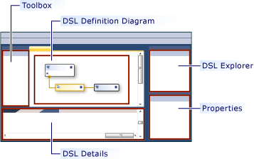
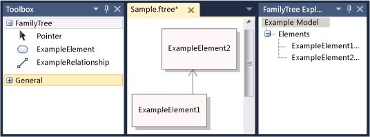
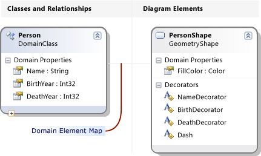
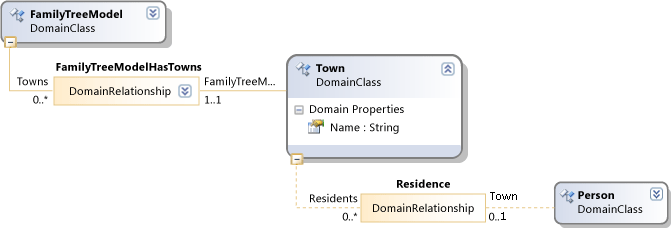
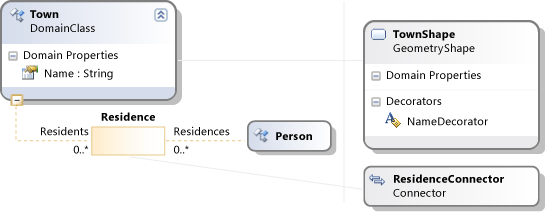

# Getting Started with Domain-Specific Languages
This topic explains the basic concepts in defining and using a domain-specific language (DSL) created with the Modeling SDK for Visual Studio.  
  
 If you are new to DSLs, we recommend that you work through the **DSL Tools Lab**, which you can find in this site: [Visualizaton and Modeling SDK](http://go.microsoft.com/fwlink/?LinkID=186128)  
  
## What can you do with a Domain-Specific Language?  
 A domain-specific language is a notation, usually graphical, that is designed to be used for a particular purpose. By contrast, languages such as UML are general-purpose. In a DSL, you can define the types of model element and their relationships, and how they are presented on the screen.  
  
 When you have designed a DSL, you can distribute it as part of a Visual Studio Integration Extension (VSIX) package. Users work with the DSL in [!INCLUDE[vsprvs](../vs140/includes/vsprvs_md.md)]:  
  
   
  
 The notation is only part of a DSL. Together with the notation, your VSIX package includes tools that users can apply to help them edit and generate material from their models.  
  
 One of the principal applications of DSLs is to generate program code, configuration files, and other artifacts. Especially in large projects and product lines, where several variants of a product will be created, generating many of the variable aspects from DSLs can provide a large increase in reliability and a very rapid response to requirements changes.  
  
 The rest of this overview is a walkthrough that introduces the basic operations of creating and using a domain-specific language in [!INCLUDE[vsprvs](../vs140/includes/vsprvs_md.md)].  
  
## Prerequisites  
 To define a DSL, you must have installed the following components:  
  
|||  
|-|-|  
|[!INCLUDE[vsprvs](../vs140/includes/vsprvs_md.md)]|[http://go.microsoft.com/fwlink/?LinkId=185579](http://go.microsoft.com/fwlink/?LinkId=185579)|  
|[!INCLUDE[vssdk_current_short](../vs140/includes/vssdk_current_short_md.md)]|[http://go.microsoft.com/fwlink/?LinkId=185580](http://go.microsoft.com/fwlink/?LinkId=185580)|  
|Modeling SDK for Visual Studio|[Download MSDK](http://www.microsoft.com/download/details.aspx?id=40754)|  
  
## Creating a DSL Solution  
 To create a new domain-specific language, you create a new [!INCLUDE[vsprvs](../vs140/includes/vsprvs_md.md)] solution by using the Domain-Specific Language project template.  
  
#### To create a DSL solution  
  
1.  On the **File** menu, point to **New**, and then click **Project**.  
  
2.  Under **Project types**, expand the **Other Project Types** node, and click **Extensibility**.  
  
3.  Click **Domain-Specific Language Designer**.  
  
       
  
4.  In the **Name** box, type **FamilyTree**. Click **OK**.  
  
     The **Domain-Specific Language Wizard** opens, and displays a list of template DSL solutions.  
  
     Click each template to see a description,  
  
     The templates are useful starting points. Each of them provides a complete working DSL, which you can edit to suit your needs. Ordinarily, you would choose the template nearest what you want to create.  
  
5.  For this walkthrough, choose the **Minimal Language** template.  
  
6.  Enter a file name extension for your DSL in the appropriate wizard page. This is the extension that files containing instances of your DSL will use.  
  
    -   Choose an extension that is not associated with any application in your computer, or in any computer where you want to install the DSL. For example, **docx** and **htm** would be unacceptable file name extensions.  
  
    -   The wizard will warn you if the extension that you have entered is being used as a DSL. Consider using a different file name extension. You can also reset the Visual Studio SDK Experimental instance to clear out old experimental designers. Click **Start**, click **All Programs**, **Microsoft Visual Studio 2010 SDK**, **Tools**, and then **Reset the Microsoft Visual Studio 2010 Experimental instance**.  
  
7.  Inspect the other pages and then click **Finish**.  
  
     A solution is generated that contains two projects. They are named Dsl and DslPackage. A diagram file opens that is named DslDefinition.dsl.  
  
    > [!NOTE]
    >  Most of the code that you can see in the folders in the two projects is generated from DslDefinition.dsl. For this reason, most modifications to your DSL are made in this file.  
  
 The user interface now resembles the following picture.  
  
   
  
 This solution defines a domain specific language. For more information, see [Overview of the DSL UI](../vs140/overview-of-the-domain-specific-language-tools-user-interface.md).  
  
## The important parts of the DSL solution  
 Notice the following aspects of the new solution.  
  
-   **Dsl\DslDefinition.dsl** This is the file that you see when you create a DSL solution. Almost all the code in the solution is generated from this file, and most of the changes that you make to a DSL definition are made here. For more information, see Working with the [DSL Definition Diagram](../vs140/working-with-the-dsl-definition-diagram.md).  
  
-   **Dsl project** This project contains code that defines the domain-specific language.  
  
-   **DslPackage project** This project contains code that allows instances of the DSL to be opened and edited in [!INCLUDE[vsprvs](../vs140/includes/vsprvs_md.md)].  
  
##  \<a name="Debugging">\</a> Running the DSL  
 You can run the DSL solution as soon as you have created it. Later, you can modify the DSL definition gradually, running the solution again after each change.  
  
#### To experiment with the DSL  
  
1.  Click **Transform All Templates** in the Solution Explorer toolbar. This regenerates most of the source code from DslDefinition.dsl.  
  
    > [!NOTE]
    >  Whenever you change DslDefinition.dsl, you must click **Transform All Templates** before you rebuild the solution. You can automate this step. For more information, see [How to Automate Transform All Templates](assetId:///b63cfe20-fe5e-47cc-9506-59b29bca768a).  
  
2.  Press F5, or on the **Debug** menu, click **Start Debugging**.  
  
     The DSL builds and is installed in the experimental instance of [!INCLUDE[vsprvs](../vs140/includes/vsprvs_md.md)].  
  
     An experimental instance of [!INCLUDE[vsprvs](../vs140/includes/vsprvs_md.md)] starts. The experimental instance takes its settings from a separate subtree of the registry, where [!INCLUDE[vsprvs](../vs140/includes/vsprvs_md.md)] extensions are registered for debugging purposes. Normal instances of [!INCLUDE[vsprvs](../vs140/includes/vsprvs_md.md)] do not have access to extensions registered there.  
  
3.  In the experimental instance of [!INCLUDE[vsprvs](../vs140/includes/vsprvs_md.md)], open the model file named **Test** from **Solution Explorer**.  
  
     \- or -  
  
     Right-click the Debugging project, point to **Add**, and then click **Item**. In the **Add Item** dialog box, select the file type of your DSL.  
  
     The model file opens as a blank diagram.  
  
     The toolbox opens and displays tools appropriate to the diagram type.  
  
4.  Use the tools to create shapes and connectors on the diagram.  
  
    1.  To create shapes, drag from the Example Shape tool onto the diagram.  
  
    2.  To connect two shapes, click the Example Connector tool, click the first shape, and then click the second shape.  
  
5.  Click the labels of the shapes to change them.  
  
 Your experimental [!INCLUDE[vsprvs](../vs140/includes/vsprvs_md.md)] will resemble the following example:  
  
   
  
### The Content of a Model  
 The content of a file that is an instance of a DSL is called a *model*. The model contains *model**elements* and *links* between the elements. The DSL definition specifies what types of model elements and links can exist in the model. For example, in a DSL created from the Minimal Language template, there is one type of model element, and one type of link.  
  
 The DSL definition can specify how the model appears on a diagram. You can choose from a variety of styles of shapes and connectors. You can specify that some shapes appear inside other shapes.  
  
 You can view a model as a tree in the **Explorer** view while you are editing a model. As you add shapes to the diagram, the model elements also appear in the explorer. The explorer can be used even if there is no diagram.  
  
 If you cannot see the Explorer in the debugging instance of [!INCLUDE[vsprvs](../vs140/includes/vsprvs_md.md)], on the **View** menu point to **Other Windows**, and then click *\<Your Language>* **Explorer**.  
  
### The API of your DSL  
 Your DSL generates an API that allows you to read and update models that are instances of the DSL. One application of the API is to generate text files from a model. For more information, see [Code Generation in a Visual Studio Project](../vs140/design-time-code-generation-by-using-t4-text-templates.md).  
  
 In the Debugging solution, open the template files with extension ".tt". These samples demonstrate how you can generate text from models, and allow you to test the API of your DSL. One of the samples is written in [!INCLUDE[vbprvb](../vs140/includes/vbprvb_md.md)], the other in [!INCLUDE[csprcs](../vs140/includes/csprcs_md.md)].  
  
 Under each template file is the file that it generates. Expand the template file in Solution Explorer, and open the generated file.  
  
 The template file contains a short segment of code that lists all the elements in the model.  
  
 The generated file contains the result.  
  
 When you change a model file, you will see corresponding changes in generated files after you regenerate the files.  
  
##### To regenerate text files after you change the model file  
  
1.  In the experimental instance of [!INCLUDE[vsprvs](../vs140/includes/vsprvs_md.md)], save the model file.  
  
2.  Make sure that the file name parameter in each .tt file refers to the model file that you are using for experiments. Save the .tt file.  
  
3.  Click **Transform All Templates** in the toolbar of **Solution Explorer**.  
  
     \- or -  
  
     Right-click the templates that you want to regenerate and then click **Run Custom Tool**.  
  
 You can add any number of text template files to a project. Each template generates one result file.  
  
> [!NOTE]
>  When you change the DSL definition, the sample text template code will not work, unless you update it.  
  
 For more information, see [Using Text Templates](../vs140/generating-code-from-a-domain-specific-language.md) and [Programming DSLs](../vs140/writing-code-to-customise-a-domain-specific-language.md).  
  
## Customizing the DSL  
 When you want to modify the DSL definition, close the experimental instance and update the definition in the main [!INCLUDE[vsprvs](../vs140/includes/vsprvs_md.md)] instance.  
  
> [!NOTE]
>  After you have modified the DSL definition, you might lose information in the test models that you have created by using earlier versions.  For example, the debugging solution contains a file that is named Sample, which contains some shapes and connectors. After you start to develop your DSL definition, they will not be visible, and they will be lost when you save the file.  
  
 You can make a wide variety of extensions to your DSL. The following examples will give you an impression of the possibilities.  
  
 After each change, save the DSL definition, click **Transform All Templates** in **Solution Explorer**, and then press **F5** to experiment with the changed DSL.  
  
### Rename the Types and Tools  
 Rename the existing domain classes and relationships. For example, starting from a Dsl Definition created from the Minimal Language template, you could perform the following renaming operations, to make the DSL represent family trees.  
  
##### To rename domain classes, relationships and tools  
  
1.  In the DslDefinition diagram, rename **ExampleModel** to **FamilyTreeModel**, **ExampleElement** to **Person**, **Targets** to **Parents**, and **Sources** to **Children**. You can click each label to change it.  
  
       
  
2.  Rename the element and connector tools.  
  
    1.  Open the DSL Explorer window by clicking the tab under Solution Explorer. If you cannot see it, on the **View** menu point to **Other Windows** and then click **DSL Explorer**. DSL Explorer is visible only when the DSL Definition diagram is the active window.  
  
    2.  Open the Properties window and position it so that you can see DSL Explorer and Properties at the same time.  
  
    3.  In DSL Explorer, expand **Editor**, **Toolbox Tabs**, *\<your DSL>*, and then **Tools**.  
  
    4.  Click **ExampleElement**. This is the toolbox item that is used to create elements.  
  
    5.  In the Properties window, change the **Name** property to **Person**.  
  
         Notice that the **Caption** property also changes.  
  
    6.  In the same manner, change the name of the **ExampleConnector** tool to **ParentLink**. Alter the **Caption** property so that it is not a copy of the Name property. For example, enter **Parent Link**.  
  
3.  Rebuild the DSL.  
  
    1.  Save the DSL Definition file.  
  
    2.  Click **Transform All Templates** in the toolbar of Solution Explorer  
  
    3.  Press F5. Wait until the experimental instance of [!INCLUDE[vsprvs](../vs140/includes/vsprvs_md.md)] appears.  
  
4.  In the Debugging solution in the experimental instance of [!INCLUDE[vsprvs](../vs140/includes/vsprvs_md.md)], open a test model file. Drag elements onto it from the toolbox. Notice that the tool captions and the type names in DSL Explorer have changed.  
  
5.  Save the model file.  
  
6.  Open a .tt file and replace occurrences of the old type and property names with the new names.  
  
7.  Make sure that the file name that is specified in the .tt file specifies your test model.  
  
8.  Save the .tt file. Open the generated file to see the result of running the code in the .tt file. Verify that it is correct.  
  
### Add Domain Properties to Classes  
 Add properties to a domain class, for example to represent the years of birth and death of a Person.  
  
 To make the new properties visible on the diagram, you must add *decorators* to the shape that displays the model element. You must also map the properties to the decorators.  
  
##### To add properties and display them  
  
1.  Add the properties.  
  
    1.  In the DSL Definition diagram, right-click the **Person** domain class, point to **Add**, and then click **Domain Property**.  
  
    2.  Type a list of new property names, such as **Birth** and **Death**. Press **Enter** after each one.  
  
2.  Add decorators that will display the properties in the shape.  
  
    1.  Follow the gray line that extends from the Person domain class to the other side of the diagram. This is a diagram element map. It links the domain class to a shape class.  
  
    2.  Right-click this shape class, point to **Add**, and then click **Text Decorator**.  
  
    3.  Add two decorators with names such as **BirthDecorator** and **DeathDecorator**.  
  
    4.  Select each new decorator, and in the Properties window, set the **Position** field. This determines where the domain property value will be displayed on the shape. For example, set **InnerBottomLeft** and **InnerBottomRight**.  
  
           
  
3.  Map the decorators to the properties.  
  
    1.  Open the DSL Details window. It is usually in a tab next to the Output window. If you cannot see it, on the **View** menu, point to **Other Windows**, and then click **DSL Details**.  
  
    2.  On the DSL definition diagram, click the line that connects the **Person** domain class to the shape class.  
  
    3.  In **DSL Details**, on the **Decorator Maps** tab, click the check box on an unmapped decorator. In **Display Property**, select the domain property to which you want it mapped. For example, map **BirthDecorator** to **Birth**.  
  
4.  Save the DSL, click Transform All Templates, and press F5.  
  
5.  In a sample model diagram, verify that you can now click the positions you chose and type values into them. In addition, when you select a **Person** shape, the Properties window displays the new properties Birth and Death.  
  
6.  In a .tt file, you can add code that obtains the properties of each person.  
  
   
  
### Define New Classes  
 You can add domain classes and relationships to a model. For example, you could create a new class to represent towns, and a new relationship to represent that a person lived in a town.  
  
 To make the different types distinct on a model diagram, you can map the domain classes to different kinds of shape, or to shapes with different geometry and colors.  
  
##### To add and display a new domain class  
  
1.  Add a domain class and make it a child of the model root.  
  
    1.  In the DSL Definition diagram, click the **Embedding Relationship** tool, click the root class **FamilyTreeModel**, and then click in an empty part of the diagram.  
  
         A new domain class appears, that is connected to the FamilyTreeModel with an embedding relationship.  
  
         Set its name, for example **Town**.  
  
        > [!NOTE]
        >  Every domain class except the root of the model must be the target of at least one embedding relationship, or it must inherit from a class that is the target of an embedding. For this reason, it is frequently convenient to create a domain class by using the Embedding Relationship tool.  
  
    2.  Add a domain property to the new class, for example **Name**.  
  
2.  Add a reference relationship between Person and Town.  
  
    1.  Click the **Reference Relationship** tool, click Person and then click Town.  
  
           
  
        > [!NOTE]
        >  Reference relationships represent cross-references from one part of the model tree to another.  
  
3.  Add a shape to represent towns on the model diagrams.  
  
    1.  Drag a **Geometry Shape** from the toolbox to the diagram and rename it, for example **TownShape**.  
  
    2.  In the Properties window, set the Appearance fields of the new shape, such as Fill Color and Geometry.  
  
    3.  Add a Decorator to display the name of the town, and rename it NameDecorator. Set its Position property.  
  
4.  Map the Town domain class to the TownShape.  
  
    1.  Click the **Diagram Element Map** tool, then click the Town domain class, and then the TownShape shape class.  
  
    2.  In the **Decorator Maps** tab of the **DSL Details** window with the map connector selected, check NameDecorator and set **Display Property** to Name.  
  
5.  Create a connector to display the relationship between Person and Towns.  
  
    1.  Drag a Connector from the toolbox to the diagram. Rename it and set its appearance properties.  
  
    2.  Use the **Diagram Element Map** tool to link the new connector to the relationship between Person and Town.  
  
           
  
6.  Create an element tool for making a new Town.  
  
    1.  In **DSL Explorer**, expand **Editor** then **Toolbox Tabs**.  
  
    2.  Right-click *\<your DSL>* and then click **Add New Element Tool**.  
  
    3.  Set the **Name** property of the new tool, and set its **Class** property to Town.  
  
    4.  Set the **Toolbox Icon** property. Click **[...]** and in the **File name** field, select an icon file.  
  
7.  Create a connector tool for making a link between towns and people.  
  
    1.  Right-click *\<your DSL>* and then click **Add New Connector Tool**.  
  
    2.  Set the Name property of the new tool.  
  
    3.  In the **ConnectionBuilder** property, select the builder that contains the name of the Person-Town relationship.  
  
    4.  Set the **Toolbox Icon**.  
  
8.  Save the DSL Definition, click **Transform All Templates**, and then press **F5**.  
  
9. In the experimental instance of [!INCLUDE[vsprvs](../vs140/includes/vsprvs_md.md)], open a test model file. Use the new tools to create towns and links between towns and persons. Notice that you can only create links between the correct types of element.  
  
10. Create code that lists the town in which each person lives. Text templates are one of the places where you can run such code. For example, you could modify the existing Sample.tt file in the Debugging solution so that it contains the following code:  
  
<CodeContentPlaceHolder>0\</CodeContentPlaceHolder>  
     When you save the *.tt file, it will create a subsidiary file that contains the list of people and their residences. For more information, see [Generating Code from a Domain-Specific Language](../vs140/generating-code-from-a-domain-specific-language.md).  
  
## Validation and Commands  
 You could develop this DSL further by adding validation constraints. These constraints are methods that you can define, that make sure that the model is in a correct state. For example, you could define a constraint to make sure that the birth date of a child is later than that of its parents. The validation feature displays a warning if the DSL user tries to save a model that breaks any of the constraints. For more information, see [Adding Validation](../vs140/validation-in-a-domain-specific-language.md).  
  
 You can also define menu commands that the user can invoke. Commands can modify the model. They can also interact with other models in [!INCLUDE[vsprvs](../vs140/includes/vsprvs_md.md)] and with external resources. For more information, see [Adding Custom Commands](../vs140/how-to--modify-a-standard-menu-command-in-a-domain-specific-language.md).  
  
## Deploying the DSL  
 To allow other users to use the domain-specific language, you distribute a [!INCLUDE[vsprvs](../vs140/includes/vsprvs_md.md)] Extension (VSIX) file. This is created when you build the DSL solution.  
  
 Locate the .vsix file in the bin folder of your solution. Copy it to the computer on which you want to install it. On that computer, double-click the VSIX file. The DSL can be used in all instances of [!INCLUDE[vsprvs](../vs140/includes/vsprvs_md.md)] on that computer.  
  
 You can use the same procedure to install the DSL on your own computer so that you do not have to use the experimental instance of [!INCLUDE[vsprvs](../vs140/includes/vsprvs_md.md)].  
  
 For more information, see [Deploying a DSL](../vs140/deploying-domain-specific-language-solutions.md).  
  
##  \<a name="Reset">\</a> Removing old Experimental DSLs  
 If you have created experimental DSLs that you no longer want, you can remove them from your computer by resetting the [!INCLUDE[vsprvs](../vs140/includes/vsprvs_md.md)] Experimental instance.  
  
 This will remove from your computer all experimental DSLs and other experimental [!INCLUDE[vsprvs](../vs140/includes/vsprvs_md.md)] extensions. These are extensions that have been executed in debugging mode.  
  
 This procedure does not remove DSLs or other [!INCLUDE[vsprvs](../vs140/includes/vsprvs_md.md)] extensions that have been fully installed by executing the VSIX file.  
  
#### To reset the Visual Studio Experimental instance  
  
1.  Click **Start**, click **All Programs**, **Microsoft Visual Studio 2010 SDK**, **Tools**, and then **Reset the Microsoft Visual Studio 2010 Experimental instance**.  
  
2.  Rebuild any experimental DSLs or other experimental [!INCLUDE[vsprvs](../vs140/includes/vsprvs_md.md)] extensions that you still want to use.  
  
## See Also  
 [Models, classes and relationships](../vs140/understanding-models--classes-and-relationships.md)   
 [How to Define a Domain Specific Language](../vs140/how-to-define-a-domain-specific-language.md)   
 [Visualizaton and Modeling SDK](http://go.microsoft.com/fwlink/?LinkID=186128)