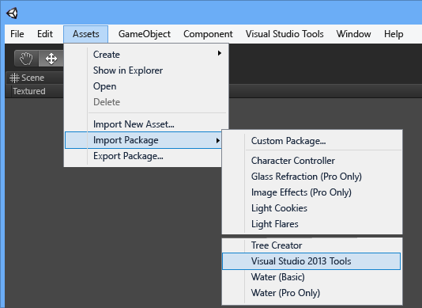
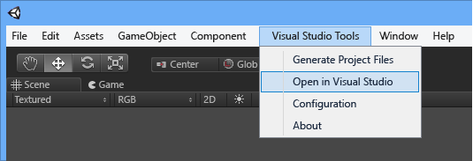

# Getting Started with Visual Studio Tools for Unity
In this section, you'll learn how to install Visual Studio Tools for Unity and configure your Unity project to work with Visual Studio.  
  
> [!IMPORTANT]
>  Unity 5.2 adds built-in support for Visual Studio Tools for Unity 2.1, which simplifies project setup. To take advantage of this, you'll need Unity version 5.2.0 or higher on Windows, and Visual Studio Tools for Unity version 2.1 or higher.  
  
## Prerequisites  
 To use Visual Studio Tools for Unity, you'll need:  
  
-   A version of **Visual Studio** that supports extensions, such as Visual Studio Community, Professional, Premium, or Enterprise. You can download Visual Studio Community for free.  
  
     [Download Visual Studio Community](http://www.visualstudio.com/downloads/download-visual-studio-vs)  
  
-   **Unity** version 4.0.0 or higher; **Unity** version 5.2.0 or higher to take advantage of built-in support for Visual Studio Tools for Unity version 2.1 or higher.  
  
     [Download Unity](https://unity3d.com/get-unity/download)  
  
## Install Visual Studio Tools for Unity  
 Download and install Visual Studio Tools for Unity from the Visual Studio Gallery. You'll need to install the right package for your version of Visual Studio. Make sure to install Visual Studio Tools for Unity version 2.1 or higher to take advantage of built-in support for VSTU in Unity 5.2 or higher.  
  
-   For Visual Studio 2015 Community, Visual Studio 2015 Professional, or Visual Studio 2015 Enterprise:  
  
     [Download Visual Studio 2015 Tools for Unity](https://visualstudiogallery.msdn.microsoft.com/8d26236e-4a64-4d64-8486-7df95156aba9)  
  
-   For Visual Studio 2013 Community, Visual Studio 2013 Professional, or Visual Studio 2013 Premium:  
  
     [Download Visual Studio 2013 Tools for Unity](https://visualstudiogallery.msdn.microsoft.com/20b80b8c-659b-45ef-96c1-437828fe7cf2)  
  
-   For Visual Studio 2012 Professional or Visual Studio 2012 Premium:  
  
     [Download Visual Studio 2012 Tools for Unity](https://visualstudiogallery.msdn.microsoft.com/7ab11d2a-f413-4ed6-b3de-ff1d05157714)  
  
-   For Visual Studio 2010 Professional or Visual Studio 2010 Premium:  
  
     [Download Visual Studio 2010 Tools for Unity](https://visualstudiogallery.msdn.microsoft.com/6e536faa-ce73-494a-a746-6a14753015f1)  
  
> [!NOTE]
>  Express versions of Visual Studio don't support extensions such as Visual Studio Tools for Unity. Visual Studio Community is a free version of Visual Studio that supports Visual Studio Tools for Unity and other extensions. For most users, Visual Studio Community is a better choice than Express.  
  
## Your first Unity project with Visual Studio Tools for Unity  
 Now that you have everything you need, you're ready for your first Unity project with Visual Studio. Setting up your Unity project is different depending on which versions of Unity and Visual Studio Tools for Unity are installed. Follow the steps below for the version of Unity and Visual Studio Tools for Unity that you have installed.  
  
### Unity 5.2 and higher (requires VSTU 2.1 or higher)  
 Starting with Unity 5.2, you no longer have to import the Visual Studio Tools unitypackage into your projects. If your project imports this unitypackage, Unity 5.2 ignores it and directly loads Visual Studio Tools for Unity from its installed location.  
  
#### 1 - Create a Unity Project  
 If you're already experienced with Unity, you can create a new project or load one of your own. If you're loading a project that imported the Visual Studio Tools unitypackage to  use Visual Studio Tools for Unity with a previous version of Unity, we recommend that you remove it by deleting the UnityVS directory.  
  
 Otherwise, if you're new to Unity, start small with a basic tutorial. Visit the Unity Learn page to find tutorials on example projects you can start with and lessons you can learn from to build your own game with Unity. The Unity Learn page has easy-to-follow tutorials for several different games.  
  
 [Tutorials – Unity Learn page](http://unity3d.com/learn/tutorials/modules)  
  
#### 2 - Configure Unity Editor to use Visual Studio Tools for Unity  
 To enable your project to use Visual Studio Tools for Unity, just set Visual Studio as its external script editor. In the Unity Editor, on the main menu, choose **Edit, Preferences**; then, in the **Unity Preferences** dialog, choose **External Tools**. Next, set the **External Script Editor** property to the version of Visual Studio you want to use (Visual Studio Tools for Unity must be installed for this version of Visual Studio) and make sure the **Editor Attaching** property is set.  
  
 To make sure that built-in support for Visual Studio Tools for Unity is now enabled, see the **About Unity** dialog. In the Unity editor, on the main menu, choose **Help, About Unity.** If Visual Studio Tools for Unity is installed and correctly configured, you'll see a message displayed in the lower left-hand corner of the **About Unity** dialog.  
  
 Finally, make sure you've set a build target through the **Build Settings** page and that **Script Debugging** is enabled.  
  
   
  
#### 3 - Launch Visual Studio from the Unity Editor  
 Starting with Unity 5.2, the **Visual Studio Tools** extension menu is no longer needed  to launch Visual Studio or to configure Visual Studio Tools for Unity. Instead, once Visual Studio is configured as your external script editor, just choose the script file from the Unity editor and your code will be opened in Visual Studio.  
  
### Previous versions of Unity (pre-5.2)  
 Before Unity 5.2, there was no built-in support for Visual Studio Tools for Unity. Instead, each project had to import the Visual Studio Tools unitypackage and configure other project settings in order to use Visual Studio Tools for Unity.  
  
#### 1 - Create a Unity Project  
 If you're already experienced with Unity,  you can create a new project or load one of your own. If you're starting a new project, import the Visual Studio Tools unitypackage when you create it.  
  
 Otherwise, if you're new to Unity, start small with a basic tutorial. Visit the Unity Learn page to find tutorials on example projects you can start with and lessons you can learn from to build your own game with Unity. The Unity Learn page has easy-to-follow tutorials for several different games.  
  
 [Tutorials – Unity Learn page](http://unity3d.com/learn/tutorials/modules)  
  
#### 2 - Configure Unity Editor to use Visual Studio Tools for Unity  
 If you're starting from an existing Unity project or you didn't import the Visual Studio Tools unitypackage when you created the project, you need to import the unitypackage now. In the Unity editor, on the main menu, choose **Assets, Import Package, Visual Studio 2015 Tools** (you should see an option for the version of Visual Studio you have installed).  
  
   
  
 Finally, make sure you've set a build target through the **Build Settings** page and that **Script Debugging** is enabled.  
  
   
  
#### 3 - Launch Visual Studio from Unity Editor  
 The final step is to start Visual Studio from Unity. This creates a Visual Studio Solution for your project, and then opens it in Visual Studio.  
  
 In the Unity Editor, on the main menu, choose **Visual Studio Tools, Open in Visual Studio**.  
  
   
  
## Next steps  
 To learn how to work with and debug your Unity project in Visual Studio, see [Using Visual Studio Tools for Unity](../vs140/getting-started-with-visual-studio-tools-for-unity.md).  
  
## See Also  
 [Unity Homepage](http://unity3d.com)