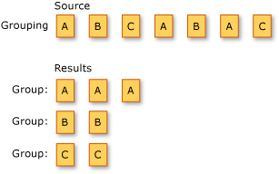

# Grouping Data (C#)
Grouping refers to the operation of putting data into groups so that the elements in each group share a common attribute.  
  
 The following illustration shows the results of grouping a sequence of characters. The key for each group is the character.  
  
   
  
 The standard query operator methods that group data elements are listed in the following section.  
  
## Methods  
  
|Method Name|Description|C# Query Expression Syntax|More Information|  
|-----------------|-----------------|---------------------------------|----------------------|  
|GroupBy|Groups elements that share a common attribute. Each group is represented by an <xref:System.Linq.IGrouping<CodeContentPlaceHolder>1\</CodeContentPlaceHolder>group … by<CodeContentPlaceHolder>2\</CodeContentPlaceHolder>group … by … into …<CodeContentPlaceHolder>3\</CodeContentPlaceHolder>2*> (a one-to-many dictionary) based on a key selector function.|Not applicable.|\<xref:System.Linq.Enumerable.ToLookup*?displayProperty=fullName>|  
  
## Query Expression Syntax Example  
 The following code example uses the <CodeContentPlaceHolder>4\</CodeContentPlaceHolder> clause to group integers in a list according to whether they are even or odd.  
  
<CodeContentPlaceHolder>0\</CodeContentPlaceHolder>  
## See Also  
 \<xref:System.Linq*>   
 [Standard Query Operators Overview (C#)](../vs140/standard-query-operators-overview--csharp-.md)   
 [group clause (C# Reference)](../vs140/group-clause--csharp-reference-.md)   
 [How to: Create a Nested Group (C# Programming Guide)](../vs140/how-to--create-a-nested-group--csharp-programming-guide-.md)   
 [How to: Group Files by Extension (LINQ) (C#)](../vs140/how-to--group-files-by-extension--linq---csharp-.md)   
 [How to: Group Query Results (C# Programming Guide)](../vs140/how-to--group-query-results--csharp-programming-guide-.md)   
 [How to: Perform a Subquery on a Grouping Operation (C# Programming Guide)](../vs140/how-to--perform-a-subquery-on-a-grouping-operation--csharp-programming-guide-.md)   
 [How to: Split a File Into Many Files by Using Groups (LINQ) (C#)](../vs140/how-to--split-a-file-into-many-files-by-using-groups--linq---csharp-.md)