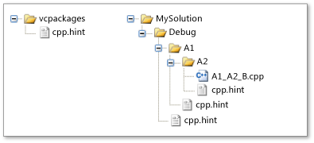

# Hint Files
A *hint file* helps the Visual Studio integrated development environment (IDE) interpret Visual C++ identifiers, such as the names of functions and macros. When you open a Visual C++ project, the IDE's *parsing system* analyzes the code in each source file in the project and gathers information about every identifier. Then the IDE uses that information to support features such as the **Class View** browser and the **Navigation Bar**.  
  
 The parsing system, which is introduced in [!INCLUDE[cpp_dev10_long](../vs140/includes/cpp_dev10_long_md.md)], understands C/C++ syntax but can misinterpret a statement that contains a macro. The statement can be misinterpreted if the macro causes the source code to be syntactically incorrect as written. The statement can become syntactically correct when the source code is compiled and the preprocesser replaces the [macro identifier](../vs140/sharpdefine-directive--c-c---.md) with its definition. The parsing system works without having to build the project because it uses hint files to interpret macros. Therefore, a browsing feature such as **Class View** is immediately available.  
  
 A hint file contains user-customizable *hints*, which have the same syntax as C/C++ macro definitions. Visual C++ includes a built-in hint file that is sufficient for most projects, but you can create your own hint files to improve the way Visual Studio handles identifiers.  
  
> [!IMPORTANT]
>  If you modify or add a hint file, you must delete the .sdf file and/or VC.db file in the solution in order for the changes to take effect.  
  
## Scenario  
 Assume that the following code is in a source file that you examine with the **Class View** browser. The <CodeContentPlaceHolder>17\</CodeContentPlaceHolder> macro declares a method named <CodeContentPlaceHolder>18\</CodeContentPlaceHolder> that takes one parameter and returns a pointer to an **HRESULT**.  
  
<CodeContentPlaceHolder>0\</CodeContentPlaceHolder>  
 The following macro definitions are in a separate header file.  
  
<CodeContentPlaceHolder>1\</CodeContentPlaceHolder>  
 The parsing system cannot interpret the source code because a function named STDMETHOD appears to be declared, and that declaration is syntactically incorrect because it has two parameter lists. The parsing system does not open the header file to discover the definitions for the <CodeContentPlaceHolder>19\</CodeContentPlaceHolder>, <CodeContentPlaceHolder>20\</CodeContentPlaceHolder>, and <CodeContentPlaceHolder>21\</CodeContentPlaceHolder> macros. Because the parsing system cannot interpret the <CodeContentPlaceHolder>22\</CodeContentPlaceHolder> macro, it ignores the whole statement and then continues parsing.  
  
 The parsing system does not use header files because your project might depend on one or more important header files. If any header file changes, the parsing system might have to reexamine all of the header files in your project, which slows down the performance of the IDE. Instead, the parsing system uses hints that specify how to handle the <CodeContentPlaceHolder>23\</CodeContentPlaceHolder>, <CodeContentPlaceHolder>24\</CodeContentPlaceHolder>, and <CodeContentPlaceHolder>25\</CodeContentPlaceHolder> macros.  
  
 How do you know that you need a hint? And if you need a hint, what kind should you create? One sign that a hint is needed is if the view of an identifier in **Class View** is inconsistent with the view in the **Editor**. For example, **Class View** might not display a class member that you know exists, or the name of the member is incorrect. For more information about the types of hints that solve common problems, see the What Macros Require A Hint? section later in this topic.  
  
## Architecture  
 Hint files pertain to physical directories, not the logical directories depicted in **Solution Explorer**. You do not have to add a hint file to your project for the hint file to have an effect. The parsing system uses hint files only when it parses source files.  
  
 Every hint file is named **cpp.hint**. Therefore, many directories can contain a hint file but only one hint file can occur in a particular directory.  
  
 Your project can be affected by zero or more hint files. If there are no hint files, the parsing system uses error recovery techniques to ignore indecipherable source code. Otherwise, the parsing system uses the following strategy to find and gather hints.  
  
### Search Order  
 The parsing system searches directories for hint files in the following order.  
  
-   The directory that contains the installation package for Visual C++ (**vcpackages**). This directory contains a built-in hint file that describes symbols in frequently used system files, such as **windows.h**. Consequently, your project automatically inherits most of the hints that it needs.  
  
-   The path from the root directory of a source file to the directory that contains the source file itself. In a typical Visual C++ project, the root directory contains the solution or project file.  
  
     The exception to this rule is if a *stop file* is in the path to the source file. A stop file provides additional control over the search order and is any file that is named **cpp.stop**. Instead of starting from the root directory, the parsing system searches from the directory that contains the stop file to the directory that contains the source file. In a typical project, you do not need a stop file.  
  
### Hint Gathering  
 A hint file contains zero or more *hints*. A hint is defined or deleted just like a C/C++ macro. That is, the <CodeContentPlaceHolder>26\</CodeContentPlaceHolder> preprocessor directive creates or redefines a hint, and the <CodeContentPlaceHolder>27\</CodeContentPlaceHolder> directive deletes a hint.  
  
 The parsing system opens each hint file in the search order described earlier, accumulates each file's hints into a set of *effective hints*, and then uses the effective hints to interpret the identifiers in your code.  
  
 The parsing system uses the following rules to accumulate hints.  
  
-   If the new hint specifies a name that is not already defined, the new hint adds the name to the effective hints.  
  
-   If the new hint specifies a name that is already defined, the new hint redefines the existing hint.  
  
-   If the new hint is an <CodeContentPlaceHolder>28\</CodeContentPlaceHolder> directive that specifies an existing effective hint, the new hint deletes the existing hint.  
  
 The first rule means that effective hints are inherited from previously opened hint files. The last two rules mean that hints that occur later in the search order can override hints that occurred earlier. For example, you can override any previous hints if you create a hint file in the directory that contains a source file.  
  
 For a depiction of how hints are gathered, see the <CodeContentPlaceHolder>29\</CodeContentPlaceHolder> section later in this topic.  
  
### Syntax  
 Hints are created and deleted with the same syntax as the preprocessor directives that create and delete macros. In fact, the parsing system uses the C/C++ preprocessor to evaluate the hints. For more information about the preprocessor directives, see [The #define Directive](../vs140/sharpdefine-directive--c-c---.md) and [The #undef Directive](../vs140/sharpundef-directive--c-c---.md).  
  
 The only unusual syntax elements are the <CodeContentPlaceHolder>30\</CodeContentPlaceHolder>, <CodeContentPlaceHolder>31\</CodeContentPlaceHolder>, and <CodeContentPlaceHolder>32\</CodeContentPlaceHolder> replacement strings. These are hint-file specific replacement strings that are used with only *map* macros. A map is a set of macros that relate data, functions, or events to other data, functions, or event handlers. For example, <CodeContentPlaceHolder>33\</CodeContentPlaceHolder> uses maps to create [message maps](../vs140/message-maps--mfc-.md), and <CodeContentPlaceHolder>34\</CodeContentPlaceHolder> uses maps to create [object maps](../vs140/object-map-macros.md). The hint-file specific replacement strings indicate the starting, intermediate, and ending elements of a map. Only the name of a map macro is significant. Therefore, each replacement string intentionally hides the implementation of the macro.  
  
 Hints use the following syntax.  
  
|Syntax|Meaning|  
|------------|-------------|  
|<CodeContentPlaceHolder>35\</CodeContentPlaceHolder> *hint-name* *replacement-string*\ \  <CodeContentPlaceHolder>36\</CodeContentPlaceHolder> *hint-name* <CodeContentPlaceHolder>37\</CodeContentPlaceHolder> *parameter*, ...<CodeContentPlaceHolder>38\</CodeContentPlaceHolder>*replacement-string*|A preprocesser directive that defines a new hint or redefines an existing hint. After the directive, the preprocessor replaces each occurrence of *hint-name* in source code with *replacement-string*.\ \  The second syntax form defines a function-like hint. If a function-like hint occurs in source code, the preprocessor first replaces each occurrence of *parameter* in *replacement-string* with the corresponding argument in source code, and then replaces *hint-name* with *replacement-string*.|  
|<CodeContentPlaceHolder>39\</CodeContentPlaceHolder>|A hint-file specific *replacement-string* that indicates the start of a set of map elements.|  
|<CodeContentPlaceHolder>40\</CodeContentPlaceHolder>|A hint-file specific *replacement-string* that indicates an intermediate map element. A map can have multiple map elements.|  
|<CodeContentPlaceHolder>41\</CodeContentPlaceHolder>|A hint-file specific *replacement-string* that indicates the end of a set of map elements.|  
|<CodeContentPlaceHolder>42\</CodeContentPlaceHolder> *hint-name*|The preprocessor directive that deletes an existing hint. The name of the hint is provided by the *hint-name* identifier.|  
|<CodeContentPlaceHolder>43\</CodeContentPlaceHolder> *comment*|A single line comment.|  
|<CodeContentPlaceHolder>44\</CodeContentPlaceHolder> *comment* <CodeContentPlaceHolder>45\</CodeContentPlaceHolder>|A multiline comment.|  
  
## What Macros Require A Hint?  
 Certain types of macros can interfere with the parsing system. This section describes the types of macros that can cause a problem, and the type of hint you can create to solve that problem.  
  
### Disruptive Macros  
 Some macros cause the parsing system to misinterpret source code, but can be ignored without impairing your browsing experience. For example, the Source Code Annotation Language ([SAL](../vs140/sal-annotations.md)) macros resolve to C++ attributes that help you find programming bugs. If you want to ignore SAL annotations as you browse code, you might want to create a hint file that hides the annotation.  
  
 In the following source code, the parameter type for the <CodeContentPlaceHolder>46\</CodeContentPlaceHolder> function is <CodeContentPlaceHolder>47\</CodeContentPlaceHolder>, and the parameter name is <CodeContentPlaceHolder>48\</CodeContentPlaceHolder>. However, the parsing system mistakes the <CodeContentPlaceHolder>49\</CodeContentPlaceHolder> and <CodeContentPlaceHolder>50\</CodeContentPlaceHolder> SAL annotations for either the parameter type or the parameter name.  
  
 **Source Code:**  
  
<CodeContentPlaceHolder>2\</CodeContentPlaceHolder>  
 **Strategy:** Null definition  
  
 The strategy in this situation is to treat the SAL annotations as if they did not exist. To do this, specify a hint whose replacement string is null. Consequently, the parsing system ignores the annotations, and the **Class View** browser does not display them. (Visual C++ includes a built-in hint file that hides SAL annotation.)  
  
 **Hint file:**  
  
<CodeContentPlaceHolder>3\</CodeContentPlaceHolder>  
### Concealed C/C++ Language Elements  
 A typical reason that the parsing system misinterprets source code is if a macro hides a C/C++ [punctuator](../vs140/punctuators--c---.md) or [keyword](../vs140/keywords--c---.md) token. That is, a macro might contain half of a pair of punctuators, such as <CodeContentPlaceHolder>51\</CodeContentPlaceHolder>, <CodeContentPlaceHolder>52\</CodeContentPlaceHolder>, <CodeContentPlaceHolder>53\</CodeContentPlaceHolder>, and <CodeContentPlaceHolder>54\</CodeContentPlaceHolder>.  
  
 In the following source code, the <CodeContentPlaceHolder>55\</CodeContentPlaceHolder> macro hides an unpaired left brace (<CodeContentPlaceHolder>56\</CodeContentPlaceHolder>).  
  
 **Source Code:**  
  
<CodeContentPlaceHolder>4\</CodeContentPlaceHolder>  
 **Strategy:** Direct copy  
  
 If the semantics of a macro are critical to the browsing experience, create a hint that is identical to the macro. The parsing system resolves the macro to the definition in the hint file.  
  
 Note that if the macro in the source file contains other macros, those macros are interpreted only if they are already in the set of effective hints.  
  
 **Hint File:**  
  
<CodeContentPlaceHolder>5\</CodeContentPlaceHolder>  
### Maps  
 A map consists of macros that designate a starting element, ending element, and zero or more intermediate elements. The parsing system misinterprets maps because each map macro hides C/C++ language elements, and the syntax of a complete C/C++ statement is distributed across many separate macros.  
  
 The following source code defines the <CodeContentPlaceHolder>57\</CodeContentPlaceHolder>, <CodeContentPlaceHolder>58\</CodeContentPlaceHolder>, and <CodeContentPlaceHolder>59\</CodeContentPlaceHolder> macros.  
  
 **Source Code:**  
  
<CodeContentPlaceHolder>6\</CodeContentPlaceHolder>  
 **Strategy:** Identify map elements  
  
 Specify hints for the start, middle (if any), and end elements of a map. Use the special map replacement strings, <CodeContentPlaceHolder>60\</CodeContentPlaceHolder>, <CodeContentPlaceHolder>61\</CodeContentPlaceHolder>, and <CodeContentPlaceHolder>62\</CodeContentPlaceHolder>. For more information, see the <CodeContentPlaceHolder>63\</CodeContentPlaceHolder> section in this topic.  
  
 **Hint File:**  
  
<CodeContentPlaceHolder>7\</CodeContentPlaceHolder>  
### Composite Macros  
 Composite macros contain one or more of the types of macro that confuse the parsing system.  
  
 The following source code contains the <CodeContentPlaceHolder>64\</CodeContentPlaceHolder> macro, which specifies the start of a namespace scope, and the <CodeContentPlaceHolder>65\</CodeContentPlaceHolder> macro, which specifies the start of a map.  
  
 **Source Code:**  
  
<CodeContentPlaceHolder>8\</CodeContentPlaceHolder>  
 **Strategy:** Direct copy  
  
 Create hints for the <CodeContentPlaceHolder>66\</CodeContentPlaceHolder> and <CodeContentPlaceHolder>67\</CodeContentPlaceHolder> macros, and then create a hint for the <CodeContentPlaceHolder>68\</CodeContentPlaceHolder> macro that is the same as shown earlier for the source code. Alternatively, if a composite macro consists of only disruptive macros and white space, you can define a hint whose replacement string is a null definition.  
  
 In this example, assume <CodeContentPlaceHolder>69\</CodeContentPlaceHolder> already has a hint as described in this topic in the <CodeContentPlaceHolder>70\</CodeContentPlaceHolder> subheading. And assume <CodeContentPlaceHolder>71\</CodeContentPlaceHolder> has a hint as described earlier in <CodeContentPlaceHolder>72\</CodeContentPlaceHolder>.  
  
 **Hint File:**  
  
<CodeContentPlaceHolder>9\</CodeContentPlaceHolder>  
### Inconvenient Macros  
 Some macros can be interpreted by the parsing system, but the source code is difficult to read because the macro is long or complex. For the sake of readability, you can provide a hint that simplifies the display of the macro.  
  
 **Source Code:**  
  
<CodeContentPlaceHolder>10\</CodeContentPlaceHolder>  
 **Strategy:** Simplification  
  
 Create a hint that displays a simpler macro definition.  
  
 **Hint File:**  
  
<CodeContentPlaceHolder>11\</CodeContentPlaceHolder>  
## Example  
 The following example illustrates how hints are accumulated from hint files. Stop files are not used in this example.  
  
 The following illustration depicts some of the physical directories in a Visual C++ project. Hint files are in the <CodeContentPlaceHolder>73\</CodeContentPlaceHolder>, <CodeContentPlaceHolder>74\</CodeContentPlaceHolder>, <CodeContentPlaceHolder>75\</CodeContentPlaceHolder>, and <CodeContentPlaceHolder>76\</CodeContentPlaceHolder> directories.  
  
### Hint File Directories  
   
  
### Directories and Hint File Contents  
 The following list shows the directories in this project that contain hint files, and the contents of those hint files. Only some of the many hints in the <CodeContentPlaceHolder>77\</CodeContentPlaceHolder> directory hint file are listed.  
  
-   vcpackages  
  
<CodeContentPlaceHolder>12\</CodeContentPlaceHolder>  
-   Debug  
  
<CodeContentPlaceHolder>13\</CodeContentPlaceHolder>  
-   A1  
  
<CodeContentPlaceHolder>14\</CodeContentPlaceHolder>  
-   A2  
  
<CodeContentPlaceHolder>15\</CodeContentPlaceHolder>  
### Effective Hints  
 The following table lists the effective hints for the source files in this project.  
  
-   Source File: A1_A2_B.cpp  
  
-   Effective hints:  
  
<CodeContentPlaceHolder>16\</CodeContentPlaceHolder>  
 The following notes apply to the preceding list.  
  
-   The effective hints are from the <CodeContentPlaceHolder>78\</CodeContentPlaceHolder>, <CodeContentPlaceHolder>79\</CodeContentPlaceHolder>, <CodeContentPlaceHolder>80\</CodeContentPlaceHolder>, and <CodeContentPlaceHolder>81\</CodeContentPlaceHolder> directories.  
  
-   The **#undef** directive in the <CodeContentPlaceHolder>82\</CodeContentPlaceHolder> hint file removed the <CodeContentPlaceHolder>83\</CodeContentPlaceHolder> hint in the <CodeContentPlaceHolder>84\</CodeContentPlaceHolder> directory hint file.  
  
-   The hint file in the <CodeContentPlaceHolder>85\</CodeContentPlaceHolder> directory redefines <CodeContentPlaceHolder>86\</CodeContentPlaceHolder>.  
  
-   The <CodeContentPlaceHolder>87\</CodeContentPlaceHolder> hint in the <CodeContentPlaceHolder>88\</CodeContentPlaceHolder> directory removed the hints for <CodeContentPlaceHolder>89\</CodeContentPlaceHolder> and <CodeContentPlaceHolder>90\</CodeContentPlaceHolder> in the <CodeContentPlaceHolder>91\</CodeContentPlaceHolder> directory hint file.  
  
## See Also  
 [File Types Created for Visual C++ Projects](../vs140/file-types-created-for-visual-c---projects.md)   
 [Creating and Controlling Environment Windows](assetId:///496ecde3-4fe1-412c-b7b4-b40e3efda618)   
 [The #define Directive](../vs140/sharpdefine-directive--c-c---.md)   
 [The #undef Directive](../vs140/sharpundef-directive--c-c---.md)   
 [SAL Annotations](../vs140/sal-annotations.md)   
 [Message Maps (MFC)](../vs140/message-maps--mfc-.md)   
 [Message Map Macros (ATL)](../vs140/message-map-macros--atl-.md)   
 [Object Map Macros](../vs140/object-map-macros.md)