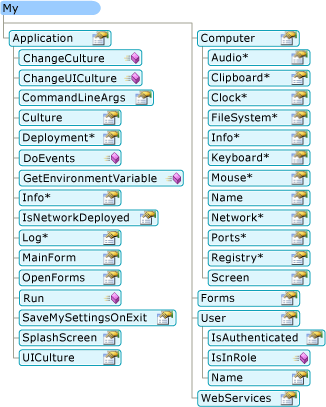
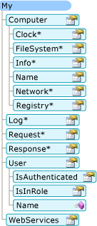

# How My Depends on Project Type (Visual Basic)
<CodeContentPlaceHolder>0\</CodeContentPlaceHolder> exposes only those objects required by a particular project type. For example, the <CodeContentPlaceHolder>1\</CodeContentPlaceHolder> object is available in a Windows Forms application but not available in a console application. This topic describes which <CodeContentPlaceHolder>2\</CodeContentPlaceHolder> objects are available in different project types.  
  
## My in Windows Applications and Web Sites  
 <CodeContentPlaceHolder>3\</CodeContentPlaceHolder> exposes only objects that are useful in the current project type; it suppresses objects that are not applicable. For example, the following image shows the <CodeContentPlaceHolder>4\</CodeContentPlaceHolder> object model in a Windows Forms project.  
  
   
  
 In a Web site project, <CodeContentPlaceHolder>5\</CodeContentPlaceHolder> exposes objects that are relevant to a Web developer (such as the <CodeContentPlaceHolder>6\</CodeContentPlaceHolder> and <CodeContentPlaceHolder>7\</CodeContentPlaceHolder> objects) while suppressing objects that are not relevant (such as the <CodeContentPlaceHolder>8\</CodeContentPlaceHolder> object). The following image shows the <CodeContentPlaceHolder>9\</CodeContentPlaceHolder> object model in a Web site project:  
  
   
  
## Project Details  
 The following table shows which <CodeContentPlaceHolder>10\</CodeContentPlaceHolder> objects are enabled by default for eight project types: Windows application, class Library, console application, Windows control library, Web control library, Windows service, empty, and Web site.  
  
 There are three versions of the <CodeContentPlaceHolder>11\</CodeContentPlaceHolder> object, two versions of the <CodeContentPlaceHolder>12\</CodeContentPlaceHolder> object, and two versions of <CodeContentPlaceHolder>13\</CodeContentPlaceHolder> object; details about these versions are given in the footnotes after the table.  
  
||||||||||  
|-|-|-|-|-|-|-|-|-|  
|My Object|Windows Application|Class Library|Console Application|Windows Control Library|Web Control Library|Windows Service|Empty|Web Site|  
|<CodeContentPlaceHolder>14\</CodeContentPlaceHolder>|**Yes** 1\|**Yes** 2\|**Yes** 3\|**Yes** 2\|No|**Yes** 3\|No|No|  
|<CodeContentPlaceHolder>15\</CodeContentPlaceHolder>|**Yes** 4\|**Yes** 4\|**Yes** 4\|**Yes** 4\|**Yes** 5\|**Yes** 4\|No|**Yes** 5\|  
|<CodeContentPlaceHolder>16\</CodeContentPlaceHolder>|**Yes**|No|No|**Yes**|No|No|No|No|  
|<CodeContentPlaceHolder>17\</CodeContentPlaceHolder>|No|No|No|No|No|No|No|**Yes**|  
|<CodeContentPlaceHolder>18\</CodeContentPlaceHolder>|No|No|No|No|No|No|No|**Yes**|  
|<CodeContentPlaceHolder>19\</CodeContentPlaceHolder>|**Yes**|**Yes**|**Yes**|**Yes**|**Yes**|**Yes**|No|No|  
|<CodeContentPlaceHolder>20\</CodeContentPlaceHolder>|No|No|No|No|No|No|No|**Yes**|  
|<CodeContentPlaceHolder>21\</CodeContentPlaceHolder>|**Yes**|**Yes**|**Yes**|**Yes**|**Yes**|**Yes**|No|No|  
|<CodeContentPlaceHolder>22\</CodeContentPlaceHolder>|**Yes** 6\|**Yes** 6\|**Yes** 6\|**Yes** 6\|**Yes** 7\|**Yes** 6\|No|**Yes** 7\|  
|<CodeContentPlaceHolder>23\</CodeContentPlaceHolder>|**Yes**|**Yes**|**Yes**|**Yes**|**Yes**|**Yes**|No|No|  
  
 1\ Windows Forms version of <CodeContentPlaceHolder>24\</CodeContentPlaceHolder>. Derives from the console version (see Note 3); adds support for interacting with the application's windows and provides the [!INCLUDE[vbprvb](../vs140/includes/vbprvb_md.md)] Application model.  
  
 2\ Library version of <CodeContentPlaceHolder>25\</CodeContentPlaceHolder>. Provides the basic functionality needed by an application: provides members for writing to the application log and accessing application information.  
  
 3\ Console version of <CodeContentPlaceHolder>26\</CodeContentPlaceHolder>. Derives from the library version (see Note 2), and adds additional members for accessing the application's command-line arguments and ClickOnce deployment information.  
  
 4\ Windows version of <CodeContentPlaceHolder>27\</CodeContentPlaceHolder>. Derives from the Server version (see Note 5), and provides access to useful objects on a client machine, such as the keyboard, screen, and mouse.  
  
 5\ Server version of <CodeContentPlaceHolder>28\</CodeContentPlaceHolder>. Provides basic information about the computer, such as the name, access to the clock, and so on.  
  
 6\ Windows version of <CodeContentPlaceHolder>29\</CodeContentPlaceHolder>. This object is associated with the thread's current identity.  
  
 7\ Web version of <CodeContentPlaceHolder>30\</CodeContentPlaceHolder>. This object is associated with the user identity of the application's current HTTP request.  
  
## See Also  
 \<xref:Microsoft.VisualBasic.ApplicationServices.ApplicationBase*>   
 \<xref:Microsoft.VisualBasic.Devices.Computer*>   
 \<xref:Microsoft.VisualBasic.Logging.Log*>   
 \<xref:Microsoft.VisualBasic.ApplicationServices.User*>   
 [Customizing Which Objects are Available in My](../vs140/customizing-which-objects-are-available-in-my--visual-basic-.md)   
 [Conditional Compilation Overview](../vs140/conditional-compilation-in-visual-basic.md)   
 [/define (Visual Basic)](../vs140/-define--visual-basic-.md)   
 [My.Forms Object](../vs140/my.forms-object.md)   
 [My.Request Object](../vs140/my.request-object.md)   
 [My.Response Object](../vs140/my.response-object.md)   
 [My.WebServices Object](../vs140/my.webservices-object.md)