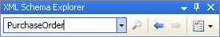
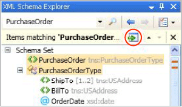

# How to: Add Nodes to the Workspace from the XML Schema Explorer
This topic explains how to add nodes to the [XML Schema Designer workspace](../vs140/xml-schema-designer-workspace.md) from the XML Schema Explorer. This can be achieved by dragging and dropping nodes from the XML Schema Explorer onto an XSD Designer view, or by using the XML Schema Explorer's context menu. You can also add nodes that are highlighted as a result of a search performed by the XML Schema Explorer. For more information, see [How to: Search the Schema Set](../vs140/how-to--add-schema-set-search-result-nodes-to-the-workspace.md).  
  
> [!NOTE]
>  Only global nodes can be added to the [workspace](../vs140/xml-schema-designer-workspace.md).  
  
### To add nodes through the XML Explorer Context Menu  
  
1.  Follow the steps in [How to: Create and Edit an XSD Schema File](../vs140/how-to--create-and-edit-an-xsd-schema-file.md).  
  
2.  Right click on the <CodeContentPlaceHolder>0\</CodeContentPlaceHolder> node in the a XSD Explorer. Select **Show in Graph View**.  
  
     The <CodeContentPlaceHolder>1\</CodeContentPlaceHolder> node appears on the design surface of the Graph View.  
  
### To drag and drop a node on to a view  
  
1.  Right click on the <CodeContentPlaceHolder>2\</CodeContentPlaceHolder> node in the Graph View. Select **Show in XML Schema Explorer**.  
  
     The node is highlighted in the XML Schema Explorer.  
  
2.  Right click on the <CodeContentPlaceHolder>3\</CodeContentPlaceHolder> node in the XML Schema Explorer and select **Show All References**.  
  
     The <CodeContentPlaceHolder>4\</CodeContentPlaceHolder> node is highlighted.  
  
3.  Drag the <CodeContentPlaceHolder>5\</CodeContentPlaceHolder> node on to the Graph View.  
  
     The <CodeContentPlaceHolder>6\</CodeContentPlaceHolder> node and the <CodeContentPlaceHolder>7\</CodeContentPlaceHolder> node appear next to each other on the design surface of the Graph View. Because the two nodes are realted (the <CodeContentPlaceHolder>8\</CodeContentPlaceHolder> element is of the <CodeContentPlaceHolder>9\</CodeContentPlaceHolder> type), an arrow is drawn between them.  
  
### To add nodes using the Schema Explorer search capability  
  
1.  Type "purchaseOrder" in the search text box of the [XML Explorer](../vs140/xml-schema-explorer.md) toolbar and click on the search button.  
  
       
  
     The search results are highlighted in the XML Schema Explorer and marked by ticks on the vertical scroll bar.  
  
2.  Add the search results to the workspace by clicking the **Add highlighted nodes to Workspace** button on the summary results pane.  
  
       
  
     The <CodeContentPlaceHolder>10\</CodeContentPlaceHolder> node and the <CodeContentPlaceHolder>11\</CodeContentPlaceHolder> node appear next to each other on the design surface of the [Graph View](../vs140/graph-view.md). Because the two nodes are related (the <CodeContentPlaceHolder>12\</CodeContentPlaceHolder> element is of the <CodeContentPlaceHolder>13\</CodeContentPlaceHolder> type), an arrow is drawn between them.  
  
## See Also  
 [XSD Explorer](../vs140/xml-schema-explorer.md)