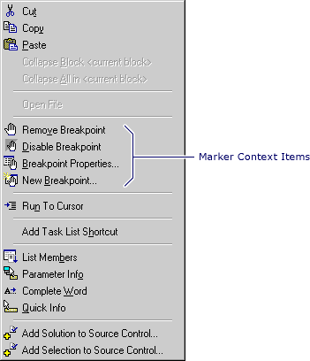

# How to: Add Standard Text Markers
Use the following procedure to create one of the default text marker types provided with the [!INCLUDE[vsprvs](../vs140/includes/vsprvs_md.md)] core editor.  
  
### To create a text marker  
  
1.  Depending on whether you are using a one or two- dimensional coordinate system, call the [CreateLineMarker](assetId:///M:Microsoft.VisualStudio.TextManager.Interop.IVsTextLines.CreateLineMarker(System.Int32,System.Int32,System.Int32,System.Int32,System.Int32,Microsoft.VisualStudio.TextManager.Interop.IVsTextMarkerClient,Microsoft.VisualStudio.TextManager.Interop.IVsTextLineMarker[])?qualifyHint=False&autoUpgrade=True) method or the [CreateStreamMarker](assetId:///M:Microsoft.VisualStudio.TextManager.Interop.IVsTextStream.CreateStreamMarker(System.Int32,System.Int32,System.Int32,Microsoft.VisualStudio.TextManager.Interop.IVsTextMarkerClient,Microsoft.VisualStudio.TextManager.Interop.IVsTextStreamMarker[])?qualifyHint=False&autoUpgrade=True) method to create a new text marker.  
  
     In this method call, specify a marker type, a range of text to create the marker over, and an <xref:Microsoft.VisualStudio.TextManager.Interop.IVsTextMarkerClient*> interface. This method then returns a pointer to the newly created text marker. Marker types are taken from the <xref:Microsoft.VisualStudio.TextManager.Interop.MARKERTYPE*> enumeration. Specify an <xref:Microsoft.VisualStudio.TextManager.Interop.IVsTextMarkerClient*> interface if you want to be informed of marker events.  
  
    > [!NOTE]
    >  Create text markers on the main UI thread only. The core editor relies on the contents of the text buffer to create text markers and the text buffer is not thread safe.  
  
## Adding a Custom Command  
 Implementing the `IVsTextMarkerClient` interface and providing a pointer to it from a marker enhances marker behavior in several ways. First, this allows you to provide tips for your marker and to execute commands. This also allows you to receive event notifications for individual markers and to create a custom context menu over the marker. Use the following procedure to add a custom command to the marker context menu.  
  
#### To add a custom command to the context menu  
  
1.  Before the Context menu is displayed, the environment calls the [GetMarkerCommandInfo](assetId:///M:Microsoft.VisualStudio.TextManager.Interop.IVsTextMarkerClient.GetMarkerCommandInfo(Microsoft.VisualStudio.TextManager.Interop.IVsTextMarker,System.Int32,System.String[],System.UInt32[])?qualifyHint=False&autoUpgrade=True) method and passes you a pointer to the text marker affected and the number of the command item in the context menu.  
  
     For example, the breakpoint-specific commands on the context menu include **Remove Breakpoint** through **New Breakpoint**, as displayed in the following screenshot.  
  
       
  
2.  Pass back some text identifying the name of the custom command. For example, **Remove Breakpoint** might be a custom command if the environment did not already provide it. You also pass back whether the command is supported, available and enabled, and/or an on-off toggle. The environment uses this information to display the custom command in the context menu in the correct way.  
  
3.  To execute the command, the environment calls the [ExecMarkerCommand](assetId:///M:Microsoft.VisualStudio.TextManager.Interop.IVsTextMarkerClient.ExecMarkerCommand(Microsoft.VisualStudio.TextManager.Interop.IVsTextMarker,System.Int32)?qualifyHint=False&autoUpgrade=True) method, passing you a pointer to the text marker and the number of the command selected from the context menu.  
  
     Use this information from this call to execute whatever actions of the text marker your custom command dictates.  
  
## See Also  
 [Text Markers in Visual Studio](../vs140/using-text-markers-with-the-legacy-api.md)   
 [How to: Implement Error Markers](../vs140/how-to--implement-error-markers.md)   
 [How To: Create a Custom Text Marker](../vs140/how-to--create-custom-text-markers.md)   
 [How To: Use Text Markers](../vs140/how-to--use-text-markers.md)