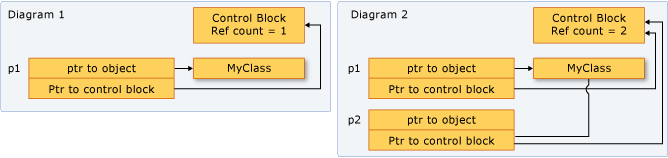

# How to: Create and Use shared_ptr Instances
The <CodeContentPlaceHolder>0\</CodeContentPlaceHolder> type is a smart pointer in the C++ standard library that is designed for scenarios in which more than one owner might have to manage the lifetime of the object in memory. After you initialize a <CodeContentPlaceHolder>1\</CodeContentPlaceHolder> you can copy it, pass it by value in function arguments, and assign it to other <CodeContentPlaceHolder>2\</CodeContentPlaceHolder> instances. All the instances point to the same object, and share access to one "control block" that increments and decrements the reference count whenever a new <CodeContentPlaceHolder>3\</CodeContentPlaceHolder> is added, goes out of scope, or is reset. When the reference count reaches zero, the control block deletes the memory resource and itself.  
  
 The following illustration shows several <CodeContentPlaceHolder>4\</CodeContentPlaceHolder> instances that point to one memory location.  
  
   
  
## Example  
 Whenever possible, use the [make_shared (\<memory>)](../vs140/make_shared---memory--.md) function to create a <CodeContentPlaceHolder>5\</CodeContentPlaceHolder> when the memory resource is created for the first time. <CodeContentPlaceHolder>6\</CodeContentPlaceHolder> is exception-safe. It uses the same call to allocate the memory for the control block and the resource, and thereby reduces the construction overhead. If you do not use <CodeContentPlaceHolder>7\</CodeContentPlaceHolder>, then you have to use an explicit new expression to create the object before you pass it to the <CodeContentPlaceHolder>8\</CodeContentPlaceHolder> constructor. The following example shows various ways to declare and initialize a <CodeContentPlaceHolder>9\</CodeContentPlaceHolder> together with a new object.  
  
 [!code[stl_smart_pointers#1](../vs140/codesnippet/CPP/how-to--create-and-use-shared_ptr-instances_1.cpp)]  
  
## Example  
 The following example shows how to declare and initialize <CodeContentPlaceHolder>10\</CodeContentPlaceHolder> instances that take on shared ownership of an object that has already been allocated by another <CodeContentPlaceHolder>11\</CodeContentPlaceHolder>. Assume that <CodeContentPlaceHolder>12\</CodeContentPlaceHolder> is an initialized <CodeContentPlaceHolder>13\</CodeContentPlaceHolder>.  
  
 [!code[stl_smart_pointers#2](../vs140/codesnippet/CPP/how-to--create-and-use-shared_ptr-instances_2.cpp)]  
  
## Example  
 <CodeContentPlaceHolder>14\</CodeContentPlaceHolder> is also helpful in Standard Template Library (STL) containers when you are using algorithms that copy elements. You can wrap elements in a <CodeContentPlaceHolder>15\</CodeContentPlaceHolder>, and then copy it into other containers with the understanding that the underlying memory is valid as long as you need it, and no longer. The following example shows how to use the <CodeContentPlaceHolder>16\</CodeContentPlaceHolder> algorithm on <CodeContentPlaceHolder>17\</CodeContentPlaceHolder> instances in a vector.  
  
 [!code[stl_smart_pointers#4](../vs140/codesnippet/CPP/how-to--create-and-use-shared_ptr-instances_3.cpp)]  
  
## Example  
 You can use <CodeContentPlaceHolder>18\</CodeContentPlaceHolder>, <CodeContentPlaceHolder>19\</CodeContentPlaceHolder>, and <CodeContentPlaceHolder>20\</CodeContentPlaceHolder> to cast a <CodeContentPlaceHolder>21\</CodeContentPlaceHolder>. These functions resemble the <CodeContentPlaceHolder>22\</CodeContentPlaceHolder>, <CodeContentPlaceHolder>23\</CodeContentPlaceHolder>, and <CodeContentPlaceHolder>24\</CodeContentPlaceHolder> operators. The following example shows how to test the derived type of each element in a vector of <CodeContentPlaceHolder>25\</CodeContentPlaceHolder> of base classes, and then copy the elements and display information about them.  
  
 [!code[stl_smart_pointers#5](../vs140/codesnippet/CPP/how-to--create-and-use-shared_ptr-instances_4.cpp)]  
  
## Example  
 You can pass a <CodeContentPlaceHolder>26\</CodeContentPlaceHolder> to another function in the following ways:  
  
-   Pass the <CodeContentPlaceHolder>27\</CodeContentPlaceHolder> by value. This invokes the copy constructor, increments the reference count, and makes the callee an owner. There is a small amount of overhead in this operation, which may be significant depending on how many <CodeContentPlaceHolder>28\</CodeContentPlaceHolder> objects you are passing. Use this option when the code contract (implied or explicit) between the caller and callee requires that the callee be an owner.  
  
-   Pass the <CodeContentPlaceHolder>29\</CodeContentPlaceHolder> by reference or const reference. In this case, the reference count is not incremented, and the callee can access the pointer as long as the caller does not go out of scope. Or, the callee can decide to create a <CodeContentPlaceHolder>30\</CodeContentPlaceHolder> based on the reference, and thereby become a shared owner. Use this option when the caller has no knowledge of the callee, or when you must pass a <CodeContentPlaceHolder>31\</CodeContentPlaceHolder> and want to avoid the copy operation for performance reasons.  
  
-   Pass the underlying pointer or a reference to the underlying object. This enables the callee to use the object, but does not enable it to share ownership or extend the lifetime. If the callee creates a <CodeContentPlaceHolder>32\</CodeContentPlaceHolder> from the raw pointer, the new <CodeContentPlaceHolder>33\</CodeContentPlaceHolder> is independent from the original, and does not control the underlying resource. Use this option when the contract between the caller and callee clearly specifies that the caller retains ownership of the <CodeContentPlaceHolder>34\</CodeContentPlaceHolder> lifetime.  
  
-   When you are deciding how to pass a <CodeContentPlaceHolder>35\</CodeContentPlaceHolder>, determine whether the callee has to share ownership of the underlying resource. An "owner" is an object or function that can keep the underlying resource alive for as long as it needs it. If the caller has to guarantee that the callee can extend the life of the pointer beyond its (the function's) lifetime, use the first option. If you don't care whether the callee extends the lifetime, then pass by reference and let the callee copy it or not.  
  
-   If you have to give a helper function access to the underlying pointer, and you know that the helper function will just use the pointer and return before the calling function returns, then that function does not have to share ownership of the underlying pointer. It just has to access the pointer within the lifetime of the caller's <CodeContentPlaceHolder>36\</CodeContentPlaceHolder>. In this case, it is safe to pass the <CodeContentPlaceHolder>37\</CodeContentPlaceHolder> by reference, or pass the raw pointer or a reference to the underlying object. Passing this way provides a small performance benefit, and may also help you express your programming intent.  
  
-   Sometimes, for example in a <CodeContentPlaceHolder>38\</CodeContentPlaceHolder>, you may have to pass each <CodeContentPlaceHolder>39\</CodeContentPlaceHolder> to a lambda expression body or named function object. If the lambda or function is not storing the pointer, then pass the <CodeContentPlaceHolder>40\</CodeContentPlaceHolder> by reference to avoid invoking the copy constructor for each element.  
  
 [!CODE [stl_smart_pointers#6](../CodeSnippet/VS_Snippets_Cpp/stl_smart_pointers#6)]  
  
## Example  
 The following example shows how <CodeContentPlaceHolder>41\</CodeContentPlaceHolder> overloads various comparison operators to enable pointer comparisons on the memory that is owned by the <CodeContentPlaceHolder>42\</CodeContentPlaceHolder> instances.  
  
 [!code[stl_smart_pointers#3](../vs140/codesnippet/CPP/how-to--create-and-use-shared_ptr-instances_6.cpp)]  
  
## See Also  
 [Smart Pointers](../vs140/smart-pointers--modern-c---.md)