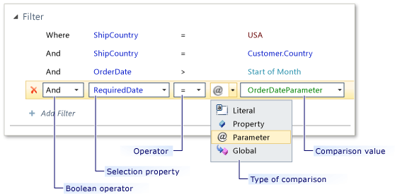
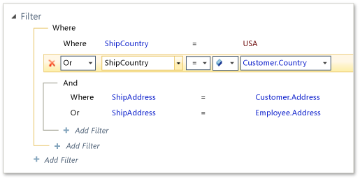

# How to: Design a Query by Using the Query Designer
A query returns data that meets certain criteria. For more information, see [Queries: Retrieving Information from a Data Source](../vs140/queries--retrieving-information-from-a-data-source.md). Use a query to display information in a screen. You can also use the results of a query in your custom business logic.  
  
 To begin, add a query to the project. For more information, see [How to: Add a Query to a Project](../vs140/how-to--add--remove--and-modify-a-query.md). The query automatically opens in the query designer. In the query designer, design a query by performing any of the following tasks:  
  
-   [Add Filter Conditions](#filters).  
  
     A *filter condition* describes a test that each row of data must pass to be included in the results.  
  
-   [Use a Parameter in a Filter Condition](#Modify).  
  
     Users of the application can provide a parameter value at run time by typing information or making selections on the user interface (UI).  
  
-   [Group Filter Conditions Together](#Groups).  
  
     Use filter groups to ensure that a set of filter conditions are evaluated together as a single unit separate from the rest of the filter conditions.  
  
-   [Add Sort Terms](#Sort).  
  
     *Sort terms* enable you to set the initial sort order of the data rows that are returned by a query.  
  
-   [Reorder Filter Conditions, Filter Groups, Sort Terms, and Parameters](#FilterOrder).  
  
     You can change the order in which filter conditions, filter groups, sort terms, and parameters are evaluated in the query.  
  
##  \<a name="Filters">\</a> Add Filter Conditions  
 Filter conditions specify the data rows that you want the query to return. For example, you can add a filter condition that returns only customers who are located in New York. A filter condition is the same as a search condition in the WHERE clause of a traditional SQL statement. Filter conditions contain a selection property, an operator, a comparison type, and a comparison value. Filter conditions are separated by Boolean operators.  
  
 The following illustration shows the parts of a filter condition.  
  
   
  
#### To add a filter condition  
  
1.  In the **Query Designer**, expand the **Filter** section of the query.  
  
2.  In the **Filter** section, click **Add Filter**.  
  
     A filter condition is added to the **Filter** section. Several drop-down lists and a text box appear next to the filter condition.  
  
3.  In the first drop-down list, select one of the following conditions:  
  
    -   Select **Where** to return all data rows that comply with the rest of the filter condition.  
  
    -   Select **Where Not** to return data rows that do not comply with the rest of the filter condition.  
  
4.  In the second drop-down list, select the property that you want to use for the filter condition.  
  
     For example, if you want the query to return sales orders that have a specific order date, the selection property is <CodeContentPlaceHolder>0\</CodeContentPlaceHolder>.  
  
5.  In the third drop-down list, select the operator that you want to use.  
  
     For example, to return sales orders that have an order date that is before 9/22/2009 12:00:00 AM, select the **\<** (less than) operator.  
  
6.  Add a comparison value. To accomplish this, click the button next to the text box that appears at the end of the filter condition, and then click one of the following buttons:  
  
    -   Click **Literal** to type the value that you want to use as the comparison value.  
  
    -   Click **Property** to use a property as the comparison value.  
  
         If you select this option, the text box becomes a drop-down list.  
  
    -   Click **Parameter** to add a parameter as a comparison value.  
  
         If you select this option, the text box becomes a drop-down list.  
  
    > [!NOTE]
    >  For certain types of fields, such as \<xref:System.DateTime*> fields, you can click **Global** to use relative values such as **Now**, **Today**, or **Start of Week**.  
  
7.  In the drop-down list or text box that appears at the end of the filter condition, perform one of the following steps:  
  
    -   If you select **Literal** in the previous step, type a value such as **9/22/2009 12:00:00 AM**.  
  
    -   If you select **Property** in the previous step, select or type the name of the property.  
  
    -   If you select **Parameter** in the previous step, select a parameter.  
  
8.  Repeat steps 2-7 to add as many filter conditions to the query as you want.  
  
 You can relate a filter condition to other filter conditions by using one of the following Boolean operators: **And**, **Or**, **And Not**, **Or Not**.  
  
##  \<a name="Modify">\</a> Use a Parameter in a Filter Condition  
 You can add a parameter as a comparison value in a filter condition. You can design screens that enable users to provide this value at run time. You can also provide this value as a parameter to the query method if you execute the query from your custom business logic.  
  
#### To add a parameter to a query  
  
1.  In the **Query Designer**, expand the **Parameter** section.  
  
2.  In the **Parameter** section of the designer, click **Add Parameter**.  
  
     A parameter is added to the **Parameter** section. A text box and a drop-down list appear as part of the parameter.  
  
3.  In the text box of the parameter, provide a name (for example, <CodeContentPlaceHolder>1\</CodeContentPlaceHolder>).  
  
4.  In the drop-down list of the parameter, select the data type of the parameter (for example, **String**).  
  
5.  On the **View** menu, click **Properties Window**.  
  
6.  In the **Properties** window, click or clear the **Is Optional** checkbox.  
  
    -   Select the **Is Optional** checkbox, if you want the query to exclude filter conditions that use the parameter when the value of the parameter is null.  
  
    -   Clear the **Is Optional** checkbox, if you want the query to always include filter conditions that use the parameter even when the value of the parameter is null. If the value of the parameter is null, the null value will be used as the comparison value when evaluating the filter condition..  
  
7.  In the **Query Designer**, expand the **Filter** section.  
  
8.  In the **Filter** section of the designer, point to the filter condition, click the button at the end of the filter condition, and then click **Parameter**.  
  
9. In the drop-down list next to the button, select the parameter.  
  
 You can enable users to type or select parameter values in a screen. For example, you can design a screen that enables a user to view a list of customers by selecting a sales territory.  
  
 Alternatively, you can bind the parameter to properties from other lists. For example, you could design a screen that enables a user to view a list of sales orders by selecting a customer. For information about how to enable users to provide a parameter value on a screen, see [How to: Provide a Value to a Query Parameter](../vs140/how-to--provide-a-value-to-a-query-parameter.md).  
  
##  \<a name="Groups">\</a> Group Filter Conditions Together  
 You can group filter conditions together so that they are evaluated as a unit. Grouping filter conditions is like putting parentheses around expressions in an SQL statement. Expressions in parentheses are evaluated before other expressions in the statement.  
  
 The following illustration shows two filter groups.  
  
   
  
#### To create a filter group  
  
1.  In the **Query Designer**, expand the **Filter** section.  
  
2.  In the **Filter** section of the designer, point to **Add Filter**, click the down arrow, and then click **Group**.  
  
     A filter group is added to the **Filter** section. A new filter condition is added to the filter group.  
  
#### To add filter conditions to a filter group  
  
1.  Perform one of the following steps:  
  
    -   At the bottom of the filter group, click **Add Filter**.  
  
        > [!NOTE]
        >  The **Add Filter** button appears at the end of the line that delineates the filter group.  
  
    -   From the **Filter** section of the designer, drag any existing filter condition to the filter group.  
  
#### To add a filter group to another filter group  
  
1.  Perform one of the following steps:  
  
    -   At the bottom of the filter group, point to **Add Filter**, click the down arrow, and then click **Group**.  
  
        > [!NOTE]
        >  The **Add Filter** button appears at the end of the line that delineates the filter group.  
  
    -   From the **Filter** section of the designer, drag any existing filter group to the filter group.  
  
     The child filter group is enclosed in the parent filter group.  
  
 You can relate a filter groups to other conditions and groups in the query by using one of the following Boolean operators: **And**, **Or**, **And Not**, **Or Not**.  
  
##  \<a name="Sort">\</a> Add Sort Terms  
 You can specify the order in which the results of a query appear by adding one or more sort terms. A sort term is similar to a column in the ORDER BY clause of a traditional SQL statement.  
  
#### To sort the results of a query  
  
1.  In the **Query Designer**, expand the **Sort** section.  
  
2.  In the **Sort** section of the designer, click **Add Sort**.  
  
     A sort term is added to the list of sort terms. Two drop-down lists appear next to the sort term.  
  
3.  In the first drop-down list, select the property that you want to use for the sort term. For example, to sort contacts by their last name, select the <CodeContentPlaceHolder>2\</CodeContentPlaceHolder> property of the <CodeContentPlaceHolder>3\</CodeContentPlaceHolder> entity.  
  
4.  In the second drop-down list, select one of the following items:  
  
    1.  Select **Ascending** to sort results from least to greatest. For example, last names that start with the letter A appear first. Last names that start with the letter Z appear last.  
  
    2.  Select **Descending** to sort results in order from greatest to least. For example, last names that start with the letter Z appear first. Last names that start with the letter A appear last.  
  
5.  Repeat steps 2-4 to add as many sort terms to the query as you want.  
  
 Sort terms only set the initial sort order of data rows that appear in a screen. Users can view data rows in a different order by interacting with the screen.  
  
##  \<a name="FilterOrder">\</a> Reorder Filter Conditions, Filter Groups, Sort Terms, and Parameters  
 You can change the order in which filter conditions, filter groups, sort terms, and parameters are evaluated in the query.  
  
#### To reorder Filter Conditions and Filter Groups  
  
1.  In the **Query Designer**, expand the **Filter** section.  
  
2.  In the **Filter** section of the designer, drag a filter condition or filter group to a location that is higher or lower in the list.  
  
#### To reorder Sort Terms  
  
1.  In the **Query Designer**, expand the **Sort** section.  
  
2.  In the **Sort** section of the designer, drag a sort term to a location that is higher or lower in the list.  
  
 Changing the order of sort terms affects how the data is sorted in the query results. For example, assume two sort terms, one that sorts the data by <CodeContentPlaceHolder>4\</CodeContentPlaceHolder>, and another that sorts by <CodeContentPlaceHolder>5\</CodeContentPlaceHolder>. In this example, orders would be sorted by <CodeContentPlaceHolder>6\</CodeContentPlaceHolder> first. Then, orders within each <CodeContentPlaceHolder>7\</CodeContentPlaceHolder> group would be sorted by their order dates.  
  
#### To reorder Parameters  
  
1.  In the **Query Designer**, expand the **Parameters** section.  
  
2.  In the **Parameters** section of the designer, drag a parameter to a location that is higher or lower in the list.  
  
## Next Steps  
 To learn how to use a query in a screen, see [How to: Create a New Screen](../vs140/how-to--create-a-silverlight-screen.md).  
  
 To learn how to extend a query in ways that go beyond the capabilities of the query designer, see [How to: Extend a Query by Using Code](../vs140/how-to--extend-a-query-by-using-code.md).  
  
## See Also  
 [How to: Provide a Value to a Query Parameter](../vs140/how-to--provide-a-value-to-a-query-parameter.md)   
 [How to: Extend a Query By Using Code](../vs140/how-to--extend-a-query-by-using-code.md)   
 [How to: Retrieve Data From a Query by Using Code](../vs140/how-to--retrieve-data-from-a-query-by-using-code.md)   
 [Queries: Providing Targeted Information](../vs140/queries--retrieving-information-from-a-data-source.md)   
 [How to: Add, Remove, and Modify a Query](../vs140/how-to--add--remove--and-modify-a-query.md)   
 [Walkthrough: The Screen Designer](../vs140/walkthrough--designing-a-silverlight-screen-in-lightswitch.md)