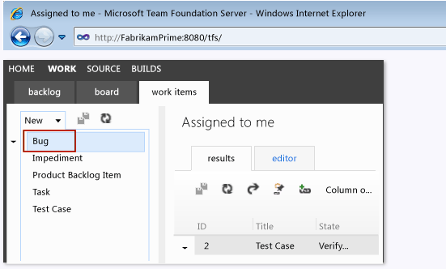

# How to: Submit a bug using the web portal
You can submit a bug using the web portal at any time during the software development process. For example, you perform ad hoc testing and find a bug, or you notice incorrect behavior while you’re discussing the application under test with your team mates. You can manually attach information to this bug and link it to other work items.  
  
> [!NOTE]
>  Using the web portal to submit a bug does not automatically add data that was collected when a test was run, unlike when you create a bug using Test Runner or the Exploratory Testing window from Microsoft Test Manager. For more information about these methods, see [Submitting Bugs](../vs140/submitting-bugs-in-microsoft-test-manager.md).  
  
### To connect to the web portal  
  
1.  Open a browser window and type a URL that uses the following form, where *ServerName* is the name of the application tier for Team Foundation Server, and the default *Port* is **8080**:  
  
     **http://** *ServerName:Port* **/tfs/**  
  
     For example, to connect to the server named **FabrikamPrime**, you would type **http://FabrikamPrime:8080/tfs/**. For more information, see [Connect to and Access Team Projects in Team Foundation Server](assetId:///1372e56c-b34f-42c2-b72c-94b57620c75c).  
  
2.  In the **Windows Identity** dialog box, enter your credentials and choose the **OK** button.  
  
3.  On the server home page, choose a team project link from those displayed, or choose **Browse all** to choose a team project from all those hosted on the server.  
  
     The **HOME** page for the selected team project displays.  
  
## To create a new bug using the web portal  
   
  
1.  On the **HOME** page of your team project, choose the **WORK** page and then choose the **work items** tab.  
  
2.  Using the drop-down list for **New**, choose **Bug**.  
  
     A **New Bug** form displays.  
  
3.  Type an appropriate title in the **Title** field.  
  
4.  (Optional) Use the drop-down list for **Iteration** to change the iteration path you want to associate with the bug.  
  
5.  Under **STATUS**, perform the following optional steps:  
  
    -   (Optional) To select the user to assign to this bug, use the drop-down list for **Assigned to**.  
  
    -   (Optional) To change the state of this bug from the default state of active, use the drop-down list for **State**.  
  
    -   (Optional) To change the reason for the bug, use the drop-down list for **Reason**.  
  
6.  Under **DETAILS**, perform the following optional steps:  
  
    -   (Optional) Add text in the **Effort** field.  
  
    -   (Optional) To assign a severity to the bug, use the drop-down list for **Severity**.  
  
    -   (Optional) Use the drop-down list for **Area** to select the appropriate area in the team project for this bug.  
  
    -   (Optional) Add text for the **Backlog Priority** field.  
  
7.  (Optional) Add comments applicable to the error causing the bug under **HISTORY**.  
  
8.  (Optional) To link this bug to other work items, choose **LINKS** and then choose **Link to**.  
  
9. (Optional) To add attachments to this bug, choose **Attachments**. Any file can be added. For example, you could add a video recording file, a screen shot file, or a log file.  
  
10. To save the bug, choose **Save work item** (disc icon) on the toolbar.  
  
## See Also  
 [Submitting Bugs](../vs140/submitting-bugs-in-microsoft-test-manager.md)   
 [Working within Team Web Access](assetId:///493362ae-5318-4719-9e0f-48c74ff8f0ba)