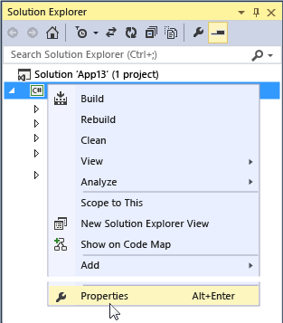

# How to: Target a Version of the .NET Framework
This document describes how to target a version of the .NET Framework when you create a project and how to change the targeted version in an existing Visual Basic, Visual C#, or Visual F# project.  
  
> [!IMPORTANT]
>  For information about how to change the target version for C++ projects, see [How to: Modify the Target Framework and Platform Toolset](../vs140/how-to--modify-the-target-framework-and-platform-toolset.md).  
  
 **In this topic**  
  
-   [Targeting a version when you create a project](../vs140/how-to--target-a-version-of-the-.net-framework.md#bkmk_new)  
  
-   [Changing the target version](../vs140/how-to--target-a-version-of-the-.net-framework.md#bkmk_existing)  
  
##   Targeting a version when you create a project  
 When you create a project, the version of the .NET Framework that you target determines which templates you can use.  
  
> [!NOTE]
>  In Express editions of Visual Studio, you must create the project first, and then you can change the target, as [Changing the Targeted Version](../vs140/how-to--target-a-version-of-the-.net-framework.md#bkmk_existing) describes later in this topic.  
  
#### To target a version when you create a project  
  
1.  On the menu bar, choose **File**, **New**, **Project**.  
  
2.  In the list at the top of the **New Project** dialog box, choose the version of the .NET Framework that you want your project to target.  
  
    > [!NOTE]
    >  Typically, only one version of the .NET Framework is installed with Visual Studio. If you want to target another version, you must first make sure that it's installed. See [Visual Studio Multi-Targeting Overview](../vs140/visual-studio-multi-targeting-overview.md).  
  
3.  In the list of installed templates, choose the type of project that you want to create, name the project, and then choose the **OK** button.  
  
     The list of templates shows only those projects that are supported by the version of the .NET Framework that you chose.  
  
##   Changing the target version  
 You can change the targeted version of the .NET Framework in a Visual Basic, Visual C#, or Visual F# project by following this procedure.  
  
#### To change the targeted version  
  
1.  In **Solution Explorer**, open the shortcut menu for the project that you want to change, and then choose **Properties**.  
  
       
  
    > [!IMPORTANT]
    >  For information about how to change the target version for C++ projects, see [How to: Modify the Target Framework and Platform Toolset](../vs140/how-to--modify-the-target-framework-and-platform-toolset.md).  
  
2.  In the left column of the properties window, choose the **Application** tab.  
  
       
  
    > [!NOTE]
    >  After you create a Windows Store app, you can't change the targeted version of either Windows or the .NET Framework.  
  
3.  In the **Target Framework** list, choose the version that you want.  
  
4.  In the verification dialog box that appears, choose the **Yes** button.  
  
     The project unloads. When it reloads, it targets the .NET Framework version that you just chose.  
  
    > [!NOTE]
    >  If your code contains references to a different version of the .NET Framework than the one that you targeted, error messages may appear when you compile or run the code. To resolve these errors, you must modify the references. See [Troubleshooting .NET Framework Targeting Errors](../vs140/troubleshooting-.net-framework-targeting-errors.md).  
  
## See Also  
 [Framework Multi-Targeting Overview](../vs140/visual-studio-multi-targeting-overview.md)   
 [.NET Framework Targeting for Web Projects](assetId:///8b8145a9-62f6-4fc4-8a83-47b0487cbe76)   
 [Troubleshooting .NET Framework Targeting Errors](../vs140/troubleshooting-.net-framework-targeting-errors.md)   
 [Application Page, Project Designer (C#)](../vs140/application-page--project-designer--csharp-.md)   
 [Application Page, Project Designer (Visual Basic)](../vs140/application-page--project-designer--visual-basic-.md)   
 [Configuring Projects (F#)](../vs140/configuring-projects--fsharp-.md)   
 [How to: Modify the Target Framework and Platform Toolset](../vs140/how-to--modify-the-target-framework-and-platform-toolset.md)