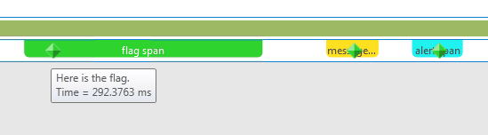
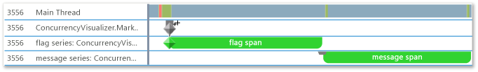
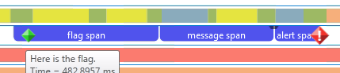
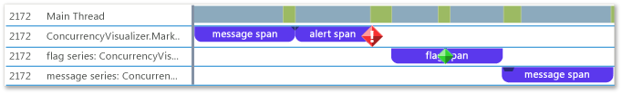

# How To: Use the Concurrency Visualizer Markers SDK
This topic shows how to use the Concurrency Visualizer SDK to create spans and write flags, messages, and alerts.  
  
### To use C++  
  
1.  Add Concurrency Visualizer SDK support to your application. For more information, see [Concurrency Visualizer SDK](../vs140/concurrency-visualizer-sdk.md).  
  
2.  Add an <CodeContentPlaceHolder>9\</CodeContentPlaceHolder> statement and a <CodeContentPlaceHolder>10\</CodeContentPlaceHolder> statement for the SDK.  
  
<CodeContentPlaceHolder>0\</CodeContentPlaceHolder>  
3.  Add code to create three spans in the default marker series and write a flag, a message, and an alert, one to each span. The methods to write flags, messages, and alerts are members of the [marker_series](../vs140/marker_series-class.md) class. The constructor for the [span](../vs140/span-class.md) class requires a <CodeContentPlaceHolder>11\</CodeContentPlaceHolder> object, so that each span is associated with a specific marker series. A <CodeContentPlaceHolder>12\</CodeContentPlaceHolder> ends when it is deleted.  
  
<CodeContentPlaceHolder>1\</CodeContentPlaceHolder>  
4.  On the menu bar, choose **Analyze**, **Concurrency Visualizer**, **Start with Current Project** to run the app and display the Concurrency Visualizer. The following illustration shows the three spans and three markers in the Concurrency Visualizer.  
  
       
  
5.  Add code to create additional, custom marker series by calling the constructor for <CodeContentPlaceHolder>13\</CodeContentPlaceHolder> that takes a string name for the marker series.  
  
<CodeContentPlaceHolder>2\</CodeContentPlaceHolder>  
6.  Start the current project to display the Concurrency Visualizer. The two marker series appear in their own lanes in Threads View. The following illustration shows the two new spans.  
  
       
  
### To Use Visual Basic or C#  
  
1.  Add Concurrency Visualizer SDK support to your application. For more information, see [Concurrency Visualizer SDK](../vs140/concurrency-visualizer-sdk.md).  
  
2.  Add a <CodeContentPlaceHolder>14\</CodeContentPlaceHolder> or <CodeContentPlaceHolder>15\</CodeContentPlaceHolder> statement for the SDK.  
  
<CodeContentPlaceHolder>3\</CodeContentPlaceHolder>  
<CodeContentPlaceHolder>4\</CodeContentPlaceHolder>  
3.  Add code to create three spans on the default marker series and write a flag, a message, and an alert, one to each span. You create a \<xref:Microsoft.ConcurrencyVisualizer.Instrumentation.Span*> object by calling the static [EnterSpan](assetId:///EnterSpan?qualifyHint=False&autoUpgrade=True) method. To write to the default series, you use the static write methods of the \<xref:Microsoft.ConcurrencyVisualizer.Instrumentation.Markers*> class.  
  
<CodeContentPlaceHolder>5\</CodeContentPlaceHolder>  
<CodeContentPlaceHolder>6\</CodeContentPlaceHolder>  
4.  On the menu bar, choose **Analyze**, **Concurrency Visualizer**, **Start with Current Project** to run the app and display the Concurrency Visualizer. The following illustration shows the three spans and three markers in the Threads View of the Concurrency Visualizer.  
  
       
  
5.  Add code to create customer marker series by using the static \<xref:Microsoft.ConcurrencyVisualizer.Instrumentation.Markers.CreateMarkerSeries*> method. The \<xref:Microsoft.ConcurrencyVisualizer.Instrumentation.MarkerSeries*> class contains methods for creating spans and writing flags, messages, and alerts.  
  
<CodeContentPlaceHolder>7\</CodeContentPlaceHolder>  
<CodeContentPlaceHolder>8\</CodeContentPlaceHolder>  
6.  Start the current project to display the Concurrency Visualizer. The three marker series appear in their own lanes in the Threads View. The following illustration shows the three new spans.  
  
       
  
## See Also  
 [Concurrency Visualizer SDK](../vs140/concurrency-visualizer-sdk.md)