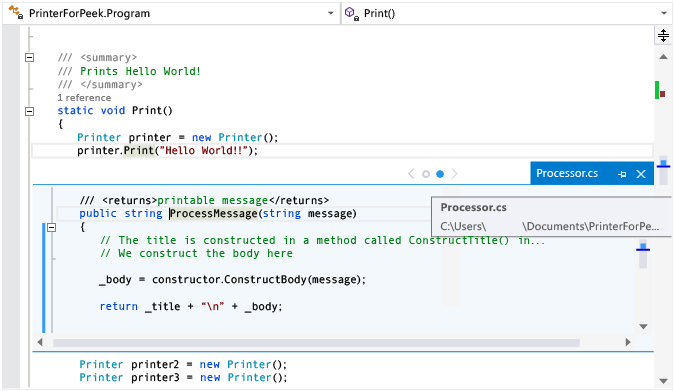
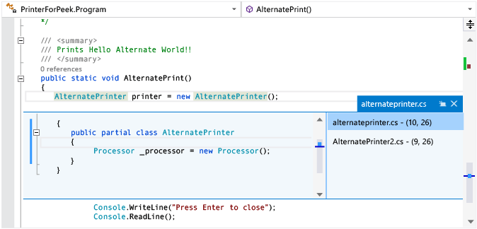
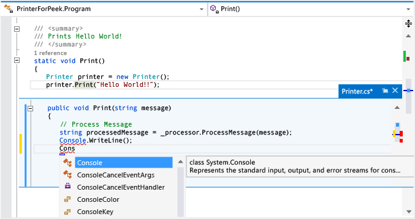

# How to: View and Edit Code by Using Peek Definition (Alt+F12)
You can use the **Peek Definition** command to view and edit code without switching away from the code that you're writing. **Peek Definition** and **Go To Definition** show the same information, but **Peek Definition** shows it in a pop-up window, and **Go To Definition** shows the code in a separate code window. **Go To Definition** causes your context (that is, the active code window, current line, and cursor position) to switch to the definition code window. By using **Peek Definition**, you  can view and edit the definition and move around inside the definition file while keeping your place in the original code file.  
  
 You can use **Peek Definition** with C#, Visual Basic, and C++ code. In Visual Basic, **Peek Definition** shows a link to the **Object Browser** for symbols that don’t have definition metadata (for example, .NET Framework types that are built in).  
  
> [!IMPORTANT]
>  You can't use this command in any Express version of Visual Studio 2013.  
  
## Working with Peek Definition  
  
#### To open a Peek Definition window  
  
1.  You can find **Peek Definition** by opening the shortcut menu for a method that you want to explore. (Keyboard: Alt+F12)  
  
     This illustration shows the **Peek Definition** window for a method that's named <CodeContentPlaceHolder>0\</CodeContentPlaceHolder>:  
  
       
  
     The definition window appears below the <CodeContentPlaceHolder>1\</CodeContentPlaceHolder> line in the original file. The window doesn't hide any of the code in your original file. The lines that follow the <CodeContentPlaceHolder>2\</CodeContentPlaceHolder> call appear under the definition window.  
  
2.  You can move the cursor to different locations in the code definition window. You can still move around in the original code window above or below the definition window.  
  
3.  You can copy a string from the definition window and paste it in the original code. You can also drag and drop the string from the definition window to the original code without deleting it from the definition window.  
  
4.  You can close the definition window by choosing the Esc key or the **Close** button on the definition window tab.  
  
#### To open a Peek Definition window from within a Peek Definition window  
  
-   If you already have a **Peek Definition** window open, you can call **Peek Definition** again on the code in that window. Another definition window opens. A set of breadcrumb dots appears next to the definition window tab, which you can use to navigate between definition windows. The tooltip on each dot shows the file name and path of the definition file that the dot represents.  
  
       
  
#### To use Peek Definition with multiple results  
  
-   If you use **Peek Definition** on code that has more than one definition (for example, partial classes), a result list appears to the right of the code definition view. You can choose any result in the list to display its definition.  
  
       
  
#### To edit inside the Peek Definition window  
  
-   When you start to edit inside a **Peek Definition** window, the file that you're modifying automatically opens as a separate tab in the code editor and reflects the changes that you've already made. You can continue to make, undo, and save changes in the **Peek Definition** window, and the tab will continue to reflect those changes. Even if you close the window without saving your changes, you can make, undo, and save more changes in the tab, picking up exactly where you left off in the window.  
  
       
  
#### To use keyboard shortcuts for Peek Definition  
  
-   You can use these keyboard shortcuts with the **Peek Definition** window:  
  
    |Functionality|Keyboard shortcut|  
    |-------------------|-----------------------|  
    |Open the definition window|Alt+F12|  
    |Close the definition window|Esc|  
    |Promote the definition window to a regular document tab|Shift+Alt+Home|  
    |Navigate between definition windows|Ctrl+Alt+- and Ctrl+Alt+=|  
    |Navigate between multiple results|F8 and Shift+F8|  
    |Toggle between the code editor window and the definition window|Shift+Esc|  
  
    > [!NOTE]
    >  You can also use the same keyboard shortcuts to edit code in a **Peek Definition** window as you use elsewhere in Visual Studio.  
  
## See Also  
 [Productivity Tips for Visual Studio](../vs140/productivity-tips-for-visual-studio.md)