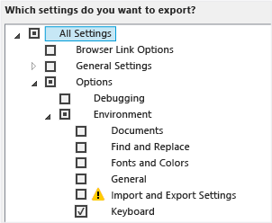
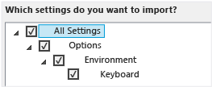

# Identifying and Customizing Keyboard Shortcuts in Visual Studio
You can identify keyboard shortcuts for Visual Studio commands, customize those shortcuts, and export them for others to use. Many shortcuts always invoke the same commands, but the behavior of a shortcut can vary based on the following conditions:  
  
-   Which default environment settings you chose the first time that you ran Visual Studio (for example, General Development or Visual C#).  
  
-   Whether you've customized the shortcut's behavior.  
  
-   Which context you're in when you choose the shortcut. For example, the F2 shortcut invokes the Edit.EditCell command if you're using the Settings Designer and the File.Rename command if you're using Team Explorer.  
  
 Regardless of settings, customization, and context, you can always find and change a keyboard shortcut in the **Options** dialog box. You can also look up the default keyboard shortcuts for several dozen commands in [Keyboard Shortcuts for Frequently Used Commands in Visual Studio](../vs140/default-keyboard-shortcuts-for-frequently-used-commands-in-visual-studio.md), and you can find a complete list of all default shortcuts (based on the General Development Settings) in [Default Keyboard Shortcuts in Visual Studio](../vs140/default-keyboard-shortcuts-in-visual-studio.md).  
  
 **In this topic**  
  
-   [Identifying a keyboard shortcut](../vs140/identifying-and-customizing-keyboard-shortcuts-in-visual-studio.md#bkmk_identify)  
  
-   [Customizing a keyboard shortcut](../vs140/identifying-and-customizing-keyboard-shortcuts-in-visual-studio.md#bkmk_assign)  
  
-   [Sharing custom keyboard shortcuts](../vs140/identifying-and-customizing-keyboard-shortcuts-in-visual-studio.md#bkmk_transfer)  
  
 If a shortcut is assigned to a command in the Global context and no other contexts, that shortcut will always invoke that command. But a shortcut can be assigned to one command in the Global context and a different command in a specific context. If you use such a shortcut when you're in the specific context, the shortcut invokes the command for the specific context, not the Global context.  
  
> [!NOTE]
>  Your settings and edition of Visual Studio might change the names and locations of menu commands and the options that appear in dialog boxes. This topic is based on the **General Development Settings**.  
  
##  \ Identifying a keyboard shortcut  
  
1.  On the menu bar, choose **Tools**, **Options**.  
  
2.  Expand **Environment**, and then choose **Keyboard**.  
  
       
  
3.  In the **Show commands containing** box, enter all or part of the name of the command without spaces.  
  
     For example, you can find commands for **solutionexplorer**.  
  
4.  In the list, choose the correct command.  
  
     For example, you can choose **View.SolutionExplorer**.  
  
5.  If the command has a keyboard shortcut, it appears in the **Shortcut(s) for selected command** list.  
  
       
  
##  \ Customizing a keyboard shortcut  
  
1.  On the menu bar, choose **Tools**, **Options**.  
  
2.  Expand the **Environment** folder, and then choose **Keyboard**.  
  
       
  
3.  In the **Show commands containing** box, enter all or part of the name of the command without spaces.  
  
     For example, you can find commands for **solutionexplorer**.  
  
4.  In the list, choose the command to which you want to assign a keyboard shortcut.  
  
5.  In the **Use new shortcut in** list, choose the feature area in which you want to use the shortcut.  
  
     For example, you can choose **Global** if you want the shortcut to work in all contexts. You can use any shortcut that isn't mapped (as Global) in another editor. Otherwise, the editor overrides the shortcut.  
  
    > [!NOTE]
    >  You can't assign the following keys as part of a keyboard shortcut in **Global**: Print Scrn/Sys Rq, Scroll Lock, Pause/Break, Tab, Caps Lock, Insert, Home, End, Page Up, Page Down, the Windows logo key, the Application key, any of the Arrow keys, or Enter; Num Lock, Delete, or Clear on the numeric keypad; or Ctrl+Alt+Delete.  
  
6.  In the **Press shortcut key(s)** box, enter the shortcut that you want to use.  
  
    > [!NOTE]
    >  You can create a shortcut that combines a letter with the Alt key, the Ctrl key, or both. You can also create a shortcut that combines the Shift key and a letter with the Alt key, the Ctrl key, or both.  
  
     If a shortcut is already assigned to another command, it appears in the **Shortcut currently used by** box. In that case, choose the Backspace key to delete that shortcut before you try a different one.  
  
       
  
7.  Choose the **Assign** button.  
  
    > [!NOTE]
    >  If you specify a different shortcut for a command, choose the **Assign** button, and then choose the **Cancel** button, the dialog box closes, but the change isn't reverted.  
  
##  \ Sharing custom keyboard shortcuts  
 You can share your custom keyboard shortcuts by exporting them to a file and then giving the file to others so that they can import the data.  
  
#### To export only keyboard shortcuts  
  
1.  On the menu bar, choose **Tools**, **Import and Export Settings**.  
  
2.  Choose **Export selected environment settings**, and then choose the **Next** button.  
  
3.  Under **What settings do you want to export?**, clear the **All Settings** check box, expand **Options**, and then expand **Environment**.  
  
4.  Select the **Keyboard** check box, and then choose the **Next** button.  
  
       
  
5.  In the **What do you want to name your settings file?** and **Store my settings file in this directory** boxes, either leave the default values or specify different values, and then choose the **Finish** button.  
  
     By default, your shortcuts are saved in a file in the %USERPROFILE%\Documents\Visual Studio 2013\Settings folder. The name of the file reflects the date when you exported the settings, and the extension is .vssettings.  
  
#### To import only keyboard shortcuts  
  
1.  On the menu bar, choose **Tools**, **Import and Export Settings**.  
  
2.  Choose the **Import selected environment settings** option button, and then choose the **Next** button.  
  
3.  Choose the **No, just import new settings, overwriting my current settings** option button, and then choose the **Next** button.  
  
4.  Under **My Settings**, choose the file that contains the shortcuts that you want to import, or choose the **Browse** button to locate the correct file.  
  
5.  Choose the **Next** button.  
  
6.  Under **Which settings do you want to import?**, clear the **All Settings** check box, expand **Options**, and then expand **Environment**.  
  
7.  Select the **Keyboard** check box, and then choose the **Finish** button.  
  
       
  
## See Also  
 [Microsoft Visual Studio Accessibility Features and Options](../vs140/accessibility-features-of-visual-studio.md)