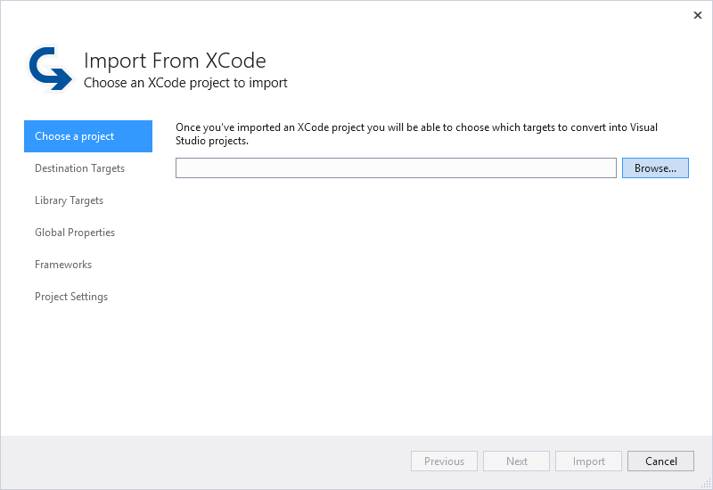
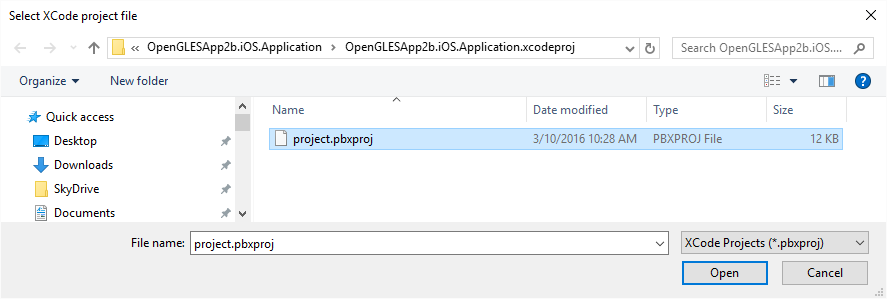
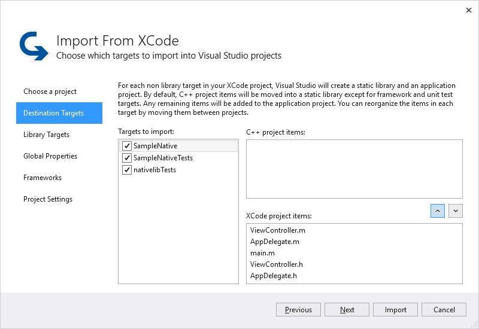
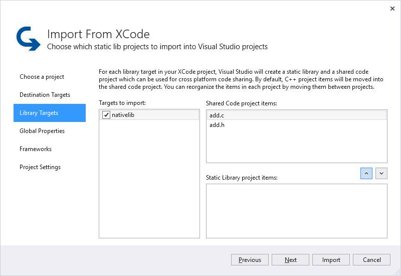
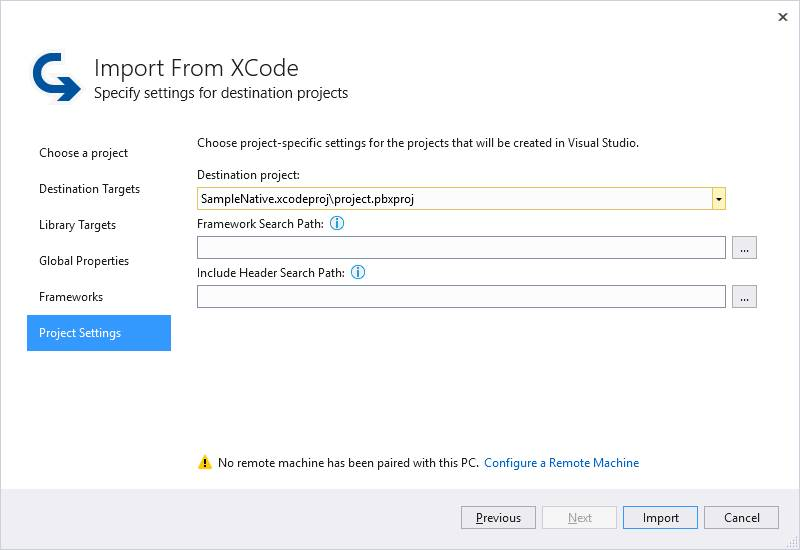

# Import an XCode Project
Microsoft Visual C++ for Cross-Platform Mobile Development includes support for moving your XCode projects into Visual Studio, where you can create cross-platform libraries and share code with other projects. The Import from XCode wizard simplifies the process of importing projects and splitting out the C++ code in your XCode targets for use as a static library or shared code project. You can manage your iOS-specific code in Visual Studio and still use XCode to do storyboards and builds. For information on how to easily move code back and forth between Visual Studio and XCode, see Move Changes Between XCode and Visual Studio.  
  
## Using the Import From XCode wizard  
 This topic shows you how to move an XCode project into Visual Studio to take advantage of code sharing and cross-platform solutions. As a prerequisite, you must pair your Mac to Visual Studio to be able to import, export, and build your project. For instructions on how to set up pairing, see [Install And Configure Tools to Build using iOS](../vs140/install-and-configure-tools-to-build-using-ios.md). You must also share your XCode project over the network or move it to your Visual Studio computer to use the Import from XCode wizard.  
  
#### Import from XCode  
  
1.  On the **File** menu, choose **New**, **Import**, **Import from XCode**. This starts the **Import from XCode** wizard dialog.  
  
       
  
2.  In the **Choose a project** pane, choose the Browse button to select an XCode .pbxproj file. Navigate to the project file in the **Select XCode project file** dialog, and then choose **Open**.  
  
       
  
     In the Import from XCode wizard, choose **Next**.  
  
3.  In the **Destination targets** pane, choose the targets from the XCode project to import into Visual Studio projects. XCode targets are similar to Visual Studio projects; most are a collection of code and resources that produce a binary. The Import from XCode wizard only allows import of targets that produce a binary, but not a static library, as destination targets. XCode static library targets are the subject of the next step.  
  
       
  
     For each target selected in **Targets to import**, the wizard automatically detects C++ code files that can be split into a separate static library project, and puts them in the **C++ project items** section. Other code and resources are left in the **XCode project items** section. These become separate static library and application projects in Visual Studio when the wizard completes the import process. By default, unit test and framework targets are not split into separate projects by the wizard.  
  
     To change which files are in each project, use the up and down buttons. When you are satisfied with the files in each project, choose **Next** to continue.  
  
4.  In the **Library targets** pane, choose which static library targets from the XCode project to import into Visual Studio projects. In this pane, you can choose which files are placed in a Shared Code project, and which are placed in a static library project. In each of targets in the **Targets to import** list, you can control which files are placed in the **Shared Code project items** and the **Static Library project items** by using the up and down buttons.  
  
       
  
     A Shared Code project is a way of sharing a set of source code files between projects in Visual Studio. The code is built as part of the project that includes it, not as a project of its own. Because the projects that include the shared code may have different architectures and configurations, this is the best way to provide a single project that contains code that may be built for many kinds of platforms.  
  
     When you are satisfied with the files in each project, choose **Next** to continue.  
  
5.  The **Global Properties** pane can be used to set a framework search path and an include header search path for all iOS projects in Visual Studio. Visual Studio uses these paths for source code browsing and for IntelliSense. These global paths are useful when you create iOS projects that use a common set of headers and frameworks.  
  
       
  
     These global paths can also be set in Visual Studio in the **Options** dialog. To find them, on the **Tools** menu, select **Options**. In the **Options** dialog, expand **Cross Platform**, **C++**, **iOS**, **Global Properties**.  
  
     Choose **Next** to continue.  
  
6.  The **Frameworks** pane is used to configure the paths used by Visual Studio for browsing and IntelliSense for your project. The paths must be accessible to Visual Studio for each framework referenced by your XCode project. The wizard checks the framework references in the XCode projects and displays whether Visual Studio can find the framework. Any path you have already set up in the Global Properties should be discovered by Visual Studio. The exceptions are listed in the Frameworks list. For each framework listed with an X, provide a PC accessible path for Visual Studio to find the framework. You can use the browse button [...] to use a **Select Folder** dialog to find the path. The framework path can be either to a local copy, or to a network-accessible share on your Mac.  
  
       
  
     Choose **Next** to continue.  
  
7.  The **Project Settings** pane allows you to change the framework and include header search path settings for each project the wizard creates. Use this pane to set project-specific paths that differ from the global settings.  
  
     To set a path for a specific project, In the **Destination project** drop-down, select the project file, then set the values in the **Framework Search Path** and **Include Header Search Path** controls. You can use the browse button [...] next to each control to use a **Select Folder** dialog to find the path.  
  
       
  
     If no remote Mac has been paired with this PC in Visual Studio, the Configure a Remote Machine link is shown. For instructions on how to set up pairing, see [Install And Configure Tools to Build using iOS](../vs140/install-and-configure-tools-to-build-using-ios.md).  
  
     To import the XCode project by using the wizard settings, choose **Import**.  
  
 The Import from XCode wizard creates projects in Visual Studio that correspond to the selected XCode project targets. The code that can be shared with other C++ projects is split into separate Shared Code and static library projects. The remaining code is placed in iOS library and application projects that can be built remotely by Visual Studio. For more information about moving code between Visual Studio and XCode, see [Move Changes between XCode and Visual Studio](../vs140/sync-changes-between-xcode-and-visual-studio.md).