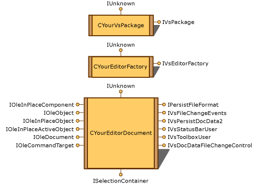

# In-Place Activation
If your editor view hosts ActiveX or other active controls, you must implement your editor view either as an ActiveX control or as an active document data object using the in-place activation model.  
  
## Support for Menus, Toolbars, and Commands  
 Visual Studio allows your editor view to use the menus and toolbars of the IDE. These extensions are referred to as *OLE in-place components*. For more information, see the <xref:Microsoft.VisualStudio.Shell.Interop.IOleInPlaceComponent*> and <xref:Microsoft.VisualStudio.Shell.Interop.IOleInPlaceComponentUIManager*>.  
  
 If you implement an ActiveX control, you can host other embedded objects. If you implement a document data object, the window frame constrains your ability to use ActiveX controls.  
  
> [!NOTE]
>  The <xref:Microsoft.VisualStudio.OLE.Interop.IOleDocument*> and <xref:Microsoft.VisualStudio.OLE.Interop.IOleDocumentView*> interfaces allow for a separation of data and view. However, Visual Studio does not support this functionality, and these interfaces are used only to represent the document view object.  
  
 Editors that use the <xref:Microsoft.VisualStudio.Shell.Interop.SOleComponentUIManager*> service can provide menu, toolbar, and command integration by calling the methods of the <xref:Microsoft.VisualStudio.Shell.Interop.IOleInPlaceComponentUIManager*> interface implemented by the <xref:Microsoft.VisualStudio.Shell.Interop.SOleComponentUIManager*> service. Editors can also offer other Visual Studio functionality, such as selection tracking and undo management. For more information, see [Creating Custom Editors and Designers](../vs140/creating-custom-editors-and-designers.md).  
  
## Objects and Interfaces Used  
 The objects that are used to create in-place activation are shown in the following illustration.  
  
   
In-place activation editor  
  
> [!NOTE]
>  Of the objects in this drawing, only the `CYourEditorFactory` object is required to create a standard editor. If you are creating a custom editor, you are not required to implement <xref:Microsoft.VisualStudio.Shell.Interop.IVsPersistDocData2*> because your editor will likely have its own private persistence mechanism. For more information, see [Types of Editors](../vs140/creating-custom-editors-and-designers.md).  
  
 All interfaces that are implemented to create an in-place activation editor are shown on the single `CYourEditorDocument` object, but this configuration only supports a single view of document data. For more information about supporting multiple views of your document data, see [Supporting Multiple Document Views](../vs140/supporting-multiple-document-views.md).  
  
|Interface|Type of object|Use|  
|---------------|--------------------|---------|  
|<xref:Microsoft.VisualStudio.Shell.Interop.IOleInPlaceComponent*>|View|Enables in-place VSPackage objects to operate as fully integrated components of the IDE by using the <xref:Microsoft.VisualStudio.Shell.Interop.SOleComponentUIManager*> service. This service integrates the menus, toolbars, and commands of the object into the IDE and issues notifications of state changes.|  
|<xref:Microsoft.VisualStudio.OLE.Interop.IOleObject*>|View|Principal means by which an embedded object provides basic functionality to its container and communicates with it.|  
|<xref:Microsoft.VisualStudio.OLE.Interop.IOleInPlaceActiveObject*>|View|Manages the activation and deactivation of in-place objects, and determines how much of the in-place object should be visible.|  
|<xref:Microsoft.VisualStudio.OLE.Interop.IOleInPlaceObject*>|View|Provides a direct channel of communication between an in-place object, the associated application's outermost frame window, and the document window in the application that contains the embedded object.|  
|<xref:Microsoft.VisualStudio.OLE.Interop.IOleDocument*>|View|Implements an ActiveX object. Note that the methods of <xref:Microsoft.VisualStudio.OLE.Interop.IOleDocument*> and `T:Microsoft.VisualStudio.OLE.Interop.IOleDocumentView` that separate document data and view are not used in the IDE .|  
|<xref:Microsoft.VisualStudio.OLE.Interop.IOleCommandTarget*>|View/Data|Enables the document data object or the document view object or both to participate in command handling.|  
|<xref:Microsoft.VisualStudio.Shell.Interop.IVsStatusbarUser*>|View|Enables status bar updates.|  
|<xref:Microsoft.VisualStudio.Shell.Interop.IVsToolboxUser*>|View|Enables adding items to the Toolbox.|  
|<xref:Microsoft.VisualStudio.Shell.Interop.IVsFileChangeEvents*>|Data|Sends notification of changes to the edited file. (This interface is optional.)|  
|<xref:Microsoft.VisualStudio.Shell.Interop.IPersistFileFormat*>|Data|Used to enable the Save As feature for a file type.|  
|<xref:Microsoft.VisualStudio.Shell.Interop.IVsPersistDocData*>|Data|Enables persistence for the document. For read-only files, call [SetDocDataReadOnly](assetId:///M:Microsoft.VisualStudio.Shell.Interop.IVsPersistDocData2.SetDocDataReadOnly(System.Int32)?qualifyHint=False&autoUpgrade=True) to provide the "lock" icon that indicates read-only files.|  
|<xref:Microsoft.VisualStudio.Shell.Interop.IVsDocDataFileChangeControl*>|Data|Determines whether changes to document data should be ignored.|