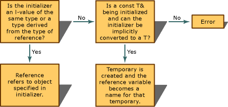

# Initializers
An initializer specifies the initial value of a variable. You can initialize variables in these contexts:  
  
-   In the definition of a variable:  
  
<CodeContentPlaceHolder>0\</CodeContentPlaceHolder>  
-   As one of the parameters of a function:  
  
<CodeContentPlaceHolder>1\</CodeContentPlaceHolder>  
-   As the return value of a function:  
  
<CodeContentPlaceHolder>2\</CodeContentPlaceHolder>  
 Initializers may take these forms:  
  
-   An expression (or a comma-separated list of expressions) in parentheses:  
  
<CodeContentPlaceHolder>3\</CodeContentPlaceHolder>  
-   An equals sign followed by an expression:  
  
<CodeContentPlaceHolder>4\</CodeContentPlaceHolder>  
-   A braced initializer list. The list may be empty or may consist of a set of lists, as in the following example:  
  
<CodeContentPlaceHolder>5\</CodeContentPlaceHolder>  
## Kinds of initialization  
 There are several kinds of initialization, which may occur at different points in program execution. Different kinds of initialization are not mutually exclusive—for example, list initialization can trigger value initialization and in other circumstances, it can trigger aggregate initialization.  
  
### Zero initialization  
 Zero initialization is the setting of a variable to a zero value implicitly converted to the type:  
  
-   Numeric variables are initialized to 0 (or 0.0, or 0.0000000000, etc.).  
  
-   Char variables are initialized to ‘\0’.  
  
-   Pointers are initialized to <CodeContentPlaceHolder>26\</CodeContentPlaceHolder>.  
  
-   Arrays, [POD](../vs140/is_pod-class.md) classes, structs, and unions have their members initialized to a zero value.  
  
 Zero initialization is performed at different times:  
  
-   At program startup, for all named variables that have static duration. These variables may later be initialized again.  
  
-   During value initialization, for scalar types and POD class types that are initialized by using empty braces.  
  
-   For arrays that have only a subset of their members initialized.  
  
 Here are some examples of zero initialization:  
  
<CodeContentPlaceHolder>6\</CodeContentPlaceHolder>  
### Default initialization  
 Default initialization for classes, structs, and unions is initialization with a default constructor. The default constructor can be called with no initialization expression or with the <CodeContentPlaceHolder>27\</CodeContentPlaceHolder> keyword:  
  
<CodeContentPlaceHolder>7\</CodeContentPlaceHolder>  
 If the class, struct, or union does not have a default constructor, the compiler emits an error.  
  
 Scalar variables are default initialized when they are defined with no initialization expression. They have indeterminate values.  
  
<CodeContentPlaceHolder>8\</CodeContentPlaceHolder>  
 Arrays are default initialized when they are defined with no initialization expression. When an array is default-initialized, its members are default initialized and have indeterminate values, as in the following example:  
  
<CodeContentPlaceHolder>9\</CodeContentPlaceHolder>  
 If the array members do not have a default constructor, the compiler emits an error.  
  
#### Default initialization of constant variables  
 Constant variables must be declared together with an initializer. If they are scalar types they cause a compiler error, and if they are class types that have a default constructor they cause a warning:  
  
<CodeContentPlaceHolder>10\</CodeContentPlaceHolder>  
#### Default initialization of static variables  
 Static variables that are declared with no initializer are initialized to 0 (implicitly converted to the type).  
  
<CodeContentPlaceHolder>11\</CodeContentPlaceHolder>  
 For more information about initialization of global static objects, see [Additional Startup Considerations](../vs140/additional-startup-considerations.md).  
  
### Value initialization  
 Value initialization occurs in the following cases:  
  
-   a named value is initialized using empty brace initialization  
  
-   an anonymous temporary object is initialized using empty parentheses or braces  
  
-   an object is initialized with the <CodeContentPlaceHolder>28\</CodeContentPlaceHolder> keyword plus empty parentheses or braces  
  
 Value initialization does the following:  
  
-   for classes with at least one public constructor, the default constructor is called  
  
-   for non-union classes with no declared constructors, the object is zero-initialized and the default constructor is called  
  
-   for arrays, every element is value-initialized  
  
-   in all other cases, the variable is zero initialized  
  
<CodeContentPlaceHolder>12\</CodeContentPlaceHolder>  
### Copy initialization  
 Copy initialization is the initialization of one object using a different object. It occurs in the following cases:  
  
-   a variable is initialized using an equals sign  
  
-   an argument is passed to a function  
  
-   an object is returned from a function  
  
-   an exception is thrown or caught  
  
-   a non-static data member is initialized using an equals sign  
  
-   class, struct, and union members are initialized by copy initialization during aggregate initialization. See [Aggregate initialization](../vs140/initializers.md#INIT_AggInit) for examples.  
  
 The following code shows several examples of copy initialization:  
  
<CodeContentPlaceHolder>13\</CodeContentPlaceHolder>  
 Copy initialization cannot invoke explicit constructors.  
  
<CodeContentPlaceHolder>14\</CodeContentPlaceHolder>  
 In some cases, if the copy constructor of the class is deleted or inaccessible, copy initialization causes a compiler error. See [(NOTINBUILD) Explicit Initialization](assetId:///c89724f8-ddd3-4d77-b86d-77fcd8bd8595) for more information.  
  
### Direct initialization  
 Direct initialization is initialization using (non-empty) braces or parentheses. Unlike copy initialization, it can invoke explicit constructors. It occurs in the following cases:  
  
-   a variable is initialized with non-empty braces or parentheses  
  
-   a variable is initialized with the <CodeContentPlaceHolder>29\</CodeContentPlaceHolder> keyword plus non-empty braces or parentheses  
  
-   a variable is initialized with <CodeContentPlaceHolder>30\</CodeContentPlaceHolder>  
  
-   in a constructor, base classes and non-static members are initialized with an initializer list  
  
-   in the copy of a captured variable inside a lambda expression  
  
 The following code shows some examples of direct initialization:  
  
<CodeContentPlaceHolder>15\</CodeContentPlaceHolder>  
### List initialization  
 List initialization occurs when a variable is initialized using a braced initializer list. Braced initializer lists can be used in the following cases:  
  
-   a variable is initialized  
  
-   a class is initialized with the <CodeContentPlaceHolder>31\</CodeContentPlaceHolder> keyword  
  
-   an object is returned from a function  
  
-   an argument passed to a function  
  
-   one of the arguments in a direct initialization  
  
-   in a non-static data member initializer  
  
-   in a constructor initializer list  
  
 The following code shows some examples of list initialization:  
  
<CodeContentPlaceHolder>16\</CodeContentPlaceHolder>  
### Aggregate initialization  
 Aggregate initialization is a form of list initialization for arrays or class types (often structs or unions) that have:  
  
-   no private or protected members  
  
-   no user-provided constructors, except for explicitly defaulted or deleted constructors  
  
-   no base classes  
  
-   no virtual member functions  
  
-   no brace-or-equal initializers for non-static members  
  
 Aggregate initializers consist of a braced initialization list, with or without an equals sign, as in the following example:  
  
<CodeContentPlaceHolder>17\</CodeContentPlaceHolder>  
 You should see the following output:  
  
<CodeContentPlaceHolder>18\</CodeContentPlaceHolder>  
> [!IMPORTANT]
>  Array members that declared but not explicitly initialized during aggregate initialization are zero-initialized, as in <CodeContentPlaceHolder>32\</CodeContentPlaceHolder> above.  
  
#### Initializing unions and structs  
 If a union does not have a constructor, you can initialize it with a single value (or with another instance of a union). The value is used to initialize the first non-static field. This is different from struct initialization, in which the first value in the initializer is used to initialize the first field, the second to initialize the second field, and so on. Compare the initialization of unions and structs in the following example:  
  
<CodeContentPlaceHolder>19\</CodeContentPlaceHolder>  
#### Initializing aggregates that contain aggregates  
 Aggregate types can contain other aggregate types, for example arrays of arrays, arrays of structs, and so on. These types are initialized by using nested sets of braces, for example:  
  
<CodeContentPlaceHolder>20\</CodeContentPlaceHolder>  
### Reference initialization  
 Variables of reference type must be initialized with an object of the type from which the reference type is derived, or with an object of a type that can be converted to the type from which the reference type is derived. For example:  
  
<CodeContentPlaceHolder>21\</CodeContentPlaceHolder>  
 The only way to initialize a reference with a temporary object is to initialize a constant temporary object. Once initialized, a reference-type variable always points to the same object; it cannot be modified to point to another object.  
  
 Although the syntax can be the same, initialization of reference-type variables and assignment to reference-type variables are semantically different. In the preceding example, the assignments that change <CodeContentPlaceHolder>33\</CodeContentPlaceHolder> and <CodeContentPlaceHolder>34\</CodeContentPlaceHolder> look similar to the initializations, but have different effects. The initialization specifies the object to which the reference-type variable points; the assignment assigns to the referred-to object through the reference.  
  
 Because both passing an argument of reference type to a function and returning a value of reference type from a function are initializations, the formal arguments to a function are initialized correctly, as are the references returned.  
  
 Reference-type variables can be declared without initializers only in the following:  
  
-   Function declarations (prototypes). For example:  
  
<CodeContentPlaceHolder>22\</CodeContentPlaceHolder>  
-   Function-return type declarations. For example:  
  
<CodeContentPlaceHolder>23\</CodeContentPlaceHolder>  
-   Declaration of a reference-type class member. For example:  
  
<CodeContentPlaceHolder>24\</CodeContentPlaceHolder>  
-   Declaration of a variable explicitly specified as <CodeContentPlaceHolder>35\</CodeContentPlaceHolder>. For example:  
  
<CodeContentPlaceHolder>25\</CodeContentPlaceHolder>  
 When initializing a reference-type variable, the compiler uses the decision graph shown in the following figure to select between creating a reference to an object or creating a temporary object to which the reference points.  
  
   
Decision Graph for Initialization of Reference Types  
  
 References to <CodeContentPlaceHolder>36\</CodeContentPlaceHolder> types (declared as <CodeContentPlaceHolder>37\</CodeContentPlaceHolder> *typename***&** *identifier*) can be initialized with <CodeContentPlaceHolder>38\</CodeContentPlaceHolder> objects of the same type or with objects that have not been declared as <CodeContentPlaceHolder>39\</CodeContentPlaceHolder>. They cannot, however, be initialized with **const** objects of that type. Similarly, references to **const** types (declared as **const** *typename***&** *identifier*) can be initialized with **const** objects of the same type (or anything that has a conversion to that type or with objects that have not been declared as **const**). They cannot, however, be initialized with <CodeContentPlaceHolder>40\</CodeContentPlaceHolder> objects of that type.  
  
 References that are not qualified with either the **const** or <CodeContentPlaceHolder>41\</CodeContentPlaceHolder> keyword can be initialized only with objects declared as neither **const** nor <CodeContentPlaceHolder>42\</CodeContentPlaceHolder>.  
  
### Initialization of external variables  
 Declarations of automatic, register, static, and external variables can contain initializers. However, declarations of external variables can contain initializers only if the variables are not declared as <CodeContentPlaceHolder>43\</CodeContentPlaceHolder>. For more information, see [External](../vs140/external.md).  
  
## See Also  
 [(NOTINBUILD)Declarators](assetId:///8a7b9b51-92bd-4ac0-b3fe-0c4abe771838)