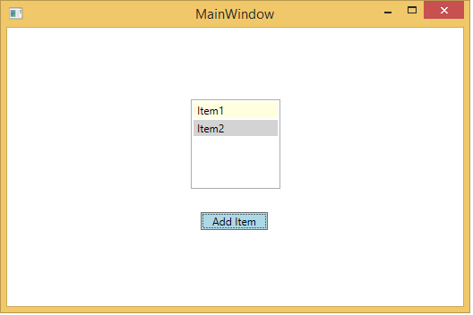
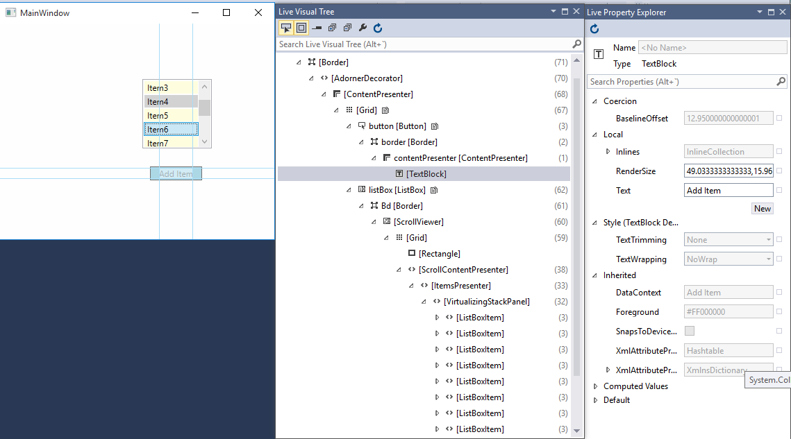

# Inspect XAML properties while debugging
You can get a real-time view of your running XAML code with the **Live Visual Tree** and the **Live Property Explorer**. These tools give you a tree view of the UI elements of your running XAML application, and show you the runtime properties of any UI element you select.  
  
 You can use these tools in the following configurations:  
  
|Type of App|Operating System and Tools|  
|-----------------|--------------------------------|  
|Windows Presentation Foundation (4.0 and above) applications|Windows 7 and above|  
|Windows Store and Windows Phone 8.1 apps|Windows 10 and above, with the [Windows 10 SDK](https://dev.windows.com/en-us/downloads/windows-10-sdk)|  
|Universal Windows apps|Windows 10 and above, with the [Windows 10 SDK](https://dev.windows.com/en-us/downloads/windows-10-sdk)|  
  
## Looking at Elements in the Live Visual Tree  
 Let’s get started with a very simple WPF application that has a list view and a button. Every time you click the button, another item is added to the list. Even-numbered items are colored gray, and odd-numbered items are colored yellow.  
  
 Create a new C# WPF application (File / New / Project, then select C# and find WPF Application). Name it **TestXAML**.  
  
 Change MainWindow.xaml to the following:  
  
```xaml  
<Window x:Class="WpfApplication1.MainWindow"  
    xmlns="http://schemas.microsoft.com/winfx/2006/xaml/presentation"  
    xmlns:x="http://schemas.microsoft.com/winfx/2006/xaml"  
    xmlns:d="http://schemas.microsoft.com/expression/blend/2008"  
    xmlns:mc="http://schemas.openxmlformats.org/markup-compatibility/2006"  
    xmlns:local="clr-namespace:WpfApplication1"  
    mc:Ignorable="d"  
     Title="MainWindow" Height="350" Width="525">  
    <Grid>  
        <Button x:Name="button" Background="LightBlue" Content="Add Item" HorizontalAlignment="Left" Margin="216,206,0,0" VerticalAlignment="Top" Width="75" Click="button_Click"/>  
        <ListBox x:Name="listBox" HorizontalAlignment="Left" Height="100" VerticalAlignment="Top" Width="100" Margin="205,80,0,0"/>  
    </Grid>  
</Window>  
```  
  
 Add the following command handler to the MainWindow.xaml.cs file:  
  
```c#  
private void button_Click(object sender, RoutedEventArgs e)  
{  
    ListBoxItem item = new ListBoxItem();  
    item.Content = "Item" + ++count;  
    if (count % 2 == 0)  
    {  
        item.Background = Brushes.LightGray;  
    }  
    else  
    {  
        item.Background = Brushes.LightYellow;  
    }  
    listBox.Items.Add(item);  
}  
```  
  
 Build the project and start debugging. (The build configuration must be Debug, not Release. For more information about build configurations, see [Understanding Build Configurations](../vs140/understanding-build-configurations.md).)  
  
 When the window comes up, click the **Add Item** button a couple of times. You should see something like this:  
  
   
  
 Now open the **Live Visual Tree** window (**Debug / Windows / Live Visual Tree**, or find it along the left side of the IDE). Drag it away from its docking position so we can look at this window and the **Live Properties** window side by side. In the **Live Visual Tree** window, expand the **ContentPresenter** node. It should contain nodes for the button and the list box. Expand the list box (and then the **ScrollContentPresenter** and the **ItemsPresenter**) to find the list box items. The window should look like this:  
  
   
  
 Go back to the application window and add a few more items. You should see more list box items appear in the **Live Visual Tree**.  
  
 Now let’s look at the properties of one of the list box items. Select the first list box item in the **Live Visual Tree** and click the **Show Properties** icon on the toolbar. The **Live Property Explorer** should appear. Note that the **Content** field is “Item1”, and the **Background** field is **#FFFFFFE0** (light yellow). Go back to the **Live Visual Tree** and select the second list box item. The **Live Property Explorer** should show that the **Content** field is “Item2”, and the **Background** field is **#FFD3D3D3** (light gray).  
  
 The actual structure of the XAML has a lot of elements that you’re probably not directly interested in, and if you don’t know the code well you might have a hard time navigating the tree to find what you’re looking for. So the **Live Visual Tree** has a couple of ways that let you use the application’s UI to help you find the element you want to examine.  
  
 **Enable selection in the running application**. You can enable this mode when you select the leftmost button on the **Live Visual Tree** toolbar. With this mode on, you can select a UI element in the application, and the **Live Visual Tree** (and the **Live Property Viewer**) automatically updates to show the node in the tree corresponding to that element, and its properties.  
  
 **Display layout adorners in the running application**. You can enable this mode when you select the button that is immediately to the right of the Enable selection button. When **Display layout adorners** is on, it causes the application window to show horizontal and vertical lines along the bounds of the selected object so you can see what it aligns to, as well as rectangles showing the margins. For example, turn both **Enable selection** and **Display layout** on, and select the **Add Item** text block in the application. You should see the text block node in the **Live Visual Tree** and the text block properties in the **Live Property Viewer**, as well as the horizontal and vertical lines on the bounds of the text block.  
  
   
  
 **Preview Selection**. You can enable this mode by selecting the third button from the left on the Live Visual Tree toolbar. This mode shows the XAML where the element was declared, if you have access to the source code of the application. Select **Enable selection** and **Preview selection**, and then you select the button in our test application. The MainWindow.xaml file opens in Visual Studio and the cursor is placed on the line where the button is defined.  
  
## Using XAML tools with running applications  
 You can use these XAML tools even when you don’t have the source code. When you attach to a running XAML application, you can use the **Live Visual Tree** on the UI elements of that application too. Here’s an example, using the same WPF test application we used before.  
  
1.  Start the **TestXaml** application in the Release configuration. You cannot attach to a process that is running in a **Debug** configuration.  
  
2.  Open a second instance of Visual Studio and click **Debug / Attach to Process**. Find **TestXaml.exe** in the list of available processes, and click **Attach**.  
  
3.  The application starts running.  
  
4.  In the second instance of Visual Studio, open the **Live Visual Tree** (**Debug / Windows / Live Visual Tree**). You should see the **TestXaml** UI elements, and you should be able to manipulate them as you did while debugging the application directly.