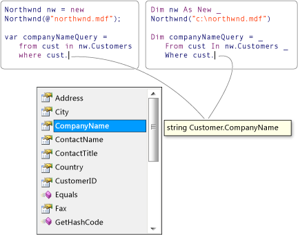

# Introduction to LINQ (Visual Basic)
Language-Integrated Query (LINQ) is an innovation introduced in the .NET Framework version 3.5 that bridges the gap between the world of objects and the world of data.  
  
 Traditionally, queries against data are expressed as simple strings without type checking at compile time or IntelliSense support. Furthermore, you have to learn a different query language for each type of data source: SQL databases, XML documents, various Web services, and so on. LINQ makes a *query* a first-class language construct in Visual Basic. You write queries against strongly typed collections of objects by using language keywords and familiar operators.  
  
 You can write LINQ queries in Visual Basic for SQL Server databases, XML documents, ADO.NET Datasets, and any collection of objects that supports \<xref:System.Collections.IEnumerable*> or the generic \<xref:System.Collections.Generic.IEnumerable`1*> interface. LINQ support is also provided by third parties for many Web services and other database implementations.  
  
 You can use LINQ queries in new projects, or alongside non-LINQ queries in existing projects. The only requirement is that the project target .NET Framework 3.5 or later.  
  
 The following illustration from Visual Studio shows a partially-completed LINQ query against a SQL Server database in both C# and Visual Basic with full type checking and IntelliSense support.  
  
   
  
## Next Steps  
 To learn more details about LINQ, start by becoming familiar with some basic concepts in the Getting Started section [Getting Started with LINQ in Visual Basic](../vs140/getting-started-with-linq-in-visual-basic.md), and then read the documentation for the LINQ technology in which you are interested:  
  
-   SQL Server databases: [LINQ to SQL](assetId:///73d13345-eece-471a-af40-4cc7a2f11655)  
  
-   XML documents: [LINQ to XML (Visual Basic)](../vs140/linq-to-xml--visual-basic-.md)  
  
-   ADO.NET Datasets: [LINQ to DataSet](assetId:///743e3755-3ecb-45a2-8d9b-9ed41f0dcf17)  
  
-   .NET collections, files, strings and so on: [LINQ to Objects (Visual Basic)](../vs140/linq-to-objects--visual-basic-.md)  
  
## See Also  
 [Language-Integrated Query (LINQ) (Visual Basic)](../vs140/language-integrated-query--linq---visual-basic-.md)