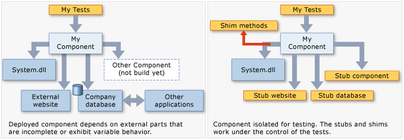

# Isolating Code Under Test with Microsoft Fakes
Microsoft Fakes help you isolate the code you are testing by replacing other parts of the application with *stubs* or *shims*. These are small pieces of code that are under the control of your tests. By isolating your code for testing, you know that if the test fails, the cause is there and not somewhere else. Stubs and shims also let you test your code even if other parts of your application are not working yet.  
  
 Fakes come in two flavors:  
  
-   A [stub](#stubs) replaces a class with a small substitute that implements the same interface.  To use stubs, you have to design your application so that each component depends only on interfaces, and not on other components. (By "component" we mean a class or group of classes that are designed and updated together and typically contained in an assembly.)  
  
-   A [shim](#shims) modifies the compiled code of your application at run time so that instead of making a specified method call, it runs the shim code that your test provides. Shims can be used to replace calls to assemblies that you cannot modify, such .NET assemblies.  
  
   
  
 **Requirements**  
  
-   Visual Studio Enterprise  
  
## Choosing between stub and shim types  
 Typically, you would consider a Visual Studio project to be a component, because you develop and update those classes at the same time. You would consider using stubs and shims for calls that the project makes to other projects in your solution, or to other assemblies that the project references.  
  
 As a general guide, use stubs for calls within your Visual Studio solution, and shims for calls to other referenced assemblies. This is because within your own solution it is good practice to decouple the components by defining interfaces in the way that stubbing requires. But external assemblies such as System.dll typically are not provided with separate interface definitions, so you must use shims instead.  
  
 Other considerations are:  
  
 **Performance.** Shims run slower because they rewrite your code at run time. Stubs do not have this performance overhead and are as fast as virtual methods can go.  
  
 **Static methods, sealed types.** You can only use stubs to implement interfaces. Therefore, stub types cannot be used for static methods, non-virtual methods, sealed virtual methods, methods in sealed types, and so on.  
  
 **Internal types.** Both stubs and shims can be used with internal types that are made accessible by using the assembly attribute \<xref:System.Runtime.CompilerServices.InternalsVisibleToAttribute*>.  
  
 **Private methods.** Shims can replace calls to private methods if all the types on the method signature are visible. Stubs can only replace visible methods.  
  
 **Interfaces and abstract methods.** Stubs provide implementations of interfaces and abstract methods that can be used in testing. Shims can’t instrument interfaces and abstract methods, because they don’t have method bodies.  
  
 In general, we recommend that you use stub types to isolate from dependencies within your codebase. You can do this by hiding the components behind interfaces. Shim types can be used to isolate from third-party components that do not provide a testable API.  
  
##  \<a name="stubs">\</a> Getting started with stubs  
 For a more detailed description, see .  
  
1.  **Inject interfaces**  
  
     To use stubs, you have to write the code you want to test in such a way that it does not explicitly mention classes in another component of your application. By "component" we mean a class or classes that are developed and updated together, and typically contained in one Visual Studio project. Variables and parameters should be declared by using interfaces and instances of other components should be passed in or created by using a factory. For example, if StockFeed is a class in another component of the application, then this would be considered bad:  
  
     <CodeContentPlaceHolder>8\</CodeContentPlaceHolder>  
  
     Instead, define an interface that can be implemented by the other component, and which can also be implemented by a stub for test purposes:  
  
<CodeContentPlaceHolder>0\</CodeContentPlaceHolder>  
<CodeContentPlaceHolder>1\</CodeContentPlaceHolder>  
2.  **Add Fakes Assembly**  
  
    1.  In Solution Explorer, expand the test project’s reference list. If you are working in Visual Basic, you must choose **Show All Files** in order to see the reference list.  
  
    2.  Select the reference to the assembly in which the interface (for example IStockFeed) is defined. On the shortcut menu of this reference, choose **Add Fakes Assembly**.  
  
    3.  Rebuild the solution.  
  
3.  In your tests, construct instances of the stub and provide code for its methods:  
  
<CodeContentPlaceHolder>2\</CodeContentPlaceHolder>  
<CodeContentPlaceHolder>3\</CodeContentPlaceHolder>  
     The special piece of magic here is the class <CodeContentPlaceHolder>9\</CodeContentPlaceHolder>. For every interface in the referenced assembly, the Microsoft Fakes mechanism generates a stub class. The name of the stub class is the derived from the name of the interface, with "<CodeContentPlaceHolder>10\</CodeContentPlaceHolder>" as a prefix, and the parameter type names appended.  
  
     Stubs are also generated for the getters and setters of properties, for events, and for generic methods. For more information, see [Using stubs to isolate calls to virtual functions in unit test methods](../vs140/using-stubs-to-isolate-parts-of-your-application-from-each-other-for-unit-testing.md).  
  
##  \<a name="shims">\</a> Getting started with shims  
 (For a more detailed description, see .)  
  
 Suppose your component contains calls to <CodeContentPlaceHolder>11\</CodeContentPlaceHolder>:  
  
<CodeContentPlaceHolder>4\</CodeContentPlaceHolder>  
 During testing, you would like to shim the <CodeContentPlaceHolder>12\</CodeContentPlaceHolder> property, because the real version inconveniently returns a different value at every call.  
  
 To use shims, you don’t have to modify the application code or write it a particular way.  
  
1.  **Add Fakes Assembly**  
  
     In Solution Explorer, open your unit test project’s references and select the reference to the assembly that contains the method you want to fake. In this example, the <CodeContentPlaceHolder>13\</CodeContentPlaceHolder> class is in **System.dll**.  To see the references in a Visual Basic project, choose **Show All Files**.  
  
     Choose **Add Fakes Assembly**.  
  
2.  **Insert a shim in a ShimsContext**  
  
<CodeContentPlaceHolder>5\</CodeContentPlaceHolder>  
<CodeContentPlaceHolder>6\</CodeContentPlaceHolder>  
     Shim class names are made up by prefixing <CodeContentPlaceHolder>14\</CodeContentPlaceHolder> to the original type name. Parameter names are appended to the method name. (You don’t have to add any assembly reference to System.Fakes.)  
  
 The previous example uses a shim for a static method. To use a shim for an instance method, write <CodeContentPlaceHolder>15\</CodeContentPlaceHolder> between the type name and the method name:  
  
<CodeContentPlaceHolder>7\</CodeContentPlaceHolder>  
 (There is no ‘System.IO.Fakes’ assembly to reference. The namespace is generated by the shim creation process. But you can use ‘using’ or ‘Import’ in the usual way.)  
  
 You can also create shims for specific instances, for constructors, and for properties. For more information, see [Using shims to isolate calls to non-virtual functions in unit test methods](../vs140/using-shims-to-isolate-your-application-from-other-assemblies-for-unit-testing.md).  
  
## In this section  
 [Using stubs to isolate calls to virtual functions in unit test methods](../vs140/using-stubs-to-isolate-parts-of-your-application-from-each-other-for-unit-testing.md)  
  
 [Using shims to isolate calls to non-virtual functions in unit test methods](../vs140/using-shims-to-isolate-your-application-from-other-assemblies-for-unit-testing.md)  
  
 [Code generatation, compilation, and naming conventions in Microsoft Fakes](../vs140/code-generation--compilation--and-naming-conventions-in-microsoft-fakes.md)