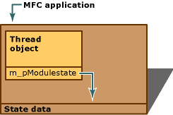
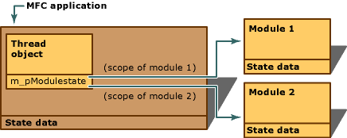

# Managing the State Data of MFC Modules
This article discusses the state data of MFC modules and how this state is updated when the flow of execution (the path code takes through an application when executing) enters and leaves a module. Switching module states with the `AFX_MANAGE_STATE` and `METHOD_PROLOGUE` macros is also discussed.  
  
> [!NOTE]
>  The term "module" here refers to an executable program, or to a DLL (or set of DLLs) that operate independently of the rest of the application, but uses a shared copy of the MFC DLL. An ActiveX control is a typical example of a module.  
  
 As shown in the following figure, MFC has state data for each module used in an application. Examples of this data include Windows instance handles (used for loading resources), pointers to the current `CWinApp` and `CWinThread` objects of an application, OLE module reference counts, and a variety of maps that maintain the connections between Windows object handles and corresponding instances of MFC objects. However, when an application uses multiple modules, the state data of each module is not application wide. Rather, each module has its own private copy of the MFC's state data.  
  
   
State Data of a Single Module (Application)  
  
 A module's state data is contained in a structure and is always available via a pointer to that structure. When the flow of execution enters a particular module, as shown in the following figure, that module's state must be the "current" or "effective" state. Therefore, each thread object has a pointer to the effective state structure of that application. Keeping this pointer updated at all times is vital to managing the application's global state and maintaining the integrity of each module's state. Incorrect management of the global state can lead to unpredictable application behavior.  
  
   
State Data of Multiple Modules  
  
 In other words, each module is responsible for correctly switching between module states at all of its entry points. An "entry point" is any place where the flow of execution can enter the module's code. Entry points include:  
  
-   [Exported functions in a DLL](../vs140/exported-dll-function-entry-points.md)  
  
-   [Member functions of COM interfaces](../vs140/com-interface-entry-points.md)  
  
-   [Window procedures](../vs140/window-procedure-entry-points.md)  
  
## See Also  
 [General MFC Topics](../vs140/general-mfc-topics.md)