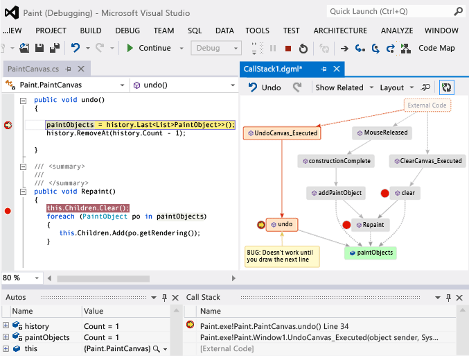
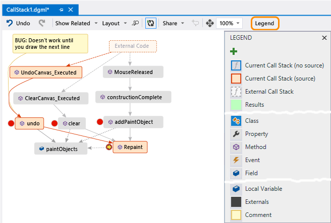

# Map methods on the call stack while debugging in Visual Studio
Create a code map to visually trace the call stack while you’re debugging. You can make notes on the map to track what the code is doing so you can focus on finding bugs.  
  
   
  
 You’ll need:  
  
-   [Visual Studio Enterprise](https://www.visualstudio.com/downloads/download-visual-studio-vs)  
  
-   Code that you can debug, such as Visual C# .NET, Visual Basic .NET, C++, JavaScript, or X++  
  
 See: [Video: Debug visually with Code Map debugger integration (Channel 9)](http://go.microsoft.com/fwlink/?LinkId=293418) • [Map the call stack](#MapStack) • [Make notes about the code](#MakeNotes) • [Update the map with the next call stack](#UpdateMap) • [Add related code to the map](#AddRelatedCode) • [Find bugs using the map](#FindBugs) • [Q & A](#QA)  
  
 For details of the commands and actions you can use when working with code maps, see [Browse and rearrange code maps](../vs140/browse-and-rearrange-code-maps.md).  
  
##  \<a name="MapStack">\</a> Map the call stack  
  
1.  Start debugging. (Keyboard: **F5**)  
  
2.  After your app enters break mode or you step into a function, choose **Code Map**. (Keyboard: **Ctrl** + **Shift** + **<CodeContentPlaceHolder>0\</CodeContentPlaceHolder>clear<CodeContentPlaceHolder>1\</CodeContentPlaceHolder>undo<CodeContentPlaceHolder>2\</CodeContentPlaceHolder>Repaint<CodeContentPlaceHolder>3\</CodeContentPlaceHolder>Repaint<CodeContentPlaceHolder>4\</CodeContentPlaceHolder>undo<CodeContentPlaceHolder>5\</CodeContentPlaceHolder>undo<CodeContentPlaceHolder>6\</CodeContentPlaceHolder>undo<CodeContentPlaceHolder>7\</CodeContentPlaceHolder>Repaint<CodeContentPlaceHolder>8\</CodeContentPlaceHolder>**.  
  
     The map will continue highlighting existing call stacks on the map while you’re debugging.  
  
-   **What do the item icons and arrows mean?**  
  
     To get more info about an item, move the mouse pointer over it and look at the item’s tooltip. You can also look at the **Legend** to learn what each icon means.  
  
       
  
 See: [Map the call stack](#MapStack) • [Make notes about the code](#MakeNotes) • [Update the map with the next call stack](#UpdateMap) • [Add related code to the map](#AddRelatedCode) • [Find bugs using the map](#FindBugs)  
  
## See Also  
 [Map dependencies across your solutions](../vs140/map-dependencies-across-your-solutions.md)   
 [Use code maps to debug your applications](../vs140/use-code-maps-to-debug-your-applications.md)   
 [Find potential problems using code map analyzers](../vs140/find-potential-problems-using-code-map-analyzers.md)   
 [Browse and rearrange code maps](../vs140/browse-and-rearrange-code-maps.md)