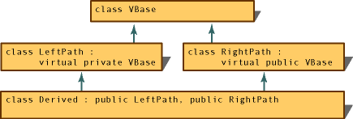

# Member Access Control (C++)
Access controls enable you to separate the [public](../vs140/public--c---.md) interface of a class from the [private](../vs140/private--c---.md) implementation details and the [protected](../vs140/protected--c---.md) members that are only for use by derived classes. The access specifier applies to all members declared after it until the next access specifier is encountered.  
  
<CodeContentPlaceHolder>0\</CodeContentPlaceHolder>  
 The default access is <CodeContentPlaceHolder>8\</CodeContentPlaceHolder> in a class, and <CodeContentPlaceHolder>9\</CodeContentPlaceHolder> in a struct or union. Access specifiers in a class can be used any number of times in any order. The allocation of storage for objects of class types is implementation dependent, but members are guaranteed to be assigned successively higher memory addresses between access specifiers.  
  
### Member-Access Control  
  
|Type of Access|Meaning|  
|--------------------|-------------|  
|[private](../vs140/private--c---.md)|Class members declared as <CodeContentPlaceHolder>10\</CodeContentPlaceHolder> can be used only by member functions and friends (classes or functions) of the class.|  
|[protected](../vs140/protected--c---.md)|Class members declared as <CodeContentPlaceHolder>11\</CodeContentPlaceHolder> can be used by member functions and friends (classes or functions) of the class. Additionally, they can be used by classes derived from the class.|  
|[public](../vs140/public--c---.md)|Class members declared as **public** can be used by any function.|  
  
 Access control helps prevent you from using objects in ways they were not intended to be used. This protection is lost when explicit type conversions (casts) are performed.  
  
> [!NOTE]
>  Access control is equally applicable to all names: member functions, member data, nested classes, and enumerators.  
  
## Access Control in Derived Classes  
 Two factors control which members of a base class are accessible in a derived class; these same factors control access to the inherited members in the derived class:  
  
-   Whether the derived class declares the base class using the **public** access specifier in the *class-head* (*class-head* is described in the Grammar section in [Defining Class Types](assetId:///e8c65425-0f3a-4dca-afc2-418c3b1e57da)).  
  
-   What the access to the member is in the base class.  
  
 The following table shows the interaction between these factors and how to determine base-class member access.  
  
### Member Access in Base Class  
  
|private|protected|Public|  
|-------------|---------------|------------|  
|Always inaccessible regardless of derivation access|Private in derived class if you use private derivation|Private in derived class if you use private derivation|  
||Protected in derived class if you use protected derivation|Protected in derived class if you use protected derivation|  
||Protected in derived class if you use public derivation|Public in derived class if you use public derivation|  
  
 The following example illustrates this:  
  
<CodeContentPlaceHolder>1\</CodeContentPlaceHolder>  
 In <CodeContentPlaceHolder>12\</CodeContentPlaceHolder>, the member function <CodeContentPlaceHolder>13\</CodeContentPlaceHolder> is a public member and <CodeContentPlaceHolder>14\</CodeContentPlaceHolder> is a protected member because <CodeContentPlaceHolder>15\</CodeContentPlaceHolder> is a public base class. <CodeContentPlaceHolder>16\</CodeContentPlaceHolder> is private to <CodeContentPlaceHolder>17\</CodeContentPlaceHolder>, and it is inaccessible to any derived classes.  
  
 In <CodeContentPlaceHolder>18\</CodeContentPlaceHolder>, the functions <CodeContentPlaceHolder>19\</CodeContentPlaceHolder> and <CodeContentPlaceHolder>20\</CodeContentPlaceHolder> are considered private members because <CodeContentPlaceHolder>21\</CodeContentPlaceHolder> is a private base class. Again, <CodeContentPlaceHolder>22\</CodeContentPlaceHolder> is private to <CodeContentPlaceHolder>23\</CodeContentPlaceHolder>, and it is inaccessible to any derived classes.  
  
 You can declare a derived class without a base-class access specifier. In such a case, the derivation is considered private if the derived class declaration uses the **class** keyword. The derivation is considered public if the derived class declaration uses the <CodeContentPlaceHolder>24\</CodeContentPlaceHolder> keyword. For example, the following code:  
  
<CodeContentPlaceHolder>2\</CodeContentPlaceHolder>  
 is equivalent to:  
  
<CodeContentPlaceHolder>3\</CodeContentPlaceHolder>  
 Similarly, the following code:  
  
<CodeContentPlaceHolder>4\</CodeContentPlaceHolder>  
 is equivalent to:  
  
<CodeContentPlaceHolder>5\</CodeContentPlaceHolder>  
 Note that members declared as having private access are not accessible to functions or derived classes unless those functions or classes are declared using the <CodeContentPlaceHolder>25\</CodeContentPlaceHolder> declaration in the base class.  
  
 A **union** type cannot have a base class.  
  
> [!NOTE]
>  When specifying a private base class, it is advisable to explicitly use the <CodeContentPlaceHolder>26\</CodeContentPlaceHolder> keyword so users of the derived class understand the member access.  
  
## Access control and static members  
 When you specify a base class as <CodeContentPlaceHolder>27\</CodeContentPlaceHolder>, it affects only nonstatic members. Public static members are still accessible in the derived classes. However, accessing members of the base class using pointers, references, or objects can require a conversion, at which time access control is again applied. Consider the following example:  
  
<CodeContentPlaceHolder>6\</CodeContentPlaceHolder>  
 In the preceding code, access control prohibits conversion from a pointer to <CodeContentPlaceHolder>28\</CodeContentPlaceHolder> to a pointer to <CodeContentPlaceHolder>29\</CodeContentPlaceHolder>. The **this** pointer is implicitly of type <CodeContentPlaceHolder>30\</CodeContentPlaceHolder>. To select the <CodeContentPlaceHolder>31\</CodeContentPlaceHolder> function, **this** must be converted to type <CodeContentPlaceHolder>32\</CodeContentPlaceHolder>. Such a conversion is not permitted because <CodeContentPlaceHolder>33\</CodeContentPlaceHolder> is a private indirect base class to <CodeContentPlaceHolder>34\</CodeContentPlaceHolder>. Conversion to a private base class type is acceptable only for pointers to immediate derived classes. Therefore, pointers of type <CodeContentPlaceHolder>35\</CodeContentPlaceHolder> can be converted to type <CodeContentPlaceHolder>36\</CodeContentPlaceHolder>.  
  
 Note that calling the <CodeContentPlaceHolder>37\</CodeContentPlaceHolder> function explicitly, without using a pointer, reference, or object to select it, implies no conversion. Therefore, the call is allowed.  
  
 Members and friends of a derived class, <CodeContentPlaceHolder>38\</CodeContentPlaceHolder>, can convert a pointer to <CodeContentPlaceHolder>39\</CodeContentPlaceHolder> to a pointer to a private direct base class of <CodeContentPlaceHolder>40\</CodeContentPlaceHolder>.  
  
## Access to virtual functions  
 The access control applied to [virtual](../vs140/virtual--c---.md) functions is determined by the type used to make the function call. Overriding declarations of the function do not affect the access control for a given type. For example:  
  
<CodeContentPlaceHolder>7\</CodeContentPlaceHolder>  
 In the preceding example, calling the virtual function <CodeContentPlaceHolder>41\</CodeContentPlaceHolder> using a pointer to type <CodeContentPlaceHolder>42\</CodeContentPlaceHolder> calls <CodeContentPlaceHolder>43\</CodeContentPlaceHolder>, and <CodeContentPlaceHolder>44\</CodeContentPlaceHolder> is treated as public. However, calling <CodeContentPlaceHolder>45\</CodeContentPlaceHolder> using a pointer to type <CodeContentPlaceHolder>46\</CodeContentPlaceHolder> is an access-control violation because <CodeContentPlaceHolder>47\</CodeContentPlaceHolder> is declared private in class <CodeContentPlaceHolder>48\</CodeContentPlaceHolder>.  
  
> [!CAUTION]
>  The virtual function <CodeContentPlaceHolder>49\</CodeContentPlaceHolder> can be called using a pointer to the base class <CodeContentPlaceHolder>50\</CodeContentPlaceHolder>. This does not mean that the function called is the base-class version of that function.  
  
## Access control with multiple inheritance  
 In multiple-inheritance lattices involving virtual base classes, a given name can be reached through more than one path. Because different access control can be applied along these different paths, the compiler chooses the path that gives the most access. See the following figure.  
  
   
Access Along Paths of an Inheritance Graph  
  
 In the figure, a name declared in class <CodeContentPlaceHolder>51\</CodeContentPlaceHolder> is always reached through class <CodeContentPlaceHolder>52\</CodeContentPlaceHolder>. The right path is more accessible because <CodeContentPlaceHolder>53\</CodeContentPlaceHolder> declares <CodeContentPlaceHolder>54\</CodeContentPlaceHolder> as a public base class, whereas <CodeContentPlaceHolder>55\</CodeContentPlaceHolder> declares <CodeContentPlaceHolder>56\</CodeContentPlaceHolder> as private.  
  
## See Also  
 [C++ Language Reference](../vs140/c---language-reference.md)