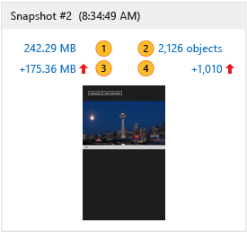
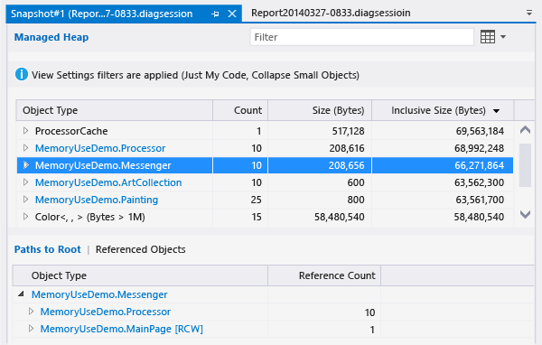
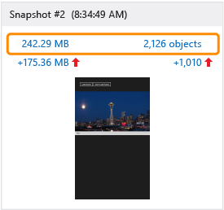
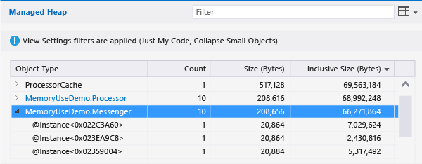
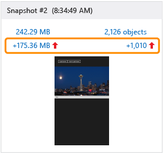
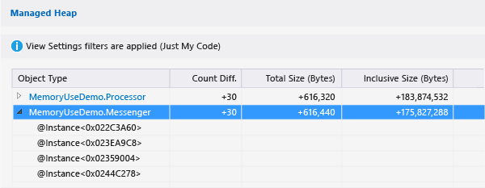
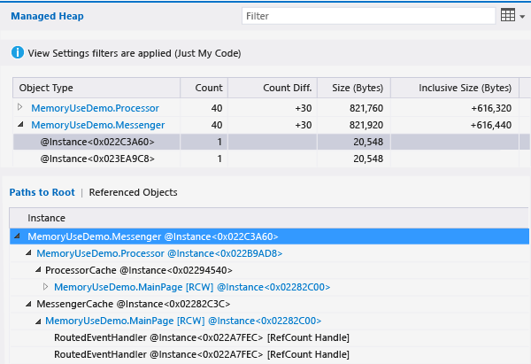

# Memory Usage without Debugging2
You can use the **Memory Usage** tool without debugging to do the following  
  
-   Monitor your app's memory use right in Visual Studio while you are developing a scenario.  
  
-   Create detailed snapshots of the state of your app’s memory.  
  
-   Compare snapshots to find the root cause of memory issues.  
  
 This topic describes how use the Memory Usage tool to analyze a Windows Universal XAML app. If you want to analyze memory use in Windows Universal apps that use JavaScript and HTML, see [Analyze memory usage (JavaScript)](http://msdn.microsoft.com/library/windows/apps/jj819176.aspx).  
  
##   Start a Memory Usage diagnostic session  
  
1.  Open a C# Universal Windows project in Visual Studio.  
  
2.  On the menu bar, choose  **Debug / Performance Profiler...**.  
  
3.  Select **Memory Usage** and then choose the **Start** button at the bottom of the page.  
  
       
  
##   Monitor memory use  
 Although you can use the **Memory Usage** tool to generate detailed reports that you can use to find and fix issues, you can also use it to study the real-time memory effects of a scenario you're actively developing.  
  
 When you start a diagnostic session, your app starts and the **Diagnostic Tools** window displays a timeline graph of your app’s memory use.  
  
   
  
 The  timeline graph shows fluctuations in your app's memory as it runs. Spikes in the graph usually indicate that some code  is collecting or creating data and then discarding it when the processing is done. Large spikes indicate areas that you might be able to optimize. Of more concern is a rise in memory consumption that's not returned because it may indicate inefficient memory use or even a memory leak.  
  
###   Close a monitoring session  
   
  
 To stop a monitoring session without creating a report, just close the diagnostic window. To generate a report when you have taken memory snapshots, choose **Stop**.  
  
##   Take snapshots of the memory state of your app  
 If you discover a memory issue that you want to investigate, you can take snapshots during the diagnostic session to capture objects in memory at particular moments. Because an app uses a large number of many types of objects, you might want to concentrate your analysis on one scenario. It’s also a good idea to get a baseline snapshot of the app before a memory issue appears, another snapshot after the first occurrence of the problem, and one or more additional snapshots if you can repeat the scenario.  
  
 To collect snapshots, start a new diagnostic session. Choose **Take Snapshot** when you want to capture the memory data. To generate a report, choose **Stop**.  
  
##   Memory Usage overview page  
 After you stop data collection, the Memory Usage tool stops the app and displays the overview report.  
  
   
  
###   Memory Usage snapshot views  
 You use snapshot views to open detailed reports in new Visual Studio windows. There are two kinds of snapshot views:  
  
-   A [Snapshot details report](../vs140/memory-usage-without-debugging2.md#BKMK_Snapshot_details_reports) shows the types and instances in one snapshot.  
  
-   A [Snapshot difference (diff) report](../vs140/memory-usage-without-debugging2.md#BKMK_Snapshot_difference__diff__reports) compares the types and instances in two snapshots.  
  
   
  
 The numbered items in the picture of the snapshot view are links that open Memory Usage report views.  
  
|||  
|-|-|  
||The link text shows the total number of bytes in memory when the snapshot was taken.   Choose this link to display a snapshot details report that's sorted by the total size of the type instances.|  
||The link text shows the total number of objects in memory when the snapshot was taken.   Choose this link to display a snapshot details report that's sorted by the count of instances of the types.|  
||The link text shows the difference between the total size of objects in memory at the moment of this snapshot and the total size of the previous snapshot.   The link text is a positive number when the memory size of this snapshot is larger than the previous one, and a negative number when the size is smaller. The link text **Baseline** indicates that this snapshot is the first in the diagnostic session; **No Difference** indicates that the difference is zero.   Choose this link to display a snapshot diff report that's sorted by the difference in the total size of instances of the types.|  
||The link text shows the difference between the total number of memory objects in this snapshot and the number of objects in the previous snapshot.   Choose this link to display a snapshot diff report that's sorted by the difference in the total count of instances of the types.|  
  
##   Snapshot reports  
   
  
###   Snapshot report trees  
  
####   Managed Heap  
 The managed heap tree [Managed Heap tree (Snapshot details)](../vs140/memory-usage-without-debugging2.md#BKMK_Managed_Heap_tree__Snapshot_details_) and the [Managed Heap tree (Snapshot diff)](../vs140/memory-usage-without-debugging2.md#BKMK_Managed_Heap_tree__Snapshot_diff_) show the types and instances in the report. Selecting a type or instance displays the **Paths to Root** and **Referenced Objects** trees for the selected item.  
  
####   Paths to Root  
 The [Paths to Root tree (Snapshot details)](../vs140/memory-usage-without-debugging2.md#BKMK_Paths_to_Root_tree__Snapshot_details_) and the [Paths to Root tree (Snapshot diff)](../vs140/memory-usage-without-debugging2.md#BKMK_Paths_to_Root_tree__Snapshot_diff_) show the chain of objects that reference the type or instance. The .NET Framework garbage collector cleans up the memory for an object only when all references to it have been released.  
  
####   Referenced Objects  
 The [Referenced Objects tree (Snapshot details)](../vs140/memory-usage-without-debugging2.md#BKMK_Referenced_Objects_tree__Snapshot_details_) and the [Referenced Objects tree (Snapshot diff)](../vs140/memory-usage-without-debugging2.md#BKMK_Referenced_Objects_tree__Snapshot_diff_) show the objects that the selected type or instance references.  
  
###   Object Type and Instance fields  
 When an **Object Type** entry has child entries, you can choose the arrow icon to display them. If the color of the **Object Type** text is blue, you can choose it to navigate to the object in its source code file. The source file is opened in a separate window.  
  
 Instance names are unique IDs that are generated by the Memory Usage tool.  
  
 If you notice a type that you can’t easily identify or if you don’t know how it’s involved in your code, it's probably an object from the .NET Framework, operating system, or compiler that the Memory Usage tool displays because it's involved in the ownership chains of your objects.  
  
###   Report tree filters  
 Most apps contain a surprisingly large number of types, most of which are not very interesting to the app developer. The **Memory Usage** tool defines two filters that you can use to hide most of these types in the **Managed Heap** and **Paths to Root** trees. You can also filter a tree by type name.  
  
   
  
####   Filter  
 Enter a string in the **Filter** box to restrict the tree displays to types that contain the specified text. The filter is not case-sensitive, and it recognizes the specified string in any part of the type names.  
  
####   Collapse Small Objects  
 When this filter is applied, types whose **Size (Bytes)** is less than 0.5 percent of the total size of the snapshot memory are hidden in the **Managed Heap** list.  
  
####   Just My Code  
 The **Just My Code** filter hides most instances that are generated by external code. External types are owned by the operating system or by Framework components, or are generated by the compiler.  
  
##   Snapshot details reports  
 You use a snapshot details report to focus on one snapshot from a diagnostic session. To open a details report, choose one of the links in a snapshot view, as shown in the following picture. Both links open the same report; the only difference is the starting sort order of the **Managed Heap** tree in the report. In both cases, you can change the sort order after the report opens.  
  
   
  
-   The **MB** link sorts the report by the **Inclusive Size (Bytes)** column.  
  
-   The **objects** link sorts the report by the **Count** column.  
  
###   Managed Heap tree (Snapshot details)  
 The **Managed Heap** tree lists the types of objects that are held in memory. You can expand a type name to view the ten largest instances of the type, sorted by size. Selecting a type or instance displays the **Paths to Root** and **Referenced Objects** trees for the selected item.  
  
   
  
|||  
|-|-|  
|**Object Type**|The name of the type or object instance.|  
|**Count**|The number of object instances of the type. The number is always 1 for an instance.|  
|**Size (Bytes)**|For a type, the size of all instances of the type in the memory snapshot, excluding the size of objects contained in the instances.   For an instance, type, the size of the object excluding the size of objects contained in the instance. instances.|  
|**Inclusive Size (Bytes)**|The size of the instances of the type or the size of a single instance, including the size of contained objects.|  
  
###   Paths to Root tree (Snapshot details)  
 The **Paths to Root tree** shows the chain of objects that reference the type or instance. The .NET Framework garbage collector cleans up the memory for an object only when all references to it have been released.  
  
   
  
 When you view a type in the **Paths to Root** tree, the number of objects of the types that hold references to that type is displayed in the **Reference Count** column. The column does not appear when you analyze an instance.  
  
###   Referenced Objects tree (Snapshot details)  
 The **Referenced Objects** tree shows the objects that the selected type or instance references.  
  
   
  
|||  
|-|-|  
|**Object Type / Instance**|The name of the type or object instance.|  
|**Size (Bytes)**|For a type, the size of all instances of the type, excluding the size of objects contained in the type.   For an instance, the size of the object, excluding the size of objects contained in the object.|  
|**Inclusive Size (Bytes)**|The total size of the instances of the type or the size of the instance, including the size of contained objects.|  
  
##   Snapshot difference (diff) reports  
 A snapshot difference (diff) report shows the changes between a primary snapshot and the snapshot that was taken immediately before it. To open a diff report, choose one of the links in a snapshot view, as shown in the following picture. Both links open the same report; the only difference is the starting sort order of the **Managed Heap** tree in the report. You can change the sort order after the report opens.  
  
   
  
-   The **MB** link sorts the report by the **Inclusive Size (Bytes)** column.  
  
-   The **objects** link sorts the report by the **Count** column.  
  
###   Managed Heap tree (Snapshot diff)  
 The **Managed Heap** tree lists the types of objects that are held in memory. You can expand a type name to view the ten largest instances of the type, sorted by size. Selecting a type or instance displays the **Paths to Root** and **Referenced Objects** trees for the selected item.  
  
   
  
 Notice that the **Count**, **Size (Bytes)**, and **Inclusive Size (Bytes)** columns have been collapsed in the picture.  
  
|||  
|-|-|  
|**Object Type**|The name of the type or object instance.|  
|**Count**|The number of instances of a type in the primary snapshot. **Count** is always 1 for an instance.|  
|**Count Diff**|For a type, the difference in the number of instances of the type between the primary snapshot and the previous snapshot. The field is blank for an instance.|  
|**Size (Bytes)**|The size of the objects in the primary snapshot, excluding the size of objects contained in the objects. For a type, **Size (Bytes)** and **Inclusive Size (Bytes)** are the totals of the sizes of the type instances.|  
|**Total Size Diff (Bytes)**|For a type, the difference in the total size of instances of the type between the primary snapshot and the previous snapshot, excluding the size of objects contained in the instances. The field is blank for an instance.|  
|**Inclusive Size (Bytes)**|The size of the objects in the primary snapshot, including the size of objects contained in the objects.|  
|**Inclusive Size Diff (Bytes)**|For a type, the difference in the size of all instances of the type between the primary snapshot and the previous snapshot, including the size of objects contained in the objects. The field is blank for an instance.|  
  
###   Paths to Root tree (Snapshot diff)  
 The **Paths to Root tree** shows the chain of objects that reference the type or instance. The .NET Framework garbage collector cleans up the memory for an object only when all references to it have been released.  
  
   
  
###   Referenced Objects tree (Snapshot diff)  
 The **Referenced Objects** tree shows the objects that the primary type or instance references.  
  
   
  
|||  
|-|-|  
|**Object Type / Instance**|The name of the type or object instance.|  
|**Size (Bytes)**|For an instance, the size of the object in the primary snapshot, excluding the size of objects contained in the instance.   For a type, the total size of the instances of the type in the primary snapshot, excluding the size of objects contained in the instance.|  
|**Inclusive Size (Bytes)**|The size of the objects in the primary snapshot, including the size of objects contained in the objects.|  
  
## See Also  
 [Analyze memory usage (JavaScript)](../vs140/javascript-memory.md)   
 [Analyze the performance of Windows Store apps using Visual Studio diagnostic tools](../vs140/analyze-the-performance-of-windows-store-apps-using-visual-studio-diagnostic-tools.md)   
 [Run analysis tools from the Performance and Diagnostic page](../vs140/run-analysis-tools-from-the-performance-and-diagnostic-page.md)   
 [Performance best practices for Windows Store apps using C++, C#, and Visual Basic](http://msdn.microsoft.com/library/windows/apps/hh750313.aspx)   
 [Diagnosing memory issues with the new Memory Usage Tool in Visual Studio](http://go.microsoft.com/fwlink/p/?LinkId=394706)