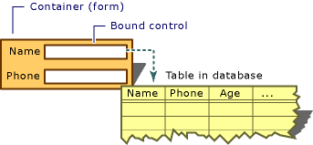

# MFC ActiveX Controls: Using Data Binding in an ActiveX Control
One of the more powerful uses of ActiveX controls is data binding, which allows a property of the control to bind with a specific field in a database. When a user modifies data in this bound property, the control notifies the database and requests that the record field be updated. The database then notifies the control of the success or failure of the request.  
  
 This article covers the control side of your task. Implementing the data binding interactions with the database is the responsibility of the control container. How you manage the database interactions in your container is beyond the scope of this documentation. How you prepare the control for data binding is explained in the rest of this article.  
  
   
Conceptual Diagram of a Data-Bound Control  
  
 The <CodeContentPlaceHolder>0\</CodeContentPlaceHolder> class provides two member functions that make data binding an easy process to implement. The first function, [BoundPropertyRequestEdit](../vs140/colecontrol--boundpropertyrequestedit.md), is used to request permission to change the property value. [BoundPropertyChanged](../vs140/colecontrol--boundpropertychanged.md), the second function, is called after the property value has been successfully changed.  
  
 This article covers the following topics:  
  
-   [Creating a Bindable Stock Property](#vchowcreatingbindablestockproperty)  
  
-   [Creating a Bindable Get/Set Method](#vchowcreatingbindablegetsetmethod)  
  
##  \<a name="vchowcreatingbindablestockproperty">\</a> Creating a Bindable Stock Property  
 It is possible to create a data-bound stock property, although it is more likely that you will want a [bindable get/set method](#vchowcreatingbindablegetsetmethod).  
  
> [!NOTE]
>  Stock properties have the **bindable** and **requestedit** attributes by default.  
  
#### To add a bindable stock property using the Add Property Wizard  
  
1.  Begin a project using the [MFC ActiveX Control Wizard](../vs140/mfc-activex-control-wizard.md).  
  
2.  Right-click the interface node for your control.  
  
     This opens the shortcut menu.  
  
3.  From the shortcut menu, click **Add** and then click **Add Property**.  
  
4.  Select one of the entries from the **Property Name** drop-down list. For example, you can select **Text**.  
  
     Because **Text** is a stock property, the **bindable** and **requestedit** attributes are already checked.  
  
5.  Select the following check boxes from the **IDL Attributes** tab: **displaybind** and **defaultbind** to add the attributes to the property definition in the project's .IDL file. These attributes make the control visible to the user and make the stock property the default bindable property.  
  
 At this point, your control can display data from a data source, but the user will not be able to update data fields. If you want your control to also be able to update data, change the <CodeContentPlaceHolder>1\</CodeContentPlaceHolder> [OnOcmCommand](../vs140/mfc-activex-controls--subclassing-a-windows-control.md) function to look as follows:  
  
 [!code[NVC_MFC_AxData#1](../vs140/codesnippet/CPP/mfc-activex-controls--using-data-binding-in-an-activex-control_1.cpp)]  
  
 You can now build the project, which will register the control. When you insert the control in a dialog box, the **Data Field** and **Data Source** properties will have been added and you can now select a data source and field to display in the control.  
  
##  \<a name="vchowcreatingbindablegetsetmethod">\</a> Creating a Bindable Get/Set Method  
 In addition to a data-bound get/set method, you can also create a [bindable stock property](#vchowcreatingbindablestockproperty).  
  
> [!NOTE]
>  This procedure assumes you have an ActiveX control project that subclasses a Windows control.  
  
#### To add a bindable get/set method using the Add Property Wizard  
  
1.  Load your control's project.  
  
2.  On the **Control Settings** page, select a window class for the control to subclass. For example, you may want to subclass an EDIT control.  
  
3.  Load your control's project.  
  
4.  Right-click the interface node for your control.  
  
     This opens the shortcut menu.  
  
5.  From the shortcut menu, click **Add** and then click **Add Property**.  
  
6.  Type the property name in the **Property Name** box. Use <CodeContentPlaceHolder>2\</CodeContentPlaceHolder> for this example.  
  
7.  Select a data type from the **Property Type** drop-down list box. Use **short** for this example.  
  
8.  For **Implementation Type**, click **Get/Set Methods**.  
  
9. Select the following check boxes from the IDL Attributes tab: **bindable**, **requestedit**, **displaybind**, and **defaultbind** to add the attributes to the property definition in the project's .IDL file. These attributes make the control visible to the user and make the stock property the default bindable property.  
  
10. Click **Finish**.  
  
11. Modify the body of the <CodeContentPlaceHolder>3\</CodeContentPlaceHolder> function so that it contains the following code:  
  
     [!code[NVC_MFC_AxData#2](../vs140/codesnippet/CPP/mfc-activex-controls--using-data-binding-in-an-activex-control_2.cpp)]  
  
12. The parameter passed to the <CodeContentPlaceHolder>4\</CodeContentPlaceHolder> and <CodeContentPlaceHolder>5\</CodeContentPlaceHolder> functions is the dispid of the property, which is the parameter passed to the id() attribute for the property in the .IDL file.  
  
13. Modify the [OnOcmCommand](../vs140/mfc-activex-controls--subclassing-a-windows-control.md) function so it contains the following code:  
  
     [!code[NVC_MFC_AxData#1](../vs140/codesnippet/CPP/mfc-activex-controls--using-data-binding-in-an-activex-control_1.cpp)]  
  
14. Modify the <CodeContentPlaceHolder>6\</CodeContentPlaceHolder> function so that it contains the following code:  
  
     [!code[NVC_MFC_AxData#3](../vs140/codesnippet/CPP/mfc-activex-controls--using-data-binding-in-an-activex-control_3.cpp)]  
  
15. To the public section of the header file the header file for your control class, add the following definitions (constructors) for member variables:  
  
     [!code[NVC_MFC_AxData#4](../vs140/codesnippet/CPP/mfc-activex-controls--using-data-binding-in-an-activex-control_4.h)]  
  
16. Make the following line the last line in the <CodeContentPlaceHolder>7\</CodeContentPlaceHolder> function:  
  
     [!code[NVC_MFC_AxData#5](../vs140/codesnippet/CPP/mfc-activex-controls--using-data-binding-in-an-activex-control_5.cpp)]  
  
17. Modify the <CodeContentPlaceHolder>8\</CodeContentPlaceHolder> function so that it contains the following code:  
  
     [!code[NVC_MFC_AxData#6](../vs140/codesnippet/CPP/mfc-activex-controls--using-data-binding-in-an-activex-control_6.cpp)]  
  
18. Modify the <CodeContentPlaceHolder>9\</CodeContentPlaceHolder> function so that it contains the following code:  
  
     [!code[NVC_MFC_AxData#7](../vs140/codesnippet/CPP/mfc-activex-controls--using-data-binding-in-an-activex-control_7.cpp)]  
  
 You can now build the project, which will register the control. When you insert the control in a dialog box, the **Data Field** and **Data Source** properties will have been added and you can now select a data source and field to display in the control.  
  
## See Also  
 [MFC ActiveX Controls](../vs140/mfc-activex-controls.md)   
 [Data-Bound Controls (ADO and RDO)](../vs140/data-bound-controls--ado-and-rdo-.md)