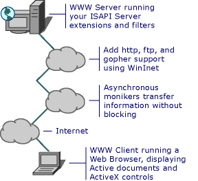

# MFC Internet Programming Basics
Microsoft provides many APIs for programming both client and server applications. Many new applications are being written for the Internet, and as technologies, browser capabilities, and security options change, new types of applications will be written. Browsers run on client computers, providing access to the World Wide Web and displaying HTML pages that contain text, graphics, ActiveX controls, and documents. Servers provide FTP, HTTP, and gopher services, and run server extension applications using CGI. Your custom application can retrieve information and provide data on the Internet.  
  
   
  
 MFC provides classes that support Internet programming. You can use [COleControl](../vs140/colecontrol-class.md) and [CDocObjectServer](../vs140/cdocobjectserver-class.md) and related MFC classes to write ActiveX controls and Active documents. You can use MFC classes such as [CInternetSession](../vs140/cinternetsession-class.md), [CFtpConnection](../vs140/cftpconnection-class.md), and [CAsyncMonikerFile](../vs140/casyncmonikerfile-class.md) to retrieve files and information using Internet protocols such as FTP, HTTP, and gopher.  
  
## In This Section  
  
-   [Internet-Related MFC Classes](../vs140/internet-related-mfc-classes.md)  
  
-   [Internet Information by Topic](../vs140/internet-information-by-topic.md)  
  
-   [Internet Information by Task](../vs140/internet-information-by-task.md)  
  
-   [Active Technology on the Internet](../vs140/active-technology-on-the-internet.md)  
  
-   [WinInet Basics](../vs140/wininet-basics.md)  
  
-   [HTML Basics](../vs140/html-basics.md)  
  
-   [HTTP Basics](../vs140/http-basics.md)  
  
## Related Sections  
  
-   [ActiveX Controls on the Internet](../vs140/activex-controls-on-the-internet.md)  
  
-   [Active Documents on the Internet](../vs140/active-documents-on-the-internet.md)  
  
-   [Asynchronous Monikers on the Internet](../vs140/asynchronous-monikers-on-the-internet.md)  
  
-   [Win32 Internet Extensions (WinInet)](../vs140/win32-internet-extensions--wininet-.md)  
  
-   [MFC Internet Programming Tasks](../vs140/mfc-internet-programming-tasks.md)  
  
-   [Application Design Choices](../vs140/application-design-choices.md)  
  
-   [Writing MFC Applications](../vs140/writing-mfc-applications.md)  
  
-   [Testing Internet Applications](../vs140/testing-internet-applications.md)  
  
-   [Internet Security](../vs140/internet-security--c---.md)  
  
-   [ATL Support for DHTML Controls](../vs140/atl-support-for-dhtml-controls.md)  
  
##   Web Sites for More Information  
 For additional information about Microsoft Internet technology, see the [Microsoft Developer Network (MSDN)](http://go.microsoft.com/fwlink/?LinkID=56322) Web site. (Links may change without notice.)  
  
 This Web site for developers contains information on using Microsoft development tools and technologies, and top stories about recent and upcoming conferences. From this page, you can jump to many related developer sites, including the .NET, and XML Developer Centers. You can also download beta SDKs and samples.  
  
 The [World Wide Web Consortium (W3C)](http://go.microsoft.com/fwlink/?LinkID=37125) publishes specifications for HTML, HTTP, CGI, and other World Wide Web technologies.  
  
##   More Internet Help  
 The OLE section of the [!INCLUDE[winSDK](../vs140/includes/winsdk_md.md)] contains additional information about OLE programming. This information provides details about using the Win32 WinInet functions directly, rather than through the MFC classes. It also contains overview information about Internet technologies.  
  
## See Also  
 [MFC Internet Programming (NIB)](assetId:///0f7a1f3a-385b-4d56-a55b-0d766840c58a)