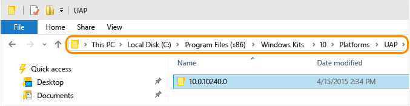
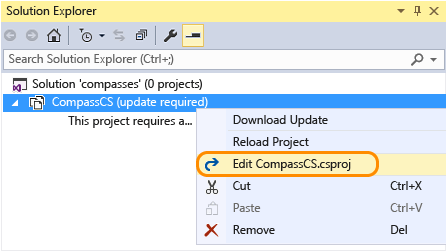
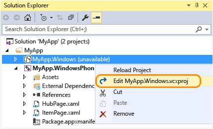
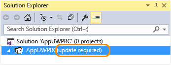
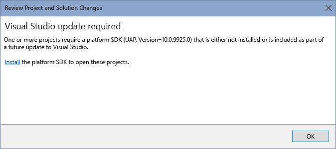
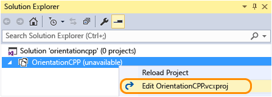

# Migrate apps to the Universal Windows Platform (UWP)
Make the necessary manual changes to your existing project files for Windows Store 8.1 apps, Windows Phone 8.1 apps, or Universal Windows apps created with Visual Studio 2015 RC, so that they can be used with Visual Studio 2015 RTM. (If you have a Windows 8.1 universal app with both a Windows app project and Windows Phone project, you will need to follow the steps to migrate each project.)  
  
 With the Universal Windows Platform, you now target your app to one or more device families. If you want more information about Universal Windows apps, take a look at this [platform guide](https://msdn.microsoft.com/library/windows/apps/dn894631.aspx).  
  
-   [Migrate your existing C#/VB Windows Store 8.1 or Windows Phone 8.1 apps](#MigrateCSharp) to use the Universal Windows Platform.  
  
-   [Migrate your existing C++ Windows Store 8.1 or Windows Phone 8.1 apps](#MigrateCPlusPlus) to use the Universal Windows Platform.  
  
-   [Changes required for existing Universal Windows apps created with Visual Studio 2015 RC](#PreviousVersions).  
  
-   [Changes required for existing unit test projects for Universal Windows apps created with Visual Studio 2015 RC](#MigrateUnitTest).  
  
 If you don’t want to make all these changes, learn how to [port your existing apps](http://msdn.microsoft.com/library/windows/apps/xaml/mt238321.aspx) into a new Universal Windows project.  
  
##  \<a name="MigrateCSharp">\</a> Migrate your C#/VB Windows Store 8.1 or Windows Phone 8.1 apps to use the Universal Windows Platform  
  
#### Migrate your C#/VB project files  
  
1.  To find which Universal Windows Platform you have installed, open this folder: **\Program Files (x86)\Windows Kits\10\Platforms\UAP**. This contains a list of folders for each Universal Windows Platform that is installed. The folder name is the Universal Windows Platform version that you have installed. For example, this Windows 10 device has version 10.0.10240.0 of the Universal Windows Platform installed.  
  
       
  
     More than one version of the Universal Windows Platform can be installed. We recommend that you use the latest version for your app.  
  
2.  Using File Explorer, go to the folder where your UWP project is stored. Create a .json file in this folder. Name the file: project.json, and then add the following content to this file:  
  
<CodeContentPlaceHolder>0\</CodeContentPlaceHolder>  
3.  Create a file called default.rd.xml with the following contents. If you have a VB project, add this file to the My Project directory for your project. If you have a C# project, add this file to the Properties directory for your project.  
  
<CodeContentPlaceHolder>1\</CodeContentPlaceHolder>  
4.  Open your solution that contains your existing Windows Store 8.1 app or Windows Phone 8.1 app in Visual Studio.  
  
5.  Right-click your existing project for your app in Solution Explorer, then select **Unload Project**. After the project is unloaded, right-click the project file again and choose to edit the .csproj or .vbproj file.  
  
       
  
6.  Find the \<PropertyGroup> element that contains the \<TargetPlatformVersion> element with a value of 8.1. Do the following steps for this \<PropertyGroup> element:  
  
    1.  Set the value of the \<Platform> element to: **x86**.  
  
    2.  Add a \<TargetPlatformIdentifier> element and set its value to: **UAP**.  
  
    3.  Change the existing value of the \<TargetPlatformVersion> element to be the value of the Universal Windows Platform version that you installed. Also add a \<TargetPlatformMinVersion> element and give it the same value.  
  
    4.  Change the value of the \<MinimumVisualStudioVersion> element to: **14**.  
  
    5.  Replace the \<ProjectTypeGuids> element as shown below:  
  
         For C#:  
  
<CodeContentPlaceHolder>2\</CodeContentPlaceHolder>  
         For VB:  
  
<CodeContentPlaceHolder>3\</CodeContentPlaceHolder>  
    6.  Add an \<EnableDotNetNativeCompatibleProfile> element and set its value to: **true**.  
  
    7.  The default asset scale for Universal Windows apps is 200. If your project includes assets not scaled at 200, you will need to add a <UapDefaultAssetScale> element with the value of the scale of your assets to this PropertyGroup. Learn more about [assets and scales](http://msdn.microsoft.com/library/jj679352.aspx).  
  
         Now your <PropertyGroup> element should look similar to this example:  
  
<CodeContentPlaceHolder>4\</CodeContentPlaceHolder>  
7.  Replace any instances of 12.0 with 14.0 to reflect the version of Visual Studio that you are now using. Like these instances:  
  
<CodeContentPlaceHolder>5\</CodeContentPlaceHolder>  
<CodeContentPlaceHolder>6\</CodeContentPlaceHolder>  
8.  Find \<PropertyGroup> elements that are configured for the AnyCPU platform as part of the Condition attribute. Remove these elements and all of their children. AnyCPU is not supported for Windows 10 apps in Visual Studio 2015. For example, you should remove \<PropertyGroup> elements like these ones:  
  
<CodeContentPlaceHolder>7\</CodeContentPlaceHolder>  
9. For each remaining \<PropertyGroup> element, check if the element has a Condition attribute with a Release configuration. If it does, but it does not contain a \<UseDotNetNativeToolchain> element, then add one. Set the value for the \<UseDotNetNativeToolchain> element to true, like this:  
  
<CodeContentPlaceHolder>8\</CodeContentPlaceHolder>  
10. For Windows Phone projects only, remove the \<PropertyGroup> element that contains a \<TargetPlatformIdentifier> element with a value of WindowsPhoneApp. Also remove any children of this element:  
  
<CodeContentPlaceHolder>9\</CodeContentPlaceHolder>  
11. Find the \<ItemGroup> element that contains the \<AppxManifest> element. Add the following \<None> element as a child of the \<ItemGroup> element:  
  
<CodeContentPlaceHolder>10\</CodeContentPlaceHolder>  
12. Find the \<ItemGroup> element that contains other assets that are added to your project such as logo .png files (\<Content Include="Assets\Logo.scale-100.png" />). Add the following \<Content> child element to this \<ItemGroup> element:  
  
     **For C#:**  
  
<CodeContentPlaceHolder>11\</CodeContentPlaceHolder>  
     **For VB:**  
  
<CodeContentPlaceHolder>12\</CodeContentPlaceHolder>  
13. Find the \<ItemGroup> element that includes \<Reference> children elements to NuGet packages. Take note of the NuGet packages that you use because you will need to download them with the NuGet package manager after your project is reloaded. Remove this \<ItemGroup> along with its children. For example, a UWP project could have the following NuGet packages that need to be removed:  
  
<CodeContentPlaceHolder>13\</CodeContentPlaceHolder>  
14. Save your changes.  
  
15. Close the .csproj or .vbproj file.  
  
16. Right-click on your project in Solution Explorer, and choose Reload Project from the context menu. All the files in your project should now be displayed in Solution Explorer.  
  
17. Use the NuGet manager to add back the packages that you deleted in an earlier step.  
  
     Now you need to follow the steps to [update the package manifest files](#PackageManifest) for all your Windows Store 8.1 or Windows Phone 8.1 projects.  
  
##  \<a name="MigrateCPlusPlus">\</a> Migrate your C++ Windows Store 8.1 or Windows Phone 8.1 apps to use the Universal Windows Platform  
  
#### Migrate your C++ project files  
  
1.  To find which Universal Windows Platform you have installed, open this folder: **\Program Files (x86)\Windows Kits\10\Platforms\UAP**. This contains a list of folders for each Universal Windows Platform that is installed. The folder name is the Universal Windows Platform version that you have installed. For example, this Windows 10 device has version 10.0.10240.0 of the Universal Windows Platform installed.  
  
       
  
     More than one version of the Universal Windows Platform can be installed. We recommend that you use the latest version for your app.  
  
2.  Open your solution that contains your existing C++ Windows Store 8.1 app or Windows Phone 8.1 app in Visual Studio.  
  
     Right-click your existing project in solution explorer, then select **Unload Project**. After the project is unloaded, right-click the project file again and choose to edit the .vcxproj file.  
  
       
  
3.  Find the \<PropertyGroup> element that contains the \<ApplicationTypeRevision> element with a value of 8.1. Do the following steps for this \<PropertyGroup> element:  
  
    1.  Add a \<WindowsTargetPlatformVersion> element and a \<WindowsTargetPlatformMinVersion> element and give them the value of the Universal Windows Platform version that you installed.  
  
    2.  Update the value of ApplicationTypeRevision element from 8.1 to 10.0.  
  
    3.  Change the value of the \<MinimumVisualStudioVersion> element to: 14.  
  
    4.  Add an \<EnableDotNetNativeCompatibleProfile> element and set its value to: true.  
  
    5.  The default asset scale for Universal Windows apps is 200. If your project includes assets not scaled at 200, you will need to add a \<UapDefaultAssetScale> element with the value of the scale of your assets to this PropertyGroup. Learn more about [assets and scales](http://msdn.microsoft.com/library/jj679352.aspx).  
  
    6.  For Windows Phone projects only, change the value of \<ApplicationType> from Windows Phone to Windows Store.  
  
         Now your \<PropertyGroup> element should look similar to this example:  
  
<CodeContentPlaceHolder>14\</CodeContentPlaceHolder>  
4.  Change all instances of the \<PlatformToolset> element to have the value v140. For example:  
  
<CodeContentPlaceHolder>15\</CodeContentPlaceHolder>  
5.  For each remaining \<PropertyGroup> element, check if the element has a Condition attribute with a Release configuration. If it does, but it does not contain a \<UseDotNetNativeToolchain> element, then add one. Set the value for the \<UseDotNetNativeToolchain> element to true, like this:  
  
<CodeContentPlaceHolder>16\</CodeContentPlaceHolder>  
6.  Save your changes. Then close the project file.  
  
7.  Right-click on your project file in Solution Explorer, and choose Reload Project from the context menu. All the files in your project should now be displayed in Solution Explorer.  
  
     Now you need to follow the steps to [update the package manifest files](#PackageManifest) for all your Windows Store 8.1 or Windows Phone 8.1 projects.  
  
##  \<a name="PackageManifest">\</a> Update your package manifest file for all your Windows Store 8.1 or Windows Phone 8.1 projects  
 You must update the package manifest file for each project in your solution.  
  
#### Update your package manifest file  
  
1.  Open the Package.appxmanifest file in your project. You need to edit the Package.AppxManifest file for each of your Windows Store and Windows Phone projects.  
  
2.  You need to update the \<Package> element with the new schemas based on your existing project type. First remove the schemas below based on whether you have a Windows Store or Windows Phone project.  
  
     **OLD for Windows Store project:** Your \<Package> element will look similar to this one.  
  
<CodeContentPlaceHolder>17\</CodeContentPlaceHolder>  
     **OLD for Windows Phone project:** Your \<Package> element will look similar to this one.  
  
<CodeContentPlaceHolder>18\</CodeContentPlaceHolder>  
     **NEW for Universal Windows Platform:** Add the schemas below to your \<Package> element. Remove any associated namespace identifier prefixes from elements for the schemas that you just removed. Update the IgnorableNamespaces property to: uap mp. Your new \<Package> element should look similar to this one.  
  
<CodeContentPlaceHolder>19\</CodeContentPlaceHolder>  
3.  Add a \<Dependencies> child element to the \<Package> element. Then add a \<TargetDeviceFamily> child element to this \<Dependencies> element with Name, MinVersion, and MaxVersionTested attributes. Give the Name attribute the value: Windows.Universal. Give the MinVersion and MaxVersionTested the value of the Universal Windows Platform version you have installed. This element should look similar to this:  
  
<CodeContentPlaceHolder>20\</CodeContentPlaceHolder>  
4.  **For Windows Store only:** You need to add a \<mp:PhoneIdentity> child element to the \<Package> element. Add a PhoneProductId attribute and a PhonePublisherId attribute. Set the PhoneProductId to have the same value as the Name attribute in the \<Identity> element. Set the PhonePublishedId value to: 00000000-0000-0000-0000-000000000000. Like this:  
  
<CodeContentPlaceHolder>21\</CodeContentPlaceHolder>  
5.  Find the \<Prerequisites> element and delete this element and any child elements that it has.  
  
6.  Add the **uap** namespace to the following \<Resource> elements: Scale, DXFeatureLevel. For example:  
  
<CodeContentPlaceHolder>22\</CodeContentPlaceHolder>  
7.  Add the **uap** namespace to the following \<Capability> elements: documentsLibrary, picturesLibrary, videosLibrary, musicLibrary, enterpriseAuthentication, sharedUserCertificates, removableStorage, appointments, and contacts. For example:  
  
<CodeContentPlaceHolder>23\</CodeContentPlaceHolder>  
8.  Add the **uap** namespace to the \<VisualElements> element and any of its child elements. For example:  
  
<CodeContentPlaceHolder>24\</CodeContentPlaceHolder>  
     **Only applies to Windows Store:** The tile size names have changed. Change the attributes in the \<VisualElements> element to reflect the new converged tile sizes. 70x70 becomes 71x71, and 30x30 becomes 44x44.  
  
     **OLD:** tile size names  
  
<CodeContentPlaceHolder>25\</CodeContentPlaceHolder>  
     **NEW:** tile size names  
  
<CodeContentPlaceHolder>26\</CodeContentPlaceHolder>  
9. Add the **uap** namespace to the \<ApplicationContentUriRules> and all its child elements. For example:  
  
<CodeContentPlaceHolder>27\</CodeContentPlaceHolder>  
10. Add the **uap** namespace to the following \<Extension> elements and all of its child elements: windows.accountPictureProvide,  windows.alarm, windows.appointmentsProvider windows.autoPlayContent,  windows.autoPlayDevice, windows.cachedFileUpdate, windows.cameraSettings, windows.fileOpenPicker, windows.fileTypeAssociation, windows.fileSavePicke, windows.lockScreenCall, windows.printTaskSettings, windows.protocol, windows.search, windows.shareTarget. For example:  
  
<CodeContentPlaceHolder>28\</CodeContentPlaceHolder>  
11. Add the **uap** namespace to background tasks of type chatMessageNotification. For example:  
  
<CodeContentPlaceHolder>29\</CodeContentPlaceHolder>  
12. Change the framework dependencies. Add a Publisher name to all \<PackageDependency> elements, and specify a MinVersion if it’s not already specified.  
  
     **OLD:** \<PackageDependency> element  
  
<CodeContentPlaceHolder>30\</CodeContentPlaceHolder>  
     **NEW:** \<PackageDependency> element  
  
<CodeContentPlaceHolder>31\</CodeContentPlaceHolder>  
     Use the appropriate Publisher and MinVersion values for the actual framework that you are using. Be aware that these names might change for Windows 10.  
  
13. Replace the gattCharacteristicNotification and rfcommConnection background type tasks with a Bluetooth type task. For example:  
  
     **OLD:**  
  
<CodeContentPlaceHolder>32\</CodeContentPlaceHolder>  
     **NEW:** With the Bluetooth type task.  
  
<CodeContentPlaceHolder>33\</CodeContentPlaceHolder>  
14. Replace the Bluetooth device capabilities bluetooth.rfcomm and bluetooth.genericAttributeProfile with a generic Bluetooth capability. For example:  
  
     **OLD:**  
  
<CodeContentPlaceHolder>34\</CodeContentPlaceHolder>  
     **NEW:** Replaced with a generic Bluetooth capability.  
  
<CodeContentPlaceHolder>35\</CodeContentPlaceHolder>  
15. Remove any deprecated elements.  
  
    1.  These attributes for \<VisualElements> are deprecated and should be removed:  
  
        -   The \<VisualElements> attributes: ForegroundText, ToastCapable  
  
        -   The \<DefaultTile> attribute DefaultSize  
  
        -   The \<ApplicationView> element  
  
         For example:  
  
<CodeContentPlaceHolder>36\</CodeContentPlaceHolder>  
    2.  Remove Windows.contact and windows.contactPicker extensions, and all elements under these extensions.  
  
16. Save the Package.appxmanifest file. Then close Visual Studio.  
  
17. You need to remove some hidden files before you can reopen your solution.  
  
    1.  Open File Explorer, click **View** in the toolbar and select **Hidden items** and **File name extensions**. Open this folder on your machine: \<path for the location of your solution>\\.vs\\{Project Name}\v14. If there is a file with a .suo file extension, then delete it.  
  
    2.  Now go back to the folder where your solution is located. Open any folders for projects that exist in your solution. If a file inside any of these project folders has a .csproj.user or .vbproj.user extension, then delete it.  
  
         You can now reopen your solution in Visual Studio. You are ready to code, build, and debug your app using the Universal Windows Platform.  
  
         Learn how to [adapt your code](https://msdn.microsoft.com/library/windows/apps/dn954974.aspx) to take advantage of what’s new with the Universal Windows Platform.  
  
##  \<a name="PreviousVersions">\</a> Changes required for existing Universal Windows apps created with Visual Studio 2015 RC  
 If you created Windows 10 universal apps with Visual Studio 2015 RC, you need to retarget your project to use the version of the Universal Windows Platform installed with the latest release of Visual Studio 2015. Any previous version is not supported. The changes required are different depending on the language you used to create your app:  
  
-   [C#/VB apps](#RCUpdate10CSharp)  
  
-   [C++ apps](#RCUpdate10CPlusPlus)  
  
###  \<a name="RCUpdate10CSharp">\</a> Update your C#/VB projects to use the latest Universal Windows Platform  
 When you open your solution for your existing app, you will see that your app requires an update:  
  
   
  
 If you choose to reload this project from Solution Explorer, you will see this dialog:  
  
   
  
 Because the Universal Windows Platform SDK for your project is now unsupported, you will not be able to install it. Just click OK and then follow the steps below.  
  
##### Update your C#/VB projects to use the latest Universal Windows Platform  
  
1.  To find which Universal Windows Platform you have installed, open this folder: **\Program Files (x86)\Windows Kits\10\Platforms\UAP**. This contains a list of folders for each Universal Windows Platform that is installed. The folder name is the Universal Windows Platform version that you have installed. For example, this Windows 10 device has version 10.0.10240.0 of the Universal Windows Platform installed.  
  
       
  
     More than one version of the Universal Windows Platform can be installed. We recommend that you use the latest version for your app.  
  
2.  Using File Explorer, go to the folder where your UWP project is stored. Delete the file packages.config, and create a new .json file in this folder. Name the file: project.json, and then add the following content to this file:  
  
<CodeContentPlaceHolder>37\</CodeContentPlaceHolder>  
3.  With Visual Studio, open your solution that contains your C#/VB Universal Windows app. You will see that your project file (.csproj or .vbproj file) needs to be updated. Right-click the project file and choose to edit this file.  
  
       
  
4.  Find the \<PropertyGroup> element that contains the \<TargetPlatformVersion> and \<TargetPlatformMinVersion> elements. Change the existing value of the \<TargetPlatformVersion> and \<TargetPlatformMinVersion> elements to be the same version of the Universal Windows Platform that you have installed.  
  
     The default asset scale for Universal Windows apps is 200. Projects created with Visual Studio 2015 RC included assets scaled at 100, you will need to add a \<UapDefaultAssetScale> element with a value of 100 to this PropertyGroup. Learn more about [assets and scales](http://msdn.microsoft.com/library/jj679352.aspx).  
  
5.  If you added any references to UWP Extension SDKs (for example: the Windows Mobile SDK), you will need to update the SDK version. For example this \<SDKReference> element:  
  
<CodeContentPlaceHolder>38\</CodeContentPlaceHolder>  
     Should be changed to this:  
  
<CodeContentPlaceHolder>39\</CodeContentPlaceHolder>  
6.  Find the \<Target> element with a name attribute that has the value: EnsureNuGetPackageBuildImports. Delete this element and all its children.  
  
<CodeContentPlaceHolder>40\</CodeContentPlaceHolder>  
7.  Find and delete the \<Import> elements with Project and Condition attributes that reference Microsoft.Diagnostics.Tracing.EventSource and Microsoft.ApplicationInsights, like this:  
  
<CodeContentPlaceHolder>41\</CodeContentPlaceHolder>  
8.  Find the \<ItemGroup> that has \<Reference> children elements to NuGet packages. Take note of the NuGet packages that are referenced, because you will need this information for a future step. One significant difference between the Windows 10 project format between Visual Studio 2015 RC and Visual Studio 2015 RTM is that the RTM format uses [NuGet](http://docs.nuget.org/) version 3.  
  
     Remove the \<ItemGroup> and all its children. For example, a UWP project created with Visual Studio RC will have the following NuGet packages that need to be removed:  
  
<CodeContentPlaceHolder>42\</CodeContentPlaceHolder>  
9. Find the \<ItemGroup> element that contains an \<AppxManifest> element. If there is a \<None> element with an Include attribute set to: packages.config, delete it. Also, add a \<None> element with an Include attribute and set its value to: project.json.  
  
10. Save your changes. Then close the project file.  
  
11. Right-click on your project file in Solution Explorer, and choose Reload Project from the context menu. All the files in your project should now be displayed in Solution Explorer.  
  
12. Select the file ApplicationInsights.config in Solution Explorer, and open its properties. Set the Build Action property to “Content”, and the Copy to Output Directory property to “Copy if newer”.  
  
13. Open the Package.appxmanifest file in your project.  
  
    1.  Find the \<TargetDeviceFamily> element. Change its MinVersion and MaxVersionTested attributes to correspond to the Universal Windows Platform version that you have installed. Like this:  
  
<CodeContentPlaceHolder>43\</CodeContentPlaceHolder>  
    2.  Save your changes.  
  
14. Use the NuGet manager to add the packages that you deleted in the earlier step. One significant difference between the Windows 10 project format between Visual Studio 2015 RC and Visual Studio 2015 RTM is that the RTM format uses [NuGet](http://docs.nuget.org/) version 3.  
  
 You can now code, build, and debug your app.  
  
 If you have unit test projects for your Universal Windows apps, you must also follow [these steps](#MigrateUnitTest).  
  
###  \<a name="RCUpdate10CPlusPlus">\</a> Update your C++ projects to use the latest Universal Windows Platform  
  
1.  To find which Universal Windows Platform you have installed, open this folder: **\Program Files (x86)\Windows Kits\10\Platforms\UAP**. This contains a list of folders for each Universal Windows Platform that is installed. The folder name is the Universal Windows Platform version that you have installed. For example, this Windows 10 device has version 10.0.10240.0 of the Universal Windows Platform installed.  
  
       
  
     More than one version of the Universal Windows Platform can be installed. We recommend that you use the latest version for your app.  
  
2.  Open your solution that contains your C++ Windows Universal app. Right-click the project .vcxproj file, and choose to unload the project file. After the project has unloaded, right-click the project file again and choose to edit it.  
  
       
  
3.  Find any \<PropertyGroup> elements that do not contain a Condition attribute but do contain an \<ApplicationTypeRevision> element. Update the ApplicationTypeRevision value from 8.2 to 10.0. Add a \<WindowsTargetPlatformVersion> and a \<WindowsTargetPlatformMinVersion> element and set their values to be the value of the Universal Windows Platform version that you installed.  
  
     Add an \<EnableDotNetNativeCompatibleProfile> element and set its value to true if the element does not already exist.  
  
     The default asset scale for Universal Windows apps is 200. Projects created with Visual Studio 2015 RC included assets scaled at 100, you will need to add a \<UapDefaultAssetScale> element with a value of 100 to this PropertyGroup. Learn more about [assets and scales](http://msdn.microsoft.com/library/jj679352.aspx).  
  
     So this \<PropertyGroup> element will now be similar to this:  
  
<CodeContentPlaceHolder>44\</CodeContentPlaceHolder>  
4.  For each remaining \<PropertyGroup> element, check if the element has a Condition attribute with a Release configuration. If it does, but it does not contain a \<UseDotNetNativeToolchain> element, then add one. Set the value for the \<UseDotNetNativeToolchain> element to true, like this:  
  
<CodeContentPlaceHolder>45\</CodeContentPlaceHolder>  
5.  You need to update the \<EnableDotNetNativeCompatibleProfile> element and the \<UseDotNetNativeToolchain> element to enable .NET Native, but .NET Native is not​ enabled in the C++ templates.  
  
     Save your changes. Then close the project file.  
  
6.  Right-click on your project file in Solution Explorer, and choose Reload Project from the context menu. All the files in your project should now be displayed in Solution Explorer.  
  
7.  Open the Package.appxmanifest file in your project.  
  
    1.  Find the \<TargetDeviceFamily> element. Change its MinVersion and MaxVersionTested attributes to correspond to the Universal Windows Platform version that you have installed. Like this:  
  
<CodeContentPlaceHolder>46\</CodeContentPlaceHolder>  
    2.  Save your changes.  
  
         You can now code, build, and debug your app.  
  
         If you have unit test projects for your Universal Windows apps, you must also follow [these steps](#MigrateUnitTest).  
  
##  \<a name="MigrateUnitTest">\</a> Changes required for existing unit test projects for Universal Windows apps created with Visual Studio 2015 RC  
 If you created unit test projects for Windows 10 universal apps with Visual Studio 2015 RC, you need to make these additional changes to your project files to use these test projects with the latest release of Visual Studio 2015. The changes required are different depending on the language you used to create your app:  
  
-   [C#/VB apps](#UnitTestRCUpdate10CSharp)  
  
-   [C++ apps](#UnitTestRCUpdate10CPlusPlus)  
  
###  \<a name="UnitTestRCUpdate10CSharp">\</a> Update your C#/VB unit test projects  
  
1.  With Visual Studio, open your solution that contains your C#/VB unit test project. Change the value of the \<OuttputType> element to: AppContainerExe.  
  
<CodeContentPlaceHolder>47\</CodeContentPlaceHolder>  
2.  Replace this element \<EnableCoreRuntime>false\</EnableCoreRuntime> with the following element:  
  
<CodeContentPlaceHolder>48\</CodeContentPlaceHolder>  
3.  Remove the following lines:  
  
<CodeContentPlaceHolder>49\</CodeContentPlaceHolder>  
4.  Add this element \<UseDotNetNativeToolchain>true\</UseDotNetNativeToolchain> as a child element to these property groups:  
  
<CodeContentPlaceHolder>50\</CodeContentPlaceHolder>  
5.  Delete the following \<ItemGroup> elements:  
  
<CodeContentPlaceHolder>51\</CodeContentPlaceHolder>  
     Replace them with these elements:  
  
<CodeContentPlaceHolder>52\</CodeContentPlaceHolder>  
6.  Create a new Unit Test project and copy the UnitTestApp.xaml and UnitTestApp.xaml.cs files from that new project to your existing unit test project that you are updating.  
  
7.  Copy the UnitTestApp.rd.xml file from the Properties folder of the new Unit Test project to the Properties folder of your existing unit test project that you are updating.  
  
8.  Open the Package.appxmanifest file in your project. Then delete these elements from it:  
  
<CodeContentPlaceHolder>53\</CodeContentPlaceHolder>  
     Replace these deleted elements with the following elements. Use the appropriate value for ProjectName based on the name of your project, instead of UnitTestProject1 in the elements below:  
  
<CodeContentPlaceHolder>54\</CodeContentPlaceHolder>  
 You can now run your unit tests.  
  
###  \<a name="UnitTestRCUpdate10CPlusPlus">\</a> Update your C++ projects to use the latest Universal Windows Platform  
  
1.  With Visual Studio, open your solution that contains your C++ unit test project. Remove the following elements:  
  
<CodeContentPlaceHolder>55\</CodeContentPlaceHolder>  
2.  Add the following \<ProjectConfiguration> elements below this element \<ItemGroup Label="ProjectConfigurations"> if they are not already in this fille:  
  
<CodeContentPlaceHolder>56\</CodeContentPlaceHolder>  
3.  Replace every occurrence of this element:  
  
<CodeContentPlaceHolder>57\</CodeContentPlaceHolder>  
     With this:  
  
<CodeContentPlaceHolder>58\</CodeContentPlaceHolder>  
4.  Add these \<PropertyGroup> elements if they are not already in the file:  
  
<CodeContentPlaceHolder>59\</CodeContentPlaceHolder>  
5.  Replace every occurrence of this element:  
  
<CodeContentPlaceHolder>60\</CodeContentPlaceHolder>  
     With this:  
  
<CodeContentPlaceHolder>61\</CodeContentPlaceHolder>  
6.  Replace every occurrence of this element:  
  
<CodeContentPlaceHolder>62\</CodeContentPlaceHolder>  
     With this:  
  
<CodeContentPlaceHolder>63\</CodeContentPlaceHolder>  
7.  Add these \<ItemDefinitionGroup> elements in the section that already contains other \<ItemDefinitionGroup> elements:  
  
<CodeContentPlaceHolder>64\</CodeContentPlaceHolder>  
8.  Delete the following \< ItemGroup> element:  
  
<CodeContentPlaceHolder>65\</CodeContentPlaceHolder>  
     Replace it with this \<ItemGroup> element:  
  
<CodeContentPlaceHolder>66\</CodeContentPlaceHolder>  
9. Delete the following \< ItemGroup> element:  
  
<CodeContentPlaceHolder>67\</CodeContentPlaceHolder>  
     Replace it with these \<ItemGroup> elements:  
  
<CodeContentPlaceHolder>68\</CodeContentPlaceHolder>  
10. Delete the following element:  
  
<CodeContentPlaceHolder>69\</CodeContentPlaceHolder>  
     Replace it with these \<CICompile> elements:  
  
<CodeContentPlaceHolder>70\</CodeContentPlaceHolder>  
11. Add this element:  
  
<CodeContentPlaceHolder>71\</CodeContentPlaceHolder>  
     Above this element in the file:  
  
<CodeContentPlaceHolder>72\</CodeContentPlaceHolder>  
12. Create a new Unit Test C++ project and copy the UnitTestApp.xaml, UnitTestApp.xaml.cpp, UnitTestApp.xaml.h, and UnitTestApp.rd.xml files from that project to your existing project that you are updating.  
  
13. Open the Package.appxmanifest file in your project. Then delete these elements from it:  
  
<CodeContentPlaceHolder>73\</CodeContentPlaceHolder>  
     Replace these deleted elements with the following elements. Use the appropriate value for ProjectName based on the name of your project, instead of UnitTestProject1 in the elements below:  
  
<CodeContentPlaceHolder>74\</CodeContentPlaceHolder>