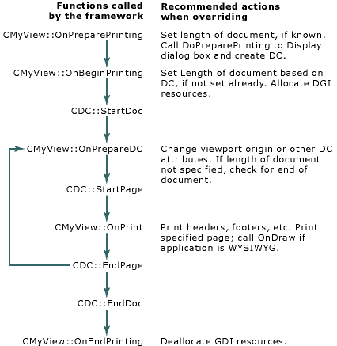

# Multipage Documents
This article describes the Windows printing protocol and explains how to print documents that contain more than one page. The article covers the following topics:  
  
-   [Printing protocol](#_core_the_printing_protocol)  
  
-   [Overriding view class functions](#_core_overriding_view_class_functions)  
  
-   [Pagination](#_core_pagination)  
  
-   [Printer pages vs. document pages](#_core_printer_pages_vs.._document_pages)  
  
-   [Print-time pagination](#_core_print.2d.time_pagination)  
  
##  \<a name="_core_the_printing_protocol">\</a> The Printing Protocol  
 To print a multipage document, the framework and view interact in the following manner. First the framework displays the **Print** dialog box, creates a device context for the printer, and calls the [StartDoc](../vs140/cdc--startdoc.md) member function of the [CDC](../vs140/cdc-class.md) object. Then, for each page of the document, the framework calls the [StartPage](../vs140/cdc--startpage.md) member function of the <CodeContentPlaceHolder>0\</CodeContentPlaceHolder> object, instructs the view object to print the page, and calls the [EndPage](../vs140/cdc--endpage.md) member function. If the printer mode must be changed before starting a particular page, the view calls [ResetDC](../vs140/cdc--resetdc.md), which updates the [DEVMODE](http://msdn.microsoft.com/library/windows/desktop/dd183565) structure containing the new printer mode information. When the entire document has been printed, the framework calls the [EndDoc](../vs140/cdc--enddoc.md) member function.  
  
##  \<a name="_core_overriding_view_class_functions">\</a> Overriding View Class Functions  
 The [CView](../vs140/cview-class.md) class defines several member functions that are called by the framework during printing. By overriding these functions in your view class, you provide the connections between the framework's printing logic and your view class's printing logic. The following table lists these member functions.  
  
### CView's Overridable Functions for Printing  
  
|Name|Reason for overriding|  
|----------|---------------------------|  
|[OnPreparePrinting](../vs140/cview--onprepareprinting.md)|To insert values in the Print dialog box, especially the length of the document|  
|[OnBeginPrinting](../vs140/cview--onbeginprinting.md)|To allocate fonts or other GDI resources|  
|[OnPrepareDC](../vs140/cview--onpreparedc.md)|To adjust attributes of the device context for a given page, or to do print-time pagination|  
|[OnPrint](../vs140/cview--onprint.md)|To print a given page|  
|[OnEndPrinting](../vs140/cview--onendprinting.md)|To deallocate GDI resources|  
  
 You can do printing-related processing in other functions as well, but these functions are the ones that drive the printing process.  
  
 The following figure illustrates the steps involved in the printing process and shows where each of <CodeContentPlaceHolder>1\</CodeContentPlaceHolder>'s printing member functions are called. The rest of this article explains most of these steps in more detail. Additional parts of the printing process are described in the article [Allocating GDI Resources](../vs140/allocating-gdi-resources.md).  
  
   
The Printing Loop  
  
##  \<a name="_core_pagination">\</a> Pagination  
 The framework stores much of the information about a print job in a [CPrintInfo](../vs140/cprintinfo-structure.md) structure. Several of the values in <CodeContentPlaceHolder>2\</CodeContentPlaceHolder> pertain to pagination; these values are accessible as shown in the following table.  
  
### Page Number Information Stored in CPrintInfo  
  
|Member variable or\ \  function name(s)|Page number referenced|  
|-----------------------------------------------|----------------------------|  
|<CodeContentPlaceHolder>3\</CodeContentPlaceHolder>/<CodeContentPlaceHolder>4\</CodeContentPlaceHolder>|First page of document|  
|<CodeContentPlaceHolder>5\</CodeContentPlaceHolder>/<CodeContentPlaceHolder>6\</CodeContentPlaceHolder>|Last page of document|  
|<CodeContentPlaceHolder>7\</CodeContentPlaceHolder>|First page to be printed|  
|<CodeContentPlaceHolder>8\</CodeContentPlaceHolder>|Last page to be printed|  
|<CodeContentPlaceHolder>9\</CodeContentPlaceHolder>|Page currently being printed|  
  
 Page numbers start at 1, that is, the first page is numbered 1, not 0. For more information about these and other members of [CPrintInfo](../vs140/cprintinfo-structure.md), see the *MFC Reference*.  
  
 At the beginning of the printing process, the framework calls the view's [OnPreparePrinting](../vs140/cview--onprepareprinting.md) member function, passing a pointer to a <CodeContentPlaceHolder>10\</CodeContentPlaceHolder> structure. The Application Wizard provides an implementation of <CodeContentPlaceHolder>11\</CodeContentPlaceHolder> that calls [DoPreparePrinting](../vs140/cview--doprepareprinting.md), another member function of <CodeContentPlaceHolder>12\</CodeContentPlaceHolder>. <CodeContentPlaceHolder>13\</CodeContentPlaceHolder> is the function that displays the Print dialog box and creates a printer device context.  
  
 At this point the application doesn't know how many pages are in the document. It uses the default values 1 and 0xFFFF for the numbers of the first and last page of the document. If you know how many pages your document has, override <CodeContentPlaceHolder>14\</CodeContentPlaceHolder> and call [SetMaxPage](../vs140/cprintinfo--setmaxpage.md) for the <CodeContentPlaceHolder>15\</CodeContentPlaceHolder> structure before you send it to <CodeContentPlaceHolder>16\</CodeContentPlaceHolder>. This lets you specify the length of your document.  
  
 <CodeContentPlaceHolder>17\</CodeContentPlaceHolder> then displays the Print dialog box. When it returns, the <CodeContentPlaceHolder>18\</CodeContentPlaceHolder> structure contains the values specified by the user. If the user wishes to print only a selected range of pages, he or she can specify the starting and ending page numbers in the Print dialog box. The framework retrieves these values using the <CodeContentPlaceHolder>19\</CodeContentPlaceHolder> and <CodeContentPlaceHolder>20\</CodeContentPlaceHolder> functions of [CPrintInfo](../vs140/cprintinfo-structure.md). If the user doesn't specify a page range, the framework calls <CodeContentPlaceHolder>21\</CodeContentPlaceHolder> and <CodeContentPlaceHolder>22\</CodeContentPlaceHolder> and uses the values returned to print the entire document.  
  
 For each page of a document to be printed, the framework calls two member functions in your view class, [OnPrepareDC](../vs140/cview--onpreparedc.md) and [OnPrint](../vs140/cview--onprint.md), and passes each function two parameters: a pointer to a [CDC](../vs140/cdc-class.md) object and a pointer to a <CodeContentPlaceHolder>23\</CodeContentPlaceHolder> structure. Each time the framework calls <CodeContentPlaceHolder>24\</CodeContentPlaceHolder> and <CodeContentPlaceHolder>25\</CodeContentPlaceHolder>, it passes a different value in the <CodeContentPlaceHolder>26\</CodeContentPlaceHolder> member of the <CodeContentPlaceHolder>27\</CodeContentPlaceHolder> structure. In this way the framework tells the view which page should be printed.  
  
 The [OnPrepareDC](../vs140/cview--onpreparedc.md) member function is also used for screen display. It makes adjustments to the device context before drawing takes place. <CodeContentPlaceHolder>28\</CodeContentPlaceHolder> serves a similar role in printing, but there are a couple of differences: first, the <CodeContentPlaceHolder>29\</CodeContentPlaceHolder> object represents a printer device context instead of a screen device context, and second, a <CodeContentPlaceHolder>30\</CodeContentPlaceHolder> object is passed as a second parameter. (This parameter is **NULL** when <CodeContentPlaceHolder>31\</CodeContentPlaceHolder> is called for screen display.) Override <CodeContentPlaceHolder>32\</CodeContentPlaceHolder> to make adjustments to the device context based on which page is being printed. For example, you can move the viewport origin and the clipping region to ensure that the appropriate portion of the document gets printed.  
  
 The [OnPrint](../vs140/cview--onprint.md) member function performs the actual printing of the page. The article [How Default Printing Is Done](../vs140/how-default-printing-is-done.md) shows how the framework calls [OnDraw](../vs140/cview--ondraw.md) with a printer device context to perform printing. More precisely, the framework calls <CodeContentPlaceHolder>33\</CodeContentPlaceHolder> with a <CodeContentPlaceHolder>34\</CodeContentPlaceHolder> structure and a device context, and <CodeContentPlaceHolder>35\</CodeContentPlaceHolder> passes the device context to <CodeContentPlaceHolder>36\</CodeContentPlaceHolder>. Override <CodeContentPlaceHolder>37\</CodeContentPlaceHolder> to perform any rendering that should be done only during printing and not for screen display. For example, to print headers or footers (see the article [Headers and Footers](../vs140/headers-and-footers.md) for more information). Then call <CodeContentPlaceHolder>38\</CodeContentPlaceHolder> from the override of <CodeContentPlaceHolder>39\</CodeContentPlaceHolder> to do the rendering common to both screen display and printing.  
  
 The fact that <CodeContentPlaceHolder>40\</CodeContentPlaceHolder> does the rendering for both screen display and printing means that your application is WYSIWYG: "What you see is what you get." However, suppose you aren't writing a WYSIWYG application. For example, consider a text editor that uses a bold font for printing but displays control codes to indicate bold text on the screen. In such a situation, you use <CodeContentPlaceHolder>41\</CodeContentPlaceHolder> strictly for screen display. When you override <CodeContentPlaceHolder>42\</CodeContentPlaceHolder>, substitute the call to <CodeContentPlaceHolder>43\</CodeContentPlaceHolder> with a call to a separate drawing function. That function draws the document the way it appears on paper, using the attributes that you don't display on the screen.  
  
##  \<a name="_core_printer_pages_vs.._document_pages">\</a> Printer Pages vs. Document Pages  
 When you refer to page numbers, it's sometimes necessary to distinguish between the printer's concept of a page and a document's concept of a page. From the point of view of the printer, a page is one sheet of paper. However, one sheet of paper doesn't necessarily equal one page of the document. For example, if you're printing a newsletter, where the sheets are to be folded, one sheet of paper might contain both the first and last pages of the document, side by side. Similarly, if you're printing a spreadsheet, the document doesn't consist of pages at all. Instead, one sheet of paper might contain rows 1 through 20, columns 6 through 10.  
  
 All the page numbers in the [CPrintInfo](../vs140/cprintinfo-structure.md) structure refer to printer pages. The framework calls <CodeContentPlaceHolder>44\</CodeContentPlaceHolder> and <CodeContentPlaceHolder>45\</CodeContentPlaceHolder> once for each sheet of paper that will pass through the printer. When you override the [OnPreparePrinting](../vs140/cview--onprepareprinting.md) function to specify the length of the document, you must use printer pages. If there is a one-to-one correspondence (that is, one printer page equals one document page), then this is easy. If, on the other hand, document pages and printer pages do not directly correspond, you must translate between them. For example, consider printing a spreadsheet. When overriding <CodeContentPlaceHolder>46\</CodeContentPlaceHolder>, you must calculate how many sheets of paper will be required to print the entire spreadsheet and then use that value when calling the <CodeContentPlaceHolder>47\</CodeContentPlaceHolder> member function of <CodeContentPlaceHolder>48\</CodeContentPlaceHolder>. Similarly, when overriding <CodeContentPlaceHolder>49\</CodeContentPlaceHolder>, you must translate <CodeContentPlaceHolder>50\</CodeContentPlaceHolder> into the range of rows and columns that will appear on that particular sheet and then adjust the viewport origin accordingly.  
  
##  \<a name="_core_print.2d.time_pagination">\</a> Print-Time Pagination  
 In some situations, your view class may not know in advance how long the document is until it has actually been printed. For example, suppose your application isn't WYSIWYG, so a document's length on the screen doesn't correspond to its length when printed.  
  
 This causes a problem when you override [OnPreparePrinting](../vs140/cview--onprepareprinting.md) for your view class: you can't pass a value to the <CodeContentPlaceHolder>51\</CodeContentPlaceHolder> function of the [CPrintInfo](../vs140/cprintinfo-structure.md) structure, because you don't know the length of a document. If the user doesn't specify a page number to stop at using the Print dialog box, the framework doesn't know when to stop the print loop. The only way to determine when to stop the print loop is to print out the document and see when it ends. Your view class must check for the end of the document while it is being printed, and then inform the framework when the end is reached.  
  
 The framework relies on your view class's [OnPrepareDC](../vs140/cview--onpreparedc.md) function to tell it when to stop. After each call to <CodeContentPlaceHolder>52\</CodeContentPlaceHolder>, the framework checks a member of the <CodeContentPlaceHolder>53\</CodeContentPlaceHolder> structure called <CodeContentPlaceHolder>54\</CodeContentPlaceHolder>. Its default value is **TRUE.** As long as it remains so, the framework continues the print loop. If it is set to **FALSE**, the framework stops. To perform print-time pagination, override <CodeContentPlaceHolder>55\</CodeContentPlaceHolder> to check whether the end of the document has been reached, and set <CodeContentPlaceHolder>56\</CodeContentPlaceHolder> to **FALSE** when it has.  
  
 The default implementation of <CodeContentPlaceHolder>57\</CodeContentPlaceHolder> sets <CodeContentPlaceHolder>58\</CodeContentPlaceHolder> to **FALSE** if the current page is greater than 1. This means that if the length of the document wasn't specified, the framework assumes the document is one page long. One consequence of this is that you must be careful if you call the base class version of <CodeContentPlaceHolder>59\</CodeContentPlaceHolder>. Do not assume that <CodeContentPlaceHolder>60\</CodeContentPlaceHolder> will be **TRUE** after calling the base class version.  
  
### What do you want to know more about?  
  
-   [Headers and footers](../vs140/headers-and-footers.md)  
  
-   [Allocating GDI resources](../vs140/allocating-gdi-resources.md)  
  
## See Also  
 [Printing](../vs140/printing.md)   
 [CView Class](../vs140/cview-class.md)   
 [CDC Class](../vs140/cdc-class.md)