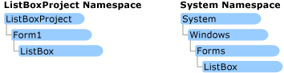

# Namespaces in Visual Basic
Namespaces organize the objects defined in an assembly. Assemblies can contain multiple namespaces, which can in turn contain other namespaces. Namespaces prevent ambiguity and simplify references when using large groups of objects such as class libraries.  
  
 For example, the [!INCLUDE[dnprdnshort](../vs140/includes/dnprdnshort_md.md)] defines the \<xref:System.Windows.Forms.ListBox*> class in the \<xref:System.Windows.Forms*?displayProperty=fullName> namespace. The following code fragment shows how to declare a variable using the fully qualified name for this class:  
  
 [!code[VbVbalrApplication#6](../vs140/codesnippet/VisualBasic/namespaces-in-visual-basic_1.vb)]  
  
## Avoiding Name Collisions  
 [!INCLUDE[dnprdnshort](../vs140/includes/dnprdnshort_md.md)] namespaces address a problem sometimes called *namespace pollution*, in which the developer of a class library is hampered by the use of similar names in another library. These conflicts with existing components are sometimes called *name collisions*.  
  
 For example, if you create a new class named <CodeContentPlaceHolder>2\</CodeContentPlaceHolder>, you can use it inside your project without qualification. However, if you want to use the [!INCLUDE[dnprdnshort](../vs140/includes/dnprdnshort_md.md)] \<xref:System.Windows.Forms.ListBox*> class in the same project, you must use a fully qualified reference to make the reference unique. If the reference is not unique, [!INCLUDE[vbprvb](../vs140/includes/vbprvb_md.md)] produces an error stating that the name is ambiguous. The following code example demonstrates how to declare these objects:  
  
 [!code[VbVbalrApplication#7](../vs140/codesnippet/VisualBasic/namespaces-in-visual-basic_2.vb)]  
  
 The following illustration shows two namespace hierarchies, both containing an object named <CodeContentPlaceHolder>3\</CodeContentPlaceHolder>.  
  
   
  
 By default, every executable file you create with [!INCLUDE[vbprvb](../vs140/includes/vbprvb_md.md)] contains a namespace with the same name as your project. For example, if you define an object within a project named <CodeContentPlaceHolder>4\</CodeContentPlaceHolder>, the executable file ListBoxProject.exe contains a namespace called <CodeContentPlaceHolder>5\</CodeContentPlaceHolder>.  
  
 Multiple assemblies can use the same namespace. [!INCLUDE[vbprvb](../vs140/includes/vbprvb_md.md)] treats them as a single set of names. For example, you can define classes for a namespace called <CodeContentPlaceHolder>6\</CodeContentPlaceHolder> in an assembly named <CodeContentPlaceHolder>7\</CodeContentPlaceHolder>, and define additional classes for the same namespace from an assembly named <CodeContentPlaceHolder>8\</CodeContentPlaceHolder>.  
  
## Fully Qualified Names  
 Fully qualified names are object references that are prefixed with the name of the namespace in which the object is defined. You can use objects defined in other projects if you create a reference to the class (by choosing **Add Reference** from the **Project** menu) and then use the fully qualified name for the object in your code. The following code fragment shows how to use the fully qualified name for an object from another project's namespace:  
  
 [!code[VbVbalrApplication#8](../vs140/codesnippet/VisualBasic/namespaces-in-visual-basic_3.vb)]  
  
 Fully qualified names prevent naming conflicts because they make it possible for the compiler to determine which object is being used. However, the names themselves can get long and cumbersome. To get around this, you can use the <CodeContentPlaceHolder>9\</CodeContentPlaceHolder> statement to define an *alias*—an abbreviated name you can use in place of a fully qualified name. For example, the following code example creates aliases for two fully qualified names, and uses these aliases to define two objects.  
  
 [!code[VbVbalrApplication#9](../vs140/codesnippet/VisualBasic/namespaces-in-visual-basic_4.vb)]  
  
 [!code[VbVbalrApplication#10](../vs140/codesnippet/VisualBasic/namespaces-in-visual-basic_5.vb)]  
  
 If you use the <CodeContentPlaceHolder>10\</CodeContentPlaceHolder> statement without an alias, you can use all the names in that namespace without qualification, provided they are unique to the project. If your project contains <CodeContentPlaceHolder>11\</CodeContentPlaceHolder> statements for namespaces that contain items with the same name, you must fully qualify that name when you use it. Suppose, for example, your project contained the following two <CodeContentPlaceHolder>12\</CodeContentPlaceHolder> statements:  
  
 [!code[VbVbalrApplication#11](../vs140/codesnippet/VisualBasic/namespaces-in-visual-basic_6.vb)]  
  
 If you attempt to use <CodeContentPlaceHolder>13\</CodeContentPlaceHolder> without fully qualifying it, [!INCLUDE[vbprvb](../vs140/includes/vbprvb_md.md)] produces an error stating that the name <CodeContentPlaceHolder>14\</CodeContentPlaceHolder> is ambiguous.  
  
## Namespace Level Statements  
 Within a namespace, you can define items such as modules, interfaces, classes, delegates, enumerations, structures, and other namespaces. You cannot define items such as properties, procedures, variables and events at the namespace level. These items must be declared within containers such as modules, structures, or classes.  
  
## Global Keyword in Fully Qualified Names  
 If you have defined a nested hierarchy of namespaces, code inside that hierarchy might be blocked from accessing the \<xref:System*?displayProperty=fullName> namespace of the .NET Framework. The following example illustrates a hierarchy in which the <CodeContentPlaceHolder>15\</CodeContentPlaceHolder> namespace blocks access to \<xref:System*?displayProperty=fullName>.  
  
<CodeContentPlaceHolder>0\</CodeContentPlaceHolder>  
 As a result, the Visual Basic compiler cannot successfully resolve the reference to \<xref:System.Int32*?displayProperty=fullName>, because <CodeContentPlaceHolder>16\</CodeContentPlaceHolder> does not define <CodeContentPlaceHolder>17\</CodeContentPlaceHolder>. You can use the <CodeContentPlaceHolder>18\</CodeContentPlaceHolder> keyword to start the qualification chain at the outermost level of the .NET Framework class library. This allows you to specify the \<xref:System*?displayProperty=fullName> namespace or any other namespace in the class library. The following example illustrates this.  
  
<CodeContentPlaceHolder>1\</CodeContentPlaceHolder>  
 You can use <CodeContentPlaceHolder>19\</CodeContentPlaceHolder> to access other root-level namespaces, such as \<xref:Microsoft.VisualBasic*?displayProperty=fullName>, and any namespace associated with your project.  
  
## Global Keyword in Namespace Statements  
 You can also use the <CodeContentPlaceHolder>20\</CodeContentPlaceHolder> keyword in a [Namespace Statement](../vs140/namespace-statement.md). This lets you define a namespace out of the root namespace of your project.  
  
 All namespaces in your project are based on the root namespace for the project.  Visual Studio assigns your project name as the default root namespace for all code in your project. For example, if your project is named <CodeContentPlaceHolder>21\</CodeContentPlaceHolder>, its programming elements belong to namespace <CodeContentPlaceHolder>22\</CodeContentPlaceHolder>. If you declare <CodeContentPlaceHolder>23\</CodeContentPlaceHolder>, references to <CodeContentPlaceHolder>24\</CodeContentPlaceHolder> in the project will access <CodeContentPlaceHolder>25\</CodeContentPlaceHolder>.  
  
 The following examples use the <CodeContentPlaceHolder>26\</CodeContentPlaceHolder> keyword to declare a namespace out of the root namespace for the project.  
  
 [!code[VbVbalrApplication#22](../vs140/codesnippet/VisualBasic/namespaces-in-visual-basic_7.vb)]  
  
 In a namespace declaration, <CodeContentPlaceHolder>27\</CodeContentPlaceHolder> cannot be nested in another namespace.  
  
 You can use the [Application Page, Project Designer (Visual Basic)](../vs140/application-page--project-designer--visual-basic-.md) to view and modify the **Root Namespace** of the project.  For new projects, the **Root Namespace** defaults to the project name. To cause <CodeContentPlaceHolder>28\</CodeContentPlaceHolder> to be the top-level namespace, you can clear the **Root Namespace** entry so that the box is empty. Clearing **Root Namespace** removes the need for the <CodeContentPlaceHolder>29\</CodeContentPlaceHolder> keyword in namespace declarations.  
  
 If a <CodeContentPlaceHolder>30\</CodeContentPlaceHolder> statement declares a name that is also a namespace in the .NET Framework, the .NET Framework namespace becomes unavailable if the <CodeContentPlaceHolder>31\</CodeContentPlaceHolder> keyword is not used in a fully qualified name. To enable access to that .NET Framework namespace without using the <CodeContentPlaceHolder>32\</CodeContentPlaceHolder> keyword, you can include the <CodeContentPlaceHolder>33\</CodeContentPlaceHolder> keyword in the <CodeContentPlaceHolder>34\</CodeContentPlaceHolder> statement.  
  
 The following example has the <CodeContentPlaceHolder>35\</CodeContentPlaceHolder> keyword in the <CodeContentPlaceHolder>36\</CodeContentPlaceHolder> namespace declaration.  
  
 If the <CodeContentPlaceHolder>37\</CodeContentPlaceHolder> keyword was not present in the namespace declaration, \<xref:System.Text.StringBuilder*> could not be accessed without specifying <CodeContentPlaceHolder>38\</CodeContentPlaceHolder>. For a project named <CodeContentPlaceHolder>39\</CodeContentPlaceHolder>, references to <CodeContentPlaceHolder>40\</CodeContentPlaceHolder> would access <CodeContentPlaceHolder>41\</CodeContentPlaceHolder> if the <CodeContentPlaceHolder>42\</CodeContentPlaceHolder> keyword was not used.  
  
 [!code[VbVbalrApplication#21](../vs140/codesnippet/VisualBasic/namespaces-in-visual-basic_8.vb)]  
  
## See Also  
 \<xref:System.Windows.Forms.ListBox*>   
 \<xref:System.Windows.Forms*?displayProperty=fullName>   
 [Assemblies and the Global Assembly Cache (C# and Visual Basic)](../vs140/assemblies-and-the-global-assembly-cache--csharp-and-visual-basic-.md)   
 [How to: Create and Use DLLs (C# and Visual Basic)](../vs140/how-to--create-and-use-assemblies-using-the-command-line--csharp-and-visual-basic-.md)   
 [References and the Imports Statement](../vs140/references-and-the-imports-statement--visual-basic-.md)   
 [Imports Statement (.NET Namespace and Type)](../vs140/imports-statement--.net-namespace-and-type-.md)   
 [Writing Code in Office Solutions](assetId:///2d4d8fd0-e881-4829-976f-0d1a9221dec0)