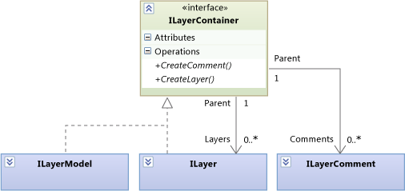
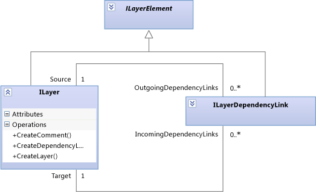
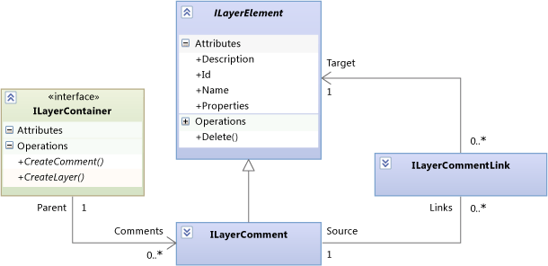
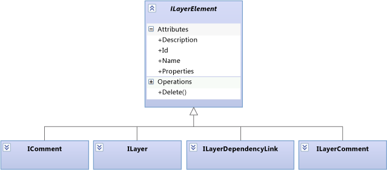
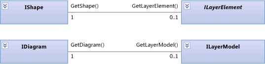

# Navigate and update layer models in program code
This topic describes the elements and relationships in layer models, which you can navigate and update by using program code. For more information about layer diagrams from the user's point of view, see [Layer Diagrams: Reference](../vs140/layer-diagrams--reference.md) and [Layer Diagrams: Guidelines](../vs140/layer-diagrams--guidelines.md).  
  
 The \<xref:Microsoft.VisualStudio.ArchitectureTools.Extensibility.Layer*> model described in this topic is a façade on a more general \<xref:Microsoft.VisualStudio.GraphModel*> model. If you are writing a [menu command or gesture extension](../vs140/add-commands-and-gestures-to-layer-diagrams.md), use the <CodeContentPlaceHolder>3\</CodeContentPlaceHolder> model. If you are writing a [layer validation extension](../vs140/add-custom-architecture-validation-to-layer-diagrams.md), it is easier to use the <CodeContentPlaceHolder>4\</CodeContentPlaceHolder>.  
  
## Transactions  
 When you update a model, consider enclosing the changes in a <CodeContentPlaceHolder>5\</CodeContentPlaceHolder>. This groups your changes into one transaction. If any of the changes fails, the whole transaction will be rolled back. If the user undoes a change, all the changes will be undone together.  
  
 For more information, see [How to Link Model Updates using Transactions](../vs140/link-uml-model-updates-by-using-transactions.md).  
  
<CodeContentPlaceHolder>0\</CodeContentPlaceHolder>  
## Containment  
   
  
 Layers (\<xref:Microsoft.VisualStudio.ArchitectureTools.Extensibility.Layer.ILayer*>) and the layer model (\<xref:Microsoft.VisualStudio.ArchitectureTools.Extensibility.Layer.ILayerModel*>) can contain Comments and Layers.  
  
 A layer (<CodeContentPlaceHolder>6\</CodeContentPlaceHolder>) can be contained in a layer model (<CodeContentPlaceHolder>7\</CodeContentPlaceHolder>) or it can be nested within another <CodeContentPlaceHolder>8\</CodeContentPlaceHolder>.  
  
 To create a comment or a layer, use the creation methods on the appropriate container.  
  
## Dependency Links  
 A dependency link is represented by an object. It can be navigated in either direction:  
  
   
  
 To create a dependency link, call <CodeContentPlaceHolder>9\</CodeContentPlaceHolder>.  
  
## Comments  
 Comments can be contained inside layers or the layer model, and can also be linked to any layer element:  
  
   
  
 A comment can be linked to any number of elements, including none.  
  
 To get the comments that are attached to a layer element, use:  
  
<CodeContentPlaceHolder>1\</CodeContentPlaceHolder>  
> [!CAUTION]
>  The <CodeContentPlaceHolder>10\</CodeContentPlaceHolder> property of an <CodeContentPlaceHolder>11\</CodeContentPlaceHolder> gets comments that are contained within the <CodeContentPlaceHolder>12\</CodeContentPlaceHolder>. It does not get the comments that are linked to it.  
  
 Create a comment by invoking <CodeContentPlaceHolder>13\</CodeContentPlaceHolder> on the appropriate container.  
  
 Create a link by using <CodeContentPlaceHolder>14\</CodeContentPlaceHolder> on the comment.  
  
## Layer Elements  
 All the types of element that can be contained in a model are layer elements:  
  
   
  
## Properties  
 Each <CodeContentPlaceHolder>15\</CodeContentPlaceHolder> has a string dictionary named <CodeContentPlaceHolder>16\</CodeContentPlaceHolder>. You can use this dictionary to attach arbitrary information to any layer element.  
  
## Artifact References  
 An artifact reference (\<xref:Microsoft.VisualStudio.ArchitectureTools.Extensibility.Layer.ILayerArtifactReference*>) represents the link between a layer and a project item such as a file, class, or folder. The user creates artifacts when they create a layer or add to it by dragging items from Solution Explorer, Class View, or Object Browser onto a layer diagram. Any number of artifact references can be linked to a layer.  
  
 Each row in Layer Explorer displays an artifact reference. For more information, see [How to Create Layer Diagrams from Artifacts](../vs140/create-layer-diagrams-from-your-code.md).  
  
 The principal types and methods concerned with artifact references are as follows:  
  
 \<xref:Microsoft.VisualStudio.ArchitectureTools.Extensibility.Layer.ILayerArtifactReference*>. The Categories property indicates what kind of artifact is referenced, such as a class, executable file, or assembly. Categories determines how the Identifier identifies the target artifact.  
  
 \<xref:Microsoft.VisualStudio.ArchitectureTools.Extensibility.Layer.ArtifactReferenceExtensions.CreateArtifactReferenceAsync*> creates an artifact reference from an \<xref:EnvDTE.Project*> or \<xref:EnvDTE.ProjectItem*>. This is an asynchronous operation. Therefore, you usually provide a callback that is called when the creation is complete.  
  
 Layer Artifact References should not be confused with Artifacts in use case diagrams.  
  
## Shapes and Diagrams  
 Two objects are used to represent each element in a layer model: an \<xref:Microsoft.VisualStudio.ArchitectureTools.Extensibility.Layer.ILayerElement*>, and an \<xref:Microsoft.VisualStudio.ArchitectureTools.Extensibility.Presentation.IShape*>. The <CodeContentPlaceHolder>17\</CodeContentPlaceHolder> represents the position and size of the shape on the diagram. In layer models, every <CodeContentPlaceHolder>18\</CodeContentPlaceHolder> has one <CodeContentPlaceHolder>19\</CodeContentPlaceHolder>, and every <CodeContentPlaceHolder>20\</CodeContentPlaceHolder> on a layer diagram has one <CodeContentPlaceHolder>21\</CodeContentPlaceHolder>. <CodeContentPlaceHolder>22\</CodeContentPlaceHolder> is also used for UML models. Therefore, not every <CodeContentPlaceHolder>23\</CodeContentPlaceHolder> has a layer element.  
  
 In the same manner, the \<xref:Microsoft.VisualStudio.ArchitectureTools.Extensibility.Layer.ILayerModel*> is displayed on one \<xref:Microsoft.VisualStudio.ArchitectureTools.Extensibility.Presentation.IDiagram*>.  
  
 In the code of a custom command or gesture handler, you can get the current diagram and the current selection of shapes from the <CodeContentPlaceHolder>24\</CodeContentPlaceHolder> import:  
  
<CodeContentPlaceHolder>2\</CodeContentPlaceHolder>  
   
  
 \<xref:Microsoft.VisualStudio.ArchitectureTools.Extensibility.Presentation.IShape*> and \<xref:Microsoft.VisualStudio.ArchitectureTools.Extensibility.Presentation.IDiagram*> are also used to display UML models. For more information, see [How to Display a Model on Diagrams](../vs140/display-a-uml-model-on-diagrams.md).  
  
## See Also  
 [Adding Commands and Gestures to Layer Diagrams](../vs140/add-commands-and-gestures-to-layer-diagrams.md)   
 [Adding Custom Architecture Validation to Layer Diagrams](../vs140/add-custom-architecture-validation-to-layer-diagrams.md)   
 [Adding Custom Properties to a Layer Diagram](../vs140/add-custom-properties-to-layer-diagrams.md)   
 [Layer Diagrams: Reference](../vs140/layer-diagrams--reference.md)   
 [Layer Diagrams: Guidelines](../vs140/layer-diagrams--guidelines.md)   
 [Extending UML Models and Diagrams](../vs140/extend-uml-models-and-diagrams.md)