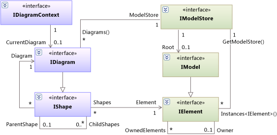

# Navigate the UML model
This topic introduces the main types of the UML model.  
  
## The Model Elements, Model, and Model Store  
 The types defined in the assembly **Microsoft.VisualStudio.Uml.Interfaces.dll** correspond to the types defined in the [UML Specification, version 2.1.2](http://www.omg.org/spec/UML/2.1.2/Superstructure/PDF/).  
  
 Types in the UML Specification are realized as interfaces in Visual Studio. The letter 'I' is prepended to the name of each type. For example: \<xref:Microsoft.VisualStudio.Uml.Classes.IElement*>, \<xref:Microsoft.VisualStudio.Uml.Classes.IClass*>, \<xref:Microsoft.VisualStudio.Uml.Interactions.IInteraction*>, \<xref:Microsoft.VisualStudio.Uml.Classes.IOperation*>.  
  
 All the types except IElement inherit properties from one or more supertypes.  
  
-   For a summary of the model types, see [Model Element Types](../vs140/uml-model-element-types.md).  
  
-   For full details of the API, see [API Reference for Modeling Extensibility](../vs140/api-reference-for-uml-modeling-extensibility.md).  
  
### Relationships  
 Properties and relationships that are defined in the UML Specification are implemented as .NET properties.  
  
 Most relationships are navigable in both directions. A relationship corresponds to a pair of properties, with one property on the type at each end. For example, the properties <CodeContentPlaceHolder>3\</CodeContentPlaceHolder> and <CodeContentPlaceHolder>4\</CodeContentPlaceHolder> represent two ends of a relationship. Therefore, this expression will always evaluate to true:  
  
 <CodeContentPlaceHolder>5\</CodeContentPlaceHolder>  
  
 Many relationships, such as IAssociation, are also represented by an object that can have its own properties.  
  
 If you delete an element from the model, any relationship in which it takes part is automatically deleted, and the property at the other end is updated.  
  
 If the UML Specification assigns a multiplicity of 0..1 to a property, it may have the value <CodeContentPlaceHolder>6\</CodeContentPlaceHolder>. A multiplicity with maximum greater than 1 means that the .NET property has the type: <CodeContentPlaceHolder>7\</CodeContentPlaceHolder>*Type*<CodeContentPlaceHolder>8\</CodeContentPlaceHolder>.  
  
 For more information about traversing relationships, see [How to: Navigate Relationships with the UML API](../vs140/navigate-relationships-with-the-uml-api.md).  
  
### The Ownership Tree  
 A model contains a tree of \<xref:Microsoft.VisualStudio.Uml.Classes.IElement*> objects. Every element has properties <CodeContentPlaceHolder>9\</CodeContentPlaceHolder> and <CodeContentPlaceHolder>10\</CodeContentPlaceHolder>.  
  
 In most cases, the targets of the <CodeContentPlaceHolder>11\</CodeContentPlaceHolder> and <CodeContentPlaceHolder>12\</CodeContentPlaceHolder> properties are also referenced by other properties that have more specific names. For example, every UML operation is owned by a UML class. Therefore \<xref:Microsoft.VisualStudio.Uml.Classes.IOperation*> has a property named \<xref:Microsoft.VisualStudio.Uml.Classes.IOperation.Class*>, and in every \<xref:Microsoft.VisualStudio.Uml.Classes.IOperation*> object, <CodeContentPlaceHolder>13\</CodeContentPlaceHolder>.  
  
 The topmost element of the tree, which has no Owner, is a \<xref:Microsoft.VisualStudio.Uml.AuxiliaryConstructs.IModel*>. The IModel is contained within a \<xref:Microsoft.VisualStudio.ArchitectureTools.Extensibility.Uml.IModelStore*>, in which it is the \<xref:Microsoft.VisualStudio.ArchitectureTools.Extensibility.Uml.IModelStore.Root*>.  
  
 Every model element is created with an Owner. For more information, see [How to Create Elements and Relationships](../vs140/create-elements-and-relationships-in-uml-models.md).  
  
   
  
## Shapes and Diagrams  
 Elements in the UML model can be displayed on diagrams. Different types of diagrams can display different subtypes of IElement.  
  
 In some cases, an element can appear on more than one diagram. For example, an IUseCase element can have several IShapes, which can appear on one diagram or different diagrams.  
  
 Shapes are arranged in a tree. The edges of the tree are represented by the ParentShape and ChildShapes properties. Diagrams are the only shapes that do not have parents. The shapes on the surface of a diagram are composed of smaller parts. For example, a class shape has compartments for attributes and operations.  
  
 For more information about shapes, see [How to: Display a Model on Diagrams](../vs140/display-a-uml-model-on-diagrams.md).  
  
## Access to the Model in Extensions  
 In [!INCLUDE[vsprvs](../vs140/includes/vsprvs_md.md)] extensions defined as MEF Components, you can declare properties that import information from the context in which the extension runs.  
  
|Attribute type|What this provides access to|More information|  
|--------------------|----------------------------------|----------------------|  
|Microsoft.VisualStudio.ArchitectureTools.Extensibility.Presentation\ \  .IDiagramContext\ \  (in Microsoft.VisualStudio.ArchitectureTools.Extensibility.dll)|The current focus diagram.|[How to: Define a Command on a Modeling Diagram](../vs140/define-a-menu-command-on-a-modeling-diagram.md)|  
|Microsoft.VisualStudio.Modeling.ExtensionEnablement\ \  .ILinkedUndoContext\ \  (in Microsoft.VisualStudio.Modeling.Sdk.[version].dll)|Allows you to group changes into transactions.|[How to: Link Model Updates using Transactions](../vs140/link-uml-model-updates-by-using-transactions.md)|  
|Microsoft.VisualStudio.Shell .SVsServiceProvider\ \  (in Microsoft.VisualStudio.Shell.Immutable.[version].dll)|The host [!INCLUDE[vsprvs](../vs140/includes/vsprvs_md.md)]. From there you can access files, projects and other aspects.|[How to: Open a UML model](../vs140/open-a-uml-model-by-using-the-visual-studio-api.md)|  
  
### To get the Context  
 Declare one or both of the following interfaces inside your extension class:  
  
<CodeContentPlaceHolder>0\</CodeContentPlaceHolder>  
 The Managed Extensibility Framework (MEF) will bind these to definitions from which you can obtain the current diagram, model store, root object, and so on:  
  
<CodeContentPlaceHolder>1\</CodeContentPlaceHolder>  
### To get the current selection  
  
<CodeContentPlaceHolder>2\</CodeContentPlaceHolder>  
## Accessing another model or diagrams  
 You can:  
  
-   Use [!INCLUDE[vsprvs](../vs140/includes/vsprvs_md.md)] model bus to create links between elements in different models. For more information, see [How to Open a UML Model using Model Bus](../vs140/integrate-uml-models-with-other-models-and-tools.md).  
  
-   Load a modeling project and diagrams in read-only mode without making it visible in the [!INCLUDE[vsprvs](../vs140/includes/vsprvs_md.md)] user interface. For more information, see [How to Read a UML Model in Program Code](../vs140/read-a-uml-model-in-program-code.md).  
  
-   Open a modeling project and its diagrams in [!INCLUDE[vsprvs](../vs140/includes/vsprvs_md.md)], and then access the contents. For more information, see [How to Open a UML Model by using the Visual Studio API](../vs140/open-a-uml-model-by-using-the-visual-studio-api.md).  
  
## See Also  
 [Extending Models and Diagrams](../vs140/extend-uml-models-and-diagrams.md)   
 [Programming with the UML API](../vs140/programming-with-the-uml-api.md)