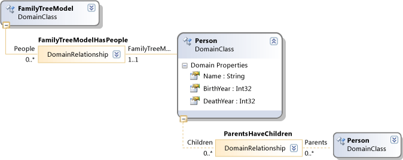
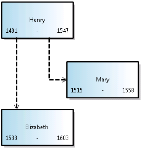
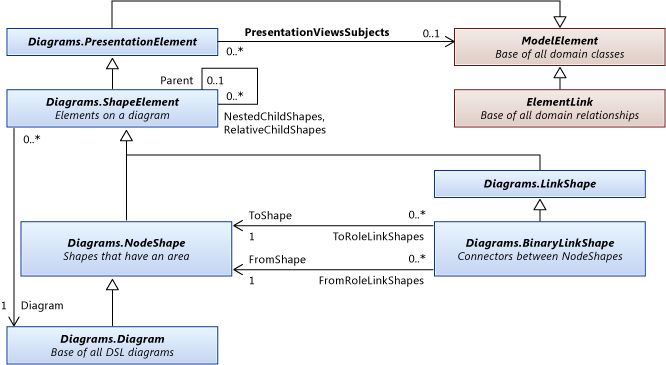
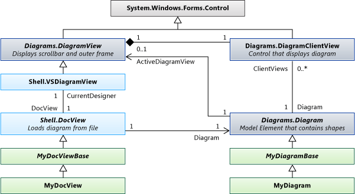

# Navigating and Updating a Model in Program Code
You can write code to create and delete model elements, set their properties, and create and delete links between elements. All changes must be made within a transaction. If the elements are viewed on a diagram, the diagram will be "fixed up" automatically at the end of the transaction.  
  
## In this Topic  
 [An Example DSL Definition](#example)  
  
 [Navigating the Model](#navigation)  
  
 [Accessing Class Information](#metadata)  
  
 [Perform Changes inside a Transaction](#transaction)  
  
 [Creating Model Elements](#elements)  
  
 [Creating Relationship Links](#links)  
  
 [Deleting Elements](#deleteelements)  
  
 [Deleting Relationship Links](#deletelinks)  
  
 [Reordering the Links of a Relationship](#reorder)  
  
 [Locks](#locks)  
  
 [Copy and Paste](#copy)  
  
 [Navigating and Updating Diagrams](#diagrams)  
  
 [Navigating between Shapes and Elements](#views)  
  
 [Properties of Shapes and Connectors](#shapeProperties)  
  
 [DocView and DocData](#docdata)  
  
 Shapes, Connectors and Diagrams, and their relationships to model elements are described in a separate topic. For more information, see [How to Access and Update Diagrams](../vs140/how-to--navigate-and-update-a-diagram.md).  
  
##  \<a name="example">\</a> An Example DSL Definition  
 This is the main part of DslDefinition.dsl for the examples in this topic:  
  
   
  
 This model is an instance of this DSL:  
  
   
  
### References and Namespaces  
 To run the code in this topic, you should reference:  
  
 <CodeContentPlaceHolder>8\</CodeContentPlaceHolder>  
  
 Your code will use this namespace:  
  
 <CodeContentPlaceHolder>9\</CodeContentPlaceHolder>  
  
 In addition, if you are writing the code in a different project from the one in which your DSL is defined, you should import the assembly that is built by the Dsl project.  
  
##  \<a name="navigation">\</a> Navigating the Model  
  
### Properties  
 Domain properties that you define in the DSL definition become properties that you can access in program code:  
  
 <CodeContentPlaceHolder>10\</CodeContentPlaceHolder>  
  
 <CodeContentPlaceHolder>11\</CodeContentPlaceHolder>  
  
 <CodeContentPlaceHolder>12\</CodeContentPlaceHolder>  
  
 If you want to set a property, you must do so inside a [transaction](#transaction):  
  
 <CodeContentPlaceHolder>13\</CodeContentPlaceHolder>  
  
 If in the DSL definition, a property's **Kind** is **Calculated**, you cannot set it. For more information, see [Calculated and Custom Properties](../vs140/calculated-and-custom-storage-properties.md).  
  
### Relationships  
 Domain relationships that you define in the DSL definition become pairs of properties, one on the class at each end of the relationship. The names of the properties appear in the DslDefinition diagram as labels on the roles at each side of the relationship. Depending on the multiplicity of the role, the type of the property is either the class at the other end of the relationship, or a collection of that class.  
  
 <CodeContentPlaceHolder>14\</CodeContentPlaceHolder>  
  
 <CodeContentPlaceHolder>15\</CodeContentPlaceHolder>  
  
 The properties at opposite ends of a relationship are always reciprocal. When a link is created or deleted, the role properties on both elements are updated. The following expression (which uses the extensions of <CodeContentPlaceHolder>16\</CodeContentPlaceHolder>) is always true for the ParentsHaveChildren relationship in the example:  
  
 <CodeContentPlaceHolder>17\</CodeContentPlaceHolder>  
  
 <CodeContentPlaceHolder>18\</CodeContentPlaceHolder>  
  
 **ElementLinks**. A relationship is also represented by a model element called a *link*, which is an instance of the domain relationship type. A link always has one source element and one target element. The source element and the target element can be the same.  
  
 You can access a link and its properties:  
  
 <CodeContentPlaceHolder>19\</CodeContentPlaceHolder>  
  
 <CodeContentPlaceHolder>20\</CodeContentPlaceHolder>  
  
 <CodeContentPlaceHolder>21\</CodeContentPlaceHolder>  
  
 By default, no more than one instance of a relationship is allowed to link any pair of model elements. But if in the DSL definition, the <CodeContentPlaceHolder>22\</CodeContentPlaceHolder> flag is true for the relationship, then there might be more than one link, and you must use <CodeContentPlaceHolder>23\</CodeContentPlaceHolder>:  
  
 <CodeContentPlaceHolder>24\</CodeContentPlaceHolder>  
  
 There are also other methods for accessing links. For example:  
  
 <CodeContentPlaceHolder>25\</CodeContentPlaceHolder>  
  
 **Hidden roles.** If in the DSL definition, **Is Property Generated** is **false** for a particular role, then no property is generated that corresponds to that role. However, you can still access the links and traverse the links using the methods of the relationship:  
  
 <CodeContentPlaceHolder>26\</CodeContentPlaceHolder>  
  
 The most frequently used example is the \<xref:Microsoft.VisualStudio.Modeling.Diagrams.PresentationViewsSubject*> relationship, which links a model element to the shape that displays it on a diagram:  
  
 <CodeContentPlaceHolder>27\</CodeContentPlaceHolder>  
  
### The Element Directory  
 You can access all the elements in the store using the element directory:  
  
 <CodeContentPlaceHolder>28\</CodeContentPlaceHolder>  
  
 There are also methods for finding elements, such as the following:  
  
 <CodeContentPlaceHolder>29\</CodeContentPlaceHolder>  
  
 <CodeContentPlaceHolder>30\</CodeContentPlaceHolder>  
  
##  \<a name="metadata">\</a> Accessing Class Information  
 You can get information about the classes, relationships, and other aspects of the DSL definition. For example:  
  
 <CodeContentPlaceHolder>31\</CodeContentPlaceHolder>  
  
 <CodeContentPlaceHolder>32\</CodeContentPlaceHolder>  
  
 <CodeContentPlaceHolder>33\</CodeContentPlaceHolder>  
  
 <CodeContentPlaceHolder>34\</CodeContentPlaceHolder>  
  
 <CodeContentPlaceHolder>35\</CodeContentPlaceHolder>  
  
 <CodeContentPlaceHolder>36\</CodeContentPlaceHolder>  
  
 The ancestor classes of model elements are as follows:  
  
-   ModelElement - all elements and relationships are ModelElements  
  
-   ElementLink - all relationships are ElementLinks  
  
##  \<a name="transaction">\</a> Perform Changes inside a Transaction  
 Whenever your program code changes anything in the Store, it must do so inside a transaction. This applies to all model elements, relationships, shapes, diagrams, and their properties. For more information, see \<xref:Microsoft.VisualStudio.Modeling.Transaction*>.  
  
 The most convenient method of managing a transaction is with a <CodeContentPlaceHolder>37\</CodeContentPlaceHolder> statement enclosed in a <CodeContentPlaceHolder>38\</CodeContentPlaceHolder> statement:  
  
<CodeContentPlaceHolder>0\</CodeContentPlaceHolder>  
 You can make any number of changes inside one transaction. You can open new transactions inside an active transaction.  
  
 To make your changes permanent, you should <CodeContentPlaceHolder>39\</CodeContentPlaceHolder> the transaction before it is disposed. If an exception occurs that is not caught inside the transaction, the Store will be reset to its state before the changes.  
  
##  \<a name="elements">\</a> Creating Model Elements  
 This example adds an element to an existing model:  
  
<CodeContentPlaceHolder>1\</CodeContentPlaceHolder>  
 This example illustrates these essential points about creating an element:  
  
-   Create the new element in a specific partition of the Store. For model elements and relationships, but not shapes, this is usually the default partition.  
  
-   Make it the target of an embedding relationship. In the DslDefinition of this example, each Person must be the target of embedding relationship FamilyTreeHasPeople. To achieve this, we can either set the FamilyTreeModel role property of the Person object, or add the Person to the People role property of the FamilyTreeModel object.  
  
-   Set the properties of a new element, particularly the property for which <CodeContentPlaceHolder>40\</CodeContentPlaceHolder> is true in the DslDefinition. This flag marks the property that serves to identify the element uniquely within its owner. In this case, the Name property has that flag.  
  
-   The DSL definition of this DSL must have been loaded into the Store. If you are writing an extension such as a menu command, this will typically be already true. In other cases, you can explicitly load the model into the Store, or use \<xref:Microsoft.VisualStudio.Modeling.Integration.ModelBus*> to load it. For more information, see [How to Read a DSL Model in Program Code](../vs140/how-to--open-a-model-from-file-in-program-code.md).  
  
 When you create an element in this way, a shape is automatically created (if the DSL has a diagram). It appears in an automatically assigned location, with default shape, color, and other features. If you want to control where and how the associated shape appears, see [Creating an Element and its Shape](#merge).  
  
##  \<a name="links">\</a> Creating Relationship Links  
 There are two relationships defined in the example DSL definition. Each relationship defines a *role property* on the class at each end of the relationship.  
  
 There are three ways in which you can create an instance of a relationship. Each of these three methods has the same effect:  
  
-   Set the property of the source role player. For example:  
  
    -   <CodeContentPlaceHolder>41\</CodeContentPlaceHolder>  
  
    -   <CodeContentPlaceHolder>42\</CodeContentPlaceHolder>  
  
-   Set the property of the target role player. For example:  
  
    -   <CodeContentPlaceHolder>43\</CodeContentPlaceHolder>  
  
         The multiplicity of this role is <CodeContentPlaceHolder>44\</CodeContentPlaceHolder>, so we assign the value.  
  
    -   <CodeContentPlaceHolder>45\</CodeContentPlaceHolder>  
  
         The multiplicity of this role is <CodeContentPlaceHolder>46\</CodeContentPlaceHolder>, so we add to the collection.  
  
-   Construct an instance of the relationship explicitly. For example:  
  
    -   <CodeContentPlaceHolder>47\</CodeContentPlaceHolder>  
  
    -   <CodeContentPlaceHolder>48\</CodeContentPlaceHolder>  
  
 The last method is useful if you want to set properties on the relationship itself.  
  
 When you create an element in this way, a connector on the diagram is automatically created, but it has a default shape, color, and other features. To control how the associated connector is created, see [Creating an Element and its Shape](#merge).  
  
##  \<a name="deleteelements">\</a> Deleting Elements  
 Delete an element by calling <CodeContentPlaceHolder>49\</CodeContentPlaceHolder>:  
  
 <CodeContentPlaceHolder>50\</CodeContentPlaceHolder>  
  
 This operation will also delete:  
  
-   Relationship links to and from the element. For example, <CodeContentPlaceHolder>51\</CodeContentPlaceHolder> will no longer contain <CodeContentPlaceHolder>52\</CodeContentPlaceHolder>.  
  
-   Elements at roles for which the <CodeContentPlaceHolder>53\</CodeContentPlaceHolder> flag is true. For example, the shape that displays the element will be deleted.  
  
 By default, every embedding relationship has <CodeContentPlaceHolder>54\</CodeContentPlaceHolder> true at the target role. Deleting <CodeContentPlaceHolder>55\</CodeContentPlaceHolder> does not delete the <CodeContentPlaceHolder>56\</CodeContentPlaceHolder>, but <CodeContentPlaceHolder>57\</CodeContentPlaceHolder> would delete all the <CodeContentPlaceHolder>58\</CodeContentPlaceHolder>. For more information, see [How to Modify Deletion Behavior](../vs140/customizing-deletion-behavior.md).  
  
 By default, <CodeContentPlaceHolder>59\</CodeContentPlaceHolder> is not true for the roles of reference relationships.  
  
 You can cause the deletion rules to omit specific propagations when you delete an object. This is useful if you are substituting one element for another. You supply the GUID of one or more roles for which deletion should not be propagated. The GUID can be obtained from the relationship class:  
  
 <CodeContentPlaceHolder>60\</CodeContentPlaceHolder>  
  
 (This particular example would have no effect, because <CodeContentPlaceHolder>61\</CodeContentPlaceHolder> is <CodeContentPlaceHolder>62\</CodeContentPlaceHolder> for the roles of the <CodeContentPlaceHolder>63\</CodeContentPlaceHolder> relationship.)  
  
 In some cases, deletion is prevented by the existence of a lock, either on the element or on an element that would be deleted by propagation. You can use <CodeContentPlaceHolder>64\</CodeContentPlaceHolder> to check whether the element can be deleted.  
  
##  \<a name="deletelinks">\</a> Deleting Relationship Links  
 You can delete a relationship link by removing an element from a role property:  
  
 <CodeContentPlaceHolder>65\</CodeContentPlaceHolder>  
  
 <CodeContentPlaceHolder>66\</CodeContentPlaceHolder>  
  
 You can also delete the link explicitly:  
  
 <CodeContentPlaceHolder>67\</CodeContentPlaceHolder>  
  
 These three methods all have the same effect. You only need to use one of them.  
  
 If the role has 0..1 or 1..1 multiplicity, you can set it to <CodeContentPlaceHolder>68\</CodeContentPlaceHolder>, or to another value:  
  
 <CodeContentPlaceHolder>69\</CodeContentPlaceHolder> // or:  
  
 <CodeContentPlaceHolder>70\</CodeContentPlaceHolder>  
  
##  \<a name="reorder">\</a> Re-ordering the Links of a Relationship  
 The links of a particular relationship that are sourced or targeted at a particular model element have a specific sequence. They appear in the order in which they were added. For example, this statement will always yield the children in the same order:  
  
 <CodeContentPlaceHolder>71\</CodeContentPlaceHolder>  
  
 You can change the order of the links:  
  
 <CodeContentPlaceHolder>72\</CodeContentPlaceHolder>  
  
 <CodeContentPlaceHolder>73\</CodeContentPlaceHolder>  
  
 <CodeContentPlaceHolder>74\</CodeContentPlaceHolder>  
  
 <CodeContentPlaceHolder>75\</CodeContentPlaceHolder>  
  
 <CodeContentPlaceHolder>76\</CodeContentPlaceHolder>  
  
##  \<a name="locks">\</a> Locks  
 Your changes might be prevented by a lock. Locks can be set on individual elements, on partitions, and on the store. If any of these levels has a lock that prevents the kind of change that you want to make, an exception might be thrown when you attempt it. You can discover whether locks are set by using element.GetLocks(), which is an extension method that is defined in the namespace \<xref:Microsoft.VisualStudio.Modeling.Immutability*>.  
  
 For more information, see [Defining a Locking Policy](../vs140/defining-a-locking-policy-to-create-read-only-segments.md).  
  
##  \<a name="copy">\</a> Copy and Paste  
 You can copy elements or groups of elements to an \<xref:System.Windows.Forms.IDataObject*>:  
  
<CodeContentPlaceHolder>2\</CodeContentPlaceHolder>  
 The elements are stored as a serialized Element Group.  
  
 You can merge elements from an IDataObject into a model:  
  
<CodeContentPlaceHolder>3\</CodeContentPlaceHolder>  
 <CodeContentPlaceHolder>77\</CodeContentPlaceHolder> can accept either a <CodeContentPlaceHolder>78\</CodeContentPlaceHolder> or a <CodeContentPlaceHolder>79\</CodeContentPlaceHolder>. If you give it a <CodeContentPlaceHolder>80\</CodeContentPlaceHolder>, you can also specify a position on the target diagram as a third parameter.  
  
##  \<a name="diagrams">\</a> Navigating and updating diagrams  
 In a DSL, the domain model element, which represents a concept such as Person or Song, is separate from the shape element, which represents what you see on the diagram. The domain model element stores the important properties and relationships of the concepts. The shape element stores the size, position and color of the object's view on the diagram, and the layout of its component parts.  
  
### Presentation Elements  
   
  
 In your DSL Definition, each element that you specify creates a class that is derived from one of the following standard classes.  
  
|Kind of element|Base class|  
|---------------------|----------------|  
|Domain class|\<xref:Microsoft.VisualStudio.Modeling.ModelElement*>|  
|Domain relationship|\<xref:Microsoft.VisualStudio.Modeling.ElementLink*>|  
|Shape|\<xref:Microsoft.VisualStudio.Modeling.Diagrams.NodeShape*>|  
|Connector|\<xref:Microsoft.VisualStudio.Modeling.Diagrams.BinaryLinkShape*>|  
|Diagram|\<xref:Microsoft.VisualStudio.Modeling.Diagrams.Diagram*>|  
  
 An element on a diagram usually represents a model element. Typically (but not always), a \<xref:Microsoft.VisualStudio.Modeling.Diagrams.NodeShape*> represents a domain class instance, and a \<xref:Microsoft.VisualStudio.Modeling.Diagrams.BinaryLinkShape*> represents a domain relationship instance. The \<xref:Microsoft.VisualStudio.Modeling.Diagrams.PresentationViewsSubject*> relationship links a node or link shape to the model element that it represents.  
  
 Every node or link shape belongs to one diagram. A binary link shape connects two node shapes.  
  
 Shapes can have child shapes in two sets. A shape in the <CodeContentPlaceHolder>81\</CodeContentPlaceHolder> set is confined to the bounding box of its parent. A shape in the <CodeContentPlaceHolder>82\</CodeContentPlaceHolder> list can appear outside or partly outside the bounds of the parent – for example a label or a port. A diagram has no <CodeContentPlaceHolder>83\</CodeContentPlaceHolder> and no <CodeContentPlaceHolder>84\</CodeContentPlaceHolder>.  
  
###  \<a name="views">\</a> Navigating between shapes and elements  
 Domain model elements and shape elements are related by the \<xref:Microsoft.VisualStudio.Modeling.Diagrams.PresentationViewsSubject*> relationship.  
  
<CodeContentPlaceHolder>4\</CodeContentPlaceHolder>  
 The same relationship links relationships to connectors on the diagram:  
  
<CodeContentPlaceHolder>5\</CodeContentPlaceHolder>  
 This relationship also links the root of the model to the diagram:  
  
<CodeContentPlaceHolder>6\</CodeContentPlaceHolder>  
 To get the model element represented by a shape, use:  
  
 <CodeContentPlaceHolder>85\</CodeContentPlaceHolder>  
  
 <CodeContentPlaceHolder>86\</CodeContentPlaceHolder>  
  
### Navigating around the Diagram  
 In general it is not advisable to navigate between shapes and connectors on the diagram. It is better to navigate the relationships in the model, moving between the shapes and connectors only when it is necessary to work on the appearance of the diagram. These methods link connectors to the shapes at each end:  
  
 <CodeContentPlaceHolder>87\</CodeContentPlaceHolder>  
  
 <CodeContentPlaceHolder>88\</CodeContentPlaceHolder>  
  
 Many shapes are composites; they are made up of a parent shape and one or more layers of children. Shapes that are positioned relative to another shape are said to be its *children*. When the parent shape moves, the children move with it.  
  
 *Relative children* can appear outside the bounding box of the parent shape. *Nested* children appear strictly inside the bounds of the parent.  
  
 To obtain the top set of shapes on a diagram, use:  
  
 <CodeContentPlaceHolder>89\</CodeContentPlaceHolder>  
  
 The ancestor classes of shapes and connectors are:  
  
 \<xref:Microsoft.VisualStudio.Modeling.ModelElement*>  
  
 -- \<xref:Microsoft.VisualStudio.Modeling.Diagrams.PresentationElement*>  
  
 -- \<xref:Microsoft.VisualStudio.Modeling.Diagrams.ShapeElement*>  
  
 ----- \<xref:Microsoft.VisualStudio.Modeling.Diagrams.NodeShape*>  
  
 ------- \<xref:Microsoft.VisualStudio.Modeling.Diagrams.Diagram*>  
  
 ------- *YourShape*  
  
 ----- \<xref:Microsoft.VisualStudio.Modeling.Diagrams.LinkShape*>  
  
 ------- \<xref:Microsoft.VisualStudio.Modeling.Diagrams.BinaryLinkShape*>  
  
 --------- *YourConnector*  
  
###  \<a name="shapeProperties">\</a> Properties of Shapes and Connectors  
 In most cases, it is not necessary to make explicit changes to shapes. When you have changed the model elements, the "fix up" rules update the shapes and connectors. For more information, see [Responding to Changes in the Model](../vs140/responding-to-and-propagating-changes.md).  
  
 However, it is useful to make some explicit changes to shapes in properties that are independent of the model elements. For example, you could change these properties:  
  
-   \<xref:Microsoft.VisualStudio.Modeling.Diagrams.NodeShape.Size*> - determines the height and width of the shape.  
  
-   \<xref:Microsoft.VisualStudio.Modeling.Diagrams.NodeShape.Location*> - position relative to the parent shape or diagram  
  
-   \<xref:Microsoft.VisualStudio.Modeling.Diagrams.ShapeElement.StyleSet*> - the set of pens and brushes used for drawing the shape or connector  
  
-   \<xref:Microsoft.VisualStudio.Modeling.Diagrams.ShapeElement.Hide*> - makes the shape invisible  
  
-   \<xref:Microsoft.VisualStudio.Modeling.Diagrams.ShapeElement.Show*> - makes the shape visible after a <CodeContentPlaceHolder>90\</CodeContentPlaceHolder>  
  
###  \<a name="merge">\</a> Creating an Element and its Shape  
 When you create an element and link it into the tree of embedding relationships, a shape is automatically created and associated with it. This is done by the "fixup" rules that execute at the end of the transaction. However, the shape will appear in an automatically-assigned location, and its shape, color and other features will have default values. To control how the shape is created, you can use the merge function. You must first add the elements you want to add into an ElementGroup, and then merge the group into the diagram.  
  
 This method:  
  
-   Sets the name, if you have assigned a property as the element name.  
  
-   Observes any Element Merge Directives that you specified in the DSL Definition.  
  
 This example creates a shape at the mouse position, when the user double-clicks the diagram. In the DSL Definition for this sample, the <CodeContentPlaceHolder>91\</CodeContentPlaceHolder> property of <CodeContentPlaceHolder>92\</CodeContentPlaceHolder> has been exposed.  
  
<CodeContentPlaceHolder>7\</CodeContentPlaceHolder>  
 If you provide more than one shape, set their relative positions using the <CodeContentPlaceHolder>93\</CodeContentPlaceHolder>.  
  
 You can also set the color and other exposed properties of connectors using this method.  
  
### Use Transactions  
 Shapes, connectors and diagrams are subtypes of \<xref:Microsoft.VisualStudio.Modeling.ModelElement*> and live in the Store. You must therefore make changes to them only inside a transaction. For more information, see [How to: use transactions to update a model](../vs140/how-to--use-transactions-to-update-the-model.md).  
  
##  \<a name="docdata">\</a> Document View and Document Data  
   
  
## Store Partitions  
 When a model is loaded, the accompanying diagram is loaded at the same time. Typically, the model is loaded into Store.DefaultPartition, and the diagram content is loaded into another Partition. Usually, the content of each partition is loaded and saved to a separate file.  
  
## See Also  
 \<xref:Microsoft.VisualStudio.Modeling.ModelElement*>   
 [Validation](../vs140/validation-in-a-domain-specific-language.md)   
 [Generating Code](../vs140/generating-code-from-a-domain-specific-language.md)   
 [How to: use transactions to update a model](../vs140/how-to--use-transactions-to-update-the-model.md)   
 [Integration using ModelBus](../vs140/integrating-models-by-using-visual-studio-modelbus.md)   
 [Responding to Changes in the Model](../vs140/responding-to-and-propagating-changes.md)