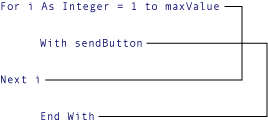

# Nested Control Structures (Visual Basic)
You can place control statements inside other control statements, for example an <CodeContentPlaceHolder>2\</CodeContentPlaceHolder> block within a <CodeContentPlaceHolder>3\</CodeContentPlaceHolder> loop. A control statement placed inside another control statement is said to be *nested*.  
  
## Nesting Levels  
 Control structures in [!INCLUDE[vbprvb](../vs140/includes/vbprvb_md.md)] can be nested to as many levels as you want. It is common practice to make nested structures more readable by indenting the body of each one. The integrated development environment (IDE) editor automatically does this.  
  
 In the following example, the procedure <CodeContentPlaceHolder>4\</CodeContentPlaceHolder> adds together the positive elements of each row of the matrix.  
  
<CodeContentPlaceHolder>0\</CodeContentPlaceHolder>  
 In the preceding example, the first <CodeContentPlaceHolder>5\</CodeContentPlaceHolder> statement closes the inner <CodeContentPlaceHolder>6\</CodeContentPlaceHolder> loop and the last <CodeContentPlaceHolder>7\</CodeContentPlaceHolder> statement closes the outer <CodeContentPlaceHolder>8\</CodeContentPlaceHolder> loop.  
  
 Likewise, in nested <CodeContentPlaceHolder>9\</CodeContentPlaceHolder> statements, the <CodeContentPlaceHolder>10\</CodeContentPlaceHolder> statements automatically apply to the nearest prior <CodeContentPlaceHolder>11\</CodeContentPlaceHolder> statement. Nested <CodeContentPlaceHolder>12\</CodeContentPlaceHolder> loops work in a similar fashion, with the innermost <CodeContentPlaceHolder>13\</CodeContentPlaceHolder> statement matching the innermost <CodeContentPlaceHolder>14\</CodeContentPlaceHolder> statement.  
  
> [!NOTE]
>  For many control structures, when you click a keyword, all of the keywords in the structure are highlighted. For instance, when you click <CodeContentPlaceHolder>15\</CodeContentPlaceHolder> in an <CodeContentPlaceHolder>16\</CodeContentPlaceHolder> construction, all instances of <CodeContentPlaceHolder>17\</CodeContentPlaceHolder>, <CodeContentPlaceHolder>18\</CodeContentPlaceHolder>, <CodeContentPlaceHolder>19\</CodeContentPlaceHolder>, <CodeContentPlaceHolder>20\</CodeContentPlaceHolder>, and <CodeContentPlaceHolder>21\</CodeContentPlaceHolder> in the construction are highlighted. To move to the next or previous highlighted keyword, press CTRL+SHIFT+DOWN ARROW or CTRL+SHIFT+UP ARROW.  
  
## Nesting Different Kinds of Control Structures  
 You can nest one kind of control structure within another kind. The following example uses a <CodeContentPlaceHolder>22\</CodeContentPlaceHolder> block inside a <CodeContentPlaceHolder>23\</CodeContentPlaceHolder> loop and nested <CodeContentPlaceHolder>24\</CodeContentPlaceHolder> blocks inside the <CodeContentPlaceHolder>25\</CodeContentPlaceHolder> block.  
  
<CodeContentPlaceHolder>1\</CodeContentPlaceHolder>  
## Overlapping Control Structures  
 You cannot overlap control structures. This means that any nested structure must be completely contained within the next innermost structure. For example, the following arrangement is invalid because the <CodeContentPlaceHolder>26\</CodeContentPlaceHolder> loop terminates before the inner <CodeContentPlaceHolder>27\</CodeContentPlaceHolder> block terminates.  
  
   
Invalid nesting of For and With structures  
  
 The [!INCLUDE[vbprvb](../vs140/includes/vbprvb_md.md)] compiler detects such overlapping control structures and signals a compile-time error.  
  
## See Also  
 [Control Flow in Visual Basic](../vs140/control-flow-in-visual-basic.md)   
 [Decision Structures](../vs140/decision-structures--visual-basic-.md)   
 [Loop Structures](../vs140/loop-structures--visual-basic-.md)   
 [Other Control Structures](../vs140/other-control-structures--visual-basic-.md)