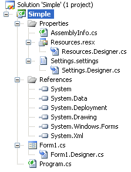

# New Project Generation: Under the Hood, Part Two
In [New Project Generation : Under the Hood](../vs140/new-project-generation--under-the-hood--part-one.md) we saw how the **New Project** dialog Box is populated. Let's assume you've selected a **Visual C# Windows Application**, filled out the **Name** and **Location** text boxes, and clicked OK.  
  
## Generating the Solution Files  
 Choosing an application template directs [!INCLUDE[vsprvs](../vs140/includes/vsprvs_md.md)] to unzip and open the corresponding .vstemplate file, and to launch a template to interpret the XML commands in this file. These commands create projects and project items in the new or existing solution.  
  
 The template unpacks source files, called item templates, from the same .zip folder that holds the .vstemplate file. The template copies these files to the new project, customizing them accordingly. For an overview of project and item templates, see [NIB: Visual Studio Templates](assetId:///141fccaa-d68f-4155-822b-27f35dd94041).  
  
### Template Parameter Replacement  
 When the template copies an item template to a new project, it replaces any template parameters with strings to customize the file. A template parameter is a special token that is preceded and followed by a dollar sign, for example, $date$.  
  
 Let's look at a typical project item template. Extract and examine Program.cs in the Program Files\Microsoft Visual Studio 8\Common7\IDE\ProjectTemplates\CSharp\Windows\1033\WindowsApplication.zip folder.  
  
<CodeContentPlaceHolder>0\</CodeContentPlaceHolder>  
 If you create a new Windows application project named Simple, the template replaces the <CodeContentPlaceHolder>7\</CodeContentPlaceHolder> parameter with the name of the project.  
  
<CodeContentPlaceHolder>1\</CodeContentPlaceHolder>  
 For a complete list of template parameters, see [Template Parameters](../vs140/template-parameters.md).  
  
## A Look Inside a .VSTemplate File  
 A basic .vstemplate file has this format  
  
<CodeContentPlaceHolder>2\</CodeContentPlaceHolder>  
 We looked at the \<TemplateData> section in the [first part of this article](../vs140/new-project-generation--under-the-hood--part-one.md). The tags in this section are used to control the appearance of the **New Project** dialog box.  
  
 The tags in the \<TemplateContent> section control the generation of new projects and project items. Here's the \<TemplateContent> section from the cswindowsapplication.vstemplate file in the \Program Files\Microsoft Visual Studio 8\Common7\IDE\ProjectTemplates\CSharp\Windows\1033\WindowsApplication.zip folder.  
  
<CodeContentPlaceHolder>3\</CodeContentPlaceHolder>  
 The \<Project> tag controls the generation of a project, and the \<ProjectItem> tag controls the generation of a project item. If the parameter ReplaceParameters is true, the template will customize all template parameters in the project file or item. In this case, all project items are customized, except for Settings.settings.  
  
 The TargetFileName parameter specifies the name and relative path of the resulting project file or item. This lets you create a folder structure for your project. If you don't specify this argument, the project item will have the same name as the project item template.  
  
 The resulting Windows application folder structure looks like this:  
  
   
  
 The first and only \<Project> tag in the template reads:  
  
<CodeContentPlaceHolder>4\</CodeContentPlaceHolder>  
 This instructs the New Project template to create the Simple.csproj project file by copying and customizing the template item windowsapplication.csproj.  
  
### Designers and References  
 You can see in the Solution Explorer that the Properties folder is present and contains the expected files. But what about project references and designer file dependencies, such as Resources.Designer.cs to Resources.resx, and Form1.Designer.cs to Form1.cs?  These are set up in the Simple.csproj file when it is generated.  
  
 Here's the \<ItemGroup> from Simple.csproj that creates the project references:  
  
<CodeContentPlaceHolder>5\</CodeContentPlaceHolder>  
 You can see that these are the six project references that appear in the Solution Explorer. Here's a section from another \<ItemGroup>. Many lines of code have been deleted for clarity. This section makes Settings.Designer.cs dependent on Settings.settings:  
  
<CodeContentPlaceHolder>6\</CodeContentPlaceHolder>  
## See Also  
 [New Project Generation: Under the Hood](../vs140/new-project-generation--under-the-hood--part-one.md)   
 [MSBuild](../vs140/msbuild.md)