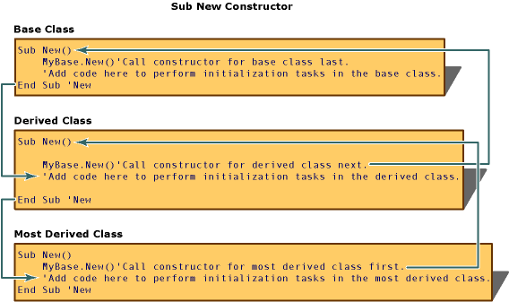
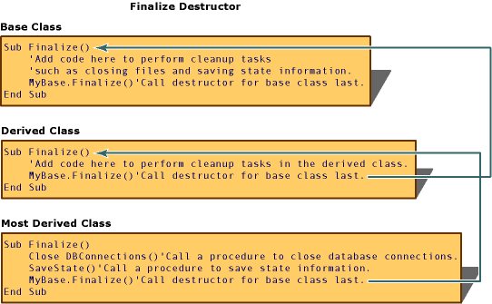

# Object Lifetime: How Objects Are Created and Destroyed (Visual Basic)
An instance of a class, an object, is created by using the <CodeContentPlaceHolder>5\</CodeContentPlaceHolder> keyword. Initialization tasks often must be performed on new objects before they are used. Common initialization tasks include opening files, connecting to databases, and reading values of registry keys. Visual Basic controls the initialization of new objects using procedures called *constructors* (special methods that allow control over initialization).  
  
 After an object leaves scope, it is released by the common language runtime (CLR). Visual Basic controls the release of system resources using procedures called *destructors*. Together, constructors and destructors support the creation of robust and predictable class libraries.  
  
## Using Constructors and Destructors  
 Constructors and destructors control the creation and destruction of objects. The <CodeContentPlaceHolder>6\</CodeContentPlaceHolder> and <CodeContentPlaceHolder>7\</CodeContentPlaceHolder> procedures in Visual Basic initialize and destroy objects; they replace the <CodeContentPlaceHolder>8\</CodeContentPlaceHolder> and <CodeContentPlaceHolder>9\</CodeContentPlaceHolder> methods used in [!INCLUDE[vbprvb](../vs140/includes/vbprvb_md.md)] 6.0 and earlier versions.  
  
### Sub New  
 The <CodeContentPlaceHolder>10\</CodeContentPlaceHolder> constructor can run only once when a class is created. It cannot be called explicitly anywhere other than in the first line of code of another constructor from either the same class or from a derived class. Furthermore, the code in the <CodeContentPlaceHolder>11\</CodeContentPlaceHolder> method always runs before any other code in a class. [!INCLUDE[vbprvblong](../vs140/includes/vbprvblong_md.md)] and later versions implicitly create a <CodeContentPlaceHolder>12\</CodeContentPlaceHolder> constructor at run time if you do not explicitly define a <CodeContentPlaceHolder>13\</CodeContentPlaceHolder> procedure for a class.  
  
 To create a constructor for a class, create a procedure named <CodeContentPlaceHolder>14\</CodeContentPlaceHolder> anywhere in the class definition. To create a parameterized constructor, specify the names and data types of arguments to <CodeContentPlaceHolder>15\</CodeContentPlaceHolder> just as you would specify arguments for any other procedure, as in the following code:  
  
 [!code[VbVbalrOOP#42](../vs140/codesnippet/VisualBasic/object-lifetime--how-objects-are-created-and-destroyed--visual-basic-_1.vb)]  
  
 Constructors are frequently overloaded, as in the following code:  
  
 [!code[VbVbalrOOP#116](../vs140/codesnippet/VisualBasic/object-lifetime--how-objects-are-created-and-destroyed--visual-basic-_2.vb)]  
  
 When you define a class derived from another class, the first line of a constructor must be a call to the constructor of the base class, unless the base class has an accessible constructor that takes no parameters. A call to the base class that contains the above constructor, for example, would be <CodeContentPlaceHolder>16\</CodeContentPlaceHolder>. Otherwise, <CodeContentPlaceHolder>17\</CodeContentPlaceHolder> is optional, and the [!INCLUDE[vbprvb](../vs140/includes/vbprvb_md.md)] runtime calls it implicitly.  
  
 After you write the code to call the parent object's constructor, you can add any additional initialization code to the <CodeContentPlaceHolder>18\</CodeContentPlaceHolder> procedure. <CodeContentPlaceHolder>19\</CodeContentPlaceHolder> can accept arguments when called as a parameterized constructor. These parameters are passed from the procedure calling the constructor, for example, <CodeContentPlaceHolder>20\</CodeContentPlaceHolder>.  
  
### Sub Finalize  
 Before releasing objects, the CLR automatically calls the <CodeContentPlaceHolder>21\</CodeContentPlaceHolder> method for objects that define a <CodeContentPlaceHolder>22\</CodeContentPlaceHolder> procedure. The <CodeContentPlaceHolder>23\</CodeContentPlaceHolder> method can contain code that needs to execute just before an object is destroyed, such as code for closing files and saving state information. There is a slight performance penalty for executing <CodeContentPlaceHolder>24\</CodeContentPlaceHolder>, so you should define a <CodeContentPlaceHolder>25\</CodeContentPlaceHolder> method only when you need to release objects explicitly.  
  
> [!NOTE]
>  The garbage collector in the CLR does not (and cannot) dispose of *unmanaged objects*, objects that the operating system executes directly, outside the CLR environment. This is because different unmanaged objects must be disposed of in different ways. That information is not directly associated with the unmanaged object; it must be found in the documentation for the object. A class that uses unmanaged objects must dispose of them in its <CodeContentPlaceHolder>26\</CodeContentPlaceHolder> method.  
  
 The <CodeContentPlaceHolder>27\</CodeContentPlaceHolder> destructor is a protected method that can be called only from the class it belongs to, or from derived classes. The system calls <CodeContentPlaceHolder>28\</CodeContentPlaceHolder> automatically when an object is destroyed, so you should not explicitly call <CodeContentPlaceHolder>29\</CodeContentPlaceHolder> from outside of a derived class's <CodeContentPlaceHolder>30\</CodeContentPlaceHolder> implementation.  
  
 Unlike <CodeContentPlaceHolder>31\</CodeContentPlaceHolder>, which executes as soon as an object is set to nothing, there is usually a delay between when an object loses scope and when Visual Basic calls the <CodeContentPlaceHolder>32\</CodeContentPlaceHolder> destructor. [!INCLUDE[vbprvblong](../vs140/includes/vbprvblong_md.md)] and later versions allow for a second kind of destructor, \<xref:System.IDisposable.Dispose*>, which can be explicitly called at any time to immediately release resources.  
  
> [!NOTE]
>  A <CodeContentPlaceHolder>33\</CodeContentPlaceHolder> destructor should not throw exceptions, because they cannot be handled by the application and can cause the application to terminate.  
  
### How New and Finalize Methods Work in a Class Hierarchy  
 Whenever an instance of a class is created, the common language runtime (CLR) attempts to execute a procedure named <CodeContentPlaceHolder>34\</CodeContentPlaceHolder>, if it exists in that object. <CodeContentPlaceHolder>35\</CodeContentPlaceHolder> is a type of procedure called a <CodeContentPlaceHolder>36\</CodeContentPlaceHolder> that is used to initialize new objects before any other code in an object executes. A <CodeContentPlaceHolder>37\</CodeContentPlaceHolder> constructor can be used to open files, connect to databases, initialize variables, and take care of any other tasks that need to be done before an object can be used.  
  
 When an instance of a derived class is created, the <CodeContentPlaceHolder>38\</CodeContentPlaceHolder> constructor of the base class executes first, followed by constructors in derived classes. This happens because the first line of code in a <CodeContentPlaceHolder>39\</CodeContentPlaceHolder> constructor uses the syntax <CodeContentPlaceHolder>40\</CodeContentPlaceHolder>to call the constructor of the class immediately above itself in the class hierarchy. The <CodeContentPlaceHolder>41\</CodeContentPlaceHolder> constructor is then called for each class in the class hierarchy until the constructor for the base class is reached. At that point, the code in the constructor for the base class executes, followed by the code in each constructor in all derived classes and the code in the most derived classes is executed last.  
  
   
  
 When an object is no longer needed, the CLR calls the \<xref:System.Object.Finalize*> method for that object before freeing its memory. The \<xref:System.Object.Finalize*> method is called a <CodeContentPlaceHolder>42\</CodeContentPlaceHolder> because it performs cleanup tasks, such as saving state information, closing files and connections to databases, and other tasks that must be done before releasing the object.  
  
   
  
## IDisposable Interface  
 Class instances often control resources not managed by the CLR, such as Windows handles and database connections. These resources must be disposed of in the <CodeContentPlaceHolder>43\</CodeContentPlaceHolder> method of the class, so that they will be released when the object is destroyed by the garbage collector. However, the garbage collector destroys objects only when the CLR requires more free memory. This means that the resources may not be released until long after the object goes out of scope.  
  
 To supplement garbage collection, your classes can provide a mechanism to actively manage system resources if they implement the \<xref:System.IDisposable*> interface. \<xref:System.IDisposable*> has one method, \<xref:System.IDisposable.Dispose*>, which clients should call when they finish using an object. You can use the \<xref:System.IDisposable.Dispose*> method to immediately release resources and perform tasks such as closing files and database connections. Unlike the <CodeContentPlaceHolder>44\</CodeContentPlaceHolder> destructor, the \<xref:System.IDisposable.Dispose*> method is not called automatically. Clients of a class must explicitly call \<xref:System.IDisposable.Dispose*> when you want to immediately release resources.  
  
### Implementing IDisposable  
 A class that implements the \<xref:System.IDisposable*> interface should include these sections of code:  
  
-   A field for keeping track of whether the object has been disposed:  
  
<CodeContentPlaceHolder>0\</CodeContentPlaceHolder>  
-   An overload of the \<xref:System.IDisposable.Dispose*> that frees the class's resources. This method should be called by the \<xref:System.IDisposable.Dispose*> and <CodeContentPlaceHolder>45\</CodeContentPlaceHolder> methods of the base class:  
  
<CodeContentPlaceHolder>1\</CodeContentPlaceHolder>  
-   An implementation of \<xref:System.IDisposable.Dispose*> that contains only the following code:  
  
<CodeContentPlaceHolder>2\</CodeContentPlaceHolder>  
-   An override of the <CodeContentPlaceHolder>46\</CodeContentPlaceHolder> method that contains only the following code:  
  
<CodeContentPlaceHolder>3\</CodeContentPlaceHolder>  
### Deriving from a Class that Implements IDisposable  
 A class that derives from a base class that implements the \<xref:System.IDisposable*> interface does not need to override any of the base methods unless it uses additional resources that need to be disposed. In that situation, the derived class should override the base class's <CodeContentPlaceHolder>47\</CodeContentPlaceHolder> method to dispose of the derived class's resources. This override must call the base class's <CodeContentPlaceHolder>48\</CodeContentPlaceHolder> method.  
  
<CodeContentPlaceHolder>4\</CodeContentPlaceHolder>  
 A derived class should not override the base class's \<xref:System.IDisposable.Dispose*> and <CodeContentPlaceHolder>49\</CodeContentPlaceHolder> methods. When those methods are called from an instance of the derived class, the base class's implementation of those methods call the derived class's override of the <CodeContentPlaceHolder>50\</CodeContentPlaceHolder> method.  
  
## Garbage Collection and the Finalize Destructor  
 The [!INCLUDE[dnprdnshort](../vs140/includes/dnprdnshort_md.md)] uses the *reference-tracing garbage collection* system to periodically release unused resources. Visual Basic 6.0 and earlier versions used a different system called *reference counting* to manage resources. Although both systems perform the same function automatically, there are a few important differences.  
  
 The CLR periodically destroys objects when the system determines that such objects are no longer needed. Objects are released more quickly when system resources are in short supply, and less frequently otherwise. The delay between when an object loses scope and when the CLR releases it means that, unlike with objects in Visual Basic 6.0 and earlier versions, you cannot determine exactly when the object will be destroyed. In such a situation, objects are said to have *non-deterministic lifetime*. In most cases, non-deterministic lifetime does not change how you write applications, as long as you remember that the <CodeContentPlaceHolder>51\</CodeContentPlaceHolder> destructor may not immediately execute when an object loses scope.  
  
 Another difference between the garbage-collection systems involves the use of <CodeContentPlaceHolder>52\</CodeContentPlaceHolder>. To take advantage of reference counting in Visual Basic 6.0 and earlier versions, programmers sometimes assigned <CodeContentPlaceHolder>53\</CodeContentPlaceHolder> to object variables to release the references those variables held. If the variable held the last reference to the object, the object's resources were released immediately. In later versions of Visual Basic, while there may be cases in which this procedure is still valuable, performing it never causes the referenced object to release its resources immediately. To release resources immediately, use the object's \<xref:System.IDisposable.Dispose*> method, if available. The only time you should set a variable to <CodeContentPlaceHolder>54\</CodeContentPlaceHolder> is when its lifetime is long relative to the time the garbage collector takes to detect orphaned objects.  
  
## See Also  
 \<xref:System.IDisposable.Dispose*>   
 [Initialization and Termination of Components](assetId:///58444076-a9d2-4c91-b3f6-0e180dc0695d)   
 [New Operator](../vs140/new-operator--visual-basic-.md)   
 [Cleaning up Unmanaged Resources](assetId:///a17b0066-71c2-4ba4-9822-8e19332fc213)   
 [Nothing](../vs140/nothing--visual-basic-.md)