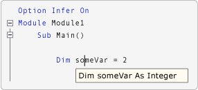
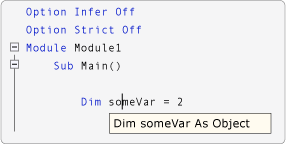

# Option Infer Statement
Enables the use of local type inference in declaring variables.  
  
## Syntax  
  
<CodeContentPlaceHolder>0\</CodeContentPlaceHolder>  
## Parts  
  
|||  
|-|-|  
|Term|Definition|  
|<CodeContentPlaceHolder>1\</CodeContentPlaceHolder>|Optional. Enables local type inference.|  
|<CodeContentPlaceHolder>2\</CodeContentPlaceHolder>|Optional. Disables local type inference.|  
  
## Remarks  
 To set <CodeContentPlaceHolder>3\</CodeContentPlaceHolder> in a file, type <CodeContentPlaceHolder>4\</CodeContentPlaceHolder> or <CodeContentPlaceHolder>5\</CodeContentPlaceHolder> at the top of the file, before any other source code. If the value set for <CodeContentPlaceHolder>6\</CodeContentPlaceHolder> in a file conflicts with the value set in the IDE or on the command line, the value in the file has precedence.  
  
 When you set <CodeContentPlaceHolder>7\</CodeContentPlaceHolder> to <CodeContentPlaceHolder>8\</CodeContentPlaceHolder>, you can declare local variables without explicitly stating a data type. The compiler infers the data type of a variable from the type of its initialization expression.  
  
 In the following illustration, <CodeContentPlaceHolder>9\</CodeContentPlaceHolder> is turned on. The variable in the declaration <CodeContentPlaceHolder>10\</CodeContentPlaceHolder> is declared as an integer by type inference.  
  
   
IntelliSense when Option Infer is on  
  
 In the following illustration, <CodeContentPlaceHolder>11\</CodeContentPlaceHolder> is turned off. The variable in the declaration <CodeContentPlaceHolder>12\</CodeContentPlaceHolder> is declared as an <CodeContentPlaceHolder>13\</CodeContentPlaceHolder> by type inference. In this example, the **Option Strict** setting is set to **Off** on the [Compile Page, Project Designer (Visual Basic)](../vs140/compile-page--project-designer--visual-basic-.md).  
  
   
IntelliSense when Option Infer is off  
  
> [!NOTE]
>  When a variable is declared as an <CodeContentPlaceHolder>14\</CodeContentPlaceHolder>, the run-time type can change while the program is running. [!INCLUDE[vbprvb](../vs140/includes/vbprvb_md.md)] performs operations called *boxing* and *unboxing* to convert between an <CodeContentPlaceHolder>15\</CodeContentPlaceHolder> and a value type, which makes execution slower. For information about boxing and unboxing, see the [Visual Basic Language Specification](../vs140/visual-basic-language-specification.md).  
  
 Type inference applies at the procedure level, and does not apply outside a procedure in a class, structure, module, or interface.  
  
 For additional information, see [Local Type Inference (Visual Basic)](../vs140/local-type-inference--visual-basic-.md).  
  
## When an Option Infer Statement Is Not Present  
 If the source code does not contain an <CodeContentPlaceHolder>16\</CodeContentPlaceHolder> statement, the **Option Infer** setting on the [Compile Page, Project Designer (Visual Basic)](../vs140/compile-page--project-designer--visual-basic-.md) is used. If the command-line compiler is used, the [/optioninfer](../vs140/-optioninfer.md) compiler option is used.  
  
#### To set Option Infer in the IDE  
  
1.  In **Solution Explorer**, select a project. On the **Project** menu, click **Properties**. For more information, see [NIB: Managing Project Properties with the Project Designer](assetId:///983f3c18-832f-4666-afec-74b716ff3e0e).  
  
2.  Click the **Compile** tab.  
  
3.  Set the value in the **Option infer** box.  
  
 When you create a new project, the **Option Infer** setting on the **Compile** tab is set to the **Option Infer** setting in the **VB Defaults** dialog box. To access the **VB Defaults** dialog box, on the **Tools** menu, click **Options**. In the **Options** dialog box, expand **Projects and Solutions**, and then click **VB Defaults**. The initial default setting in **VB Defaults** is <CodeContentPlaceHolder>17\</CodeContentPlaceHolder>.  
  
#### To set Option Infer on the command line  
  
-   Include the [/optioninfer](../vs140/-optioninfer.md) compiler option in the **vbc** command.  
  
## Default Data Types and Values  
 The following table describes the results of various combinations of specifying the data type and initializer in a <CodeContentPlaceHolder>18\</CodeContentPlaceHolder> statement.  
  
|||||  
|-|-|-|-|  
|Data type specified?|Initializer specified?|Example|Result|  
|No|No|<CodeContentPlaceHolder>19\</CodeContentPlaceHolder>|If <CodeContentPlaceHolder>20\</CodeContentPlaceHolder> is off (the default), the variable is set to <CodeContentPlaceHolder>21\</CodeContentPlaceHolder>.\ \  If <CodeContentPlaceHolder>22\</CodeContentPlaceHolder> is on, a compile-time error occurs.|  
|No|Yes|<CodeContentPlaceHolder>23\</CodeContentPlaceHolder>|If <CodeContentPlaceHolder>24\</CodeContentPlaceHolder> is on (the default), the variable takes the data type of the initializer. See [Local Type Inference (Visual Basic)](../vs140/local-type-inference--visual-basic-.md).\ \  If <CodeContentPlaceHolder>25\</CodeContentPlaceHolder> is off and <CodeContentPlaceHolder>26\</CodeContentPlaceHolder> is off, the variable takes the data type of <CodeContentPlaceHolder>27\</CodeContentPlaceHolder>.\ \  If <CodeContentPlaceHolder>28\</CodeContentPlaceHolder> is off and <CodeContentPlaceHolder>29\</CodeContentPlaceHolder> is on, a compile-time error occurs.|  
|Yes|No|<CodeContentPlaceHolder>30\</CodeContentPlaceHolder>|The variable is initialized to the default value for the data type. For more information, see [Dim Statement (Visual Basic)](../vs140/dim-statement--visual-basic-.md).|  
|Yes|Yes|<CodeContentPlaceHolder>31\</CodeContentPlaceHolder>|If the data type of the initializer is not convertible to the specified data type, a compile-time error occurs.|  
  
## Example  
 The following examples demonstrate how the <CodeContentPlaceHolder>32\</CodeContentPlaceHolder> statement enables local type inference.  
  
 [!code[VbVbalrTypeInference#6](../vs140/codesnippet/VisualBasic/option-infer-statement_1.vb)]  
  
## Example  
 The following example demonstrates that the run-time type can differ when a variable is identified as an <CodeContentPlaceHolder>33\</CodeContentPlaceHolder>.  
  
 [!code[VbVbalrTypeInference#11](../vs140/codesnippet/VisualBasic/option-infer-statement_2.vb)]  
  
## See Also  
 [Dim Statement](../vs140/dim-statement--visual-basic-.md)   
 [Local Type Inference](../vs140/local-type-inference--visual-basic-.md)   
 [Option Compare Statement](../vs140/option-compare-statement.md)   
 [Option Explicit Statement](../vs140/option-explicit-statement--visual-basic-.md)   
 [Option Strict Statement](../vs140/option-strict-statement.md)   
 [Visual Basic Defaults, Projects, Options Dialog Box](../vs140/visual-basic-defaults--projects--options-dialog-box.md)   
 [/optioninfer](../vs140/-optioninfer.md)   
 [Boxing and Unboxing (C# Programming Guide)](../vs140/boxing-and-unboxing--csharp-programming-guide-.md)